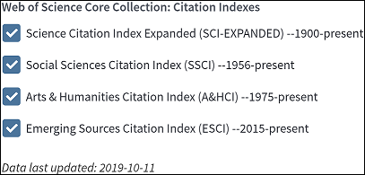

```{r,echo=FALSE, cache=FALSE}
## numbers >= 10^5 will be denoted in scientific notation, and rounded to 2 digits
options(digits=3)
```

```{r setup, echo = FALSE, eval = TRUE}
rm(list=ls())
knitr::opts_chunk$set(echo = TRUE, warning = FALSE, eval = TRUE)
pacman::p_load(openxlsx,readxl,ape,fulltext,metafor,rotl,treebase,diagram,dplyr,stringr,ggplot2,tidyverse,pander,ggpubr)

# loading necessary custom functions
source("./functions.R")

# Author's information: 
# Alfredo Sanchez-Tojar (@ASanchez_Tojar)
# Profile: https://goo.gl/PmpPEB
# Department of Evolutionary Biology, Bielefeld University (GER) 
# Email: alfredo.tojar@gmail.com
# Script first created on the 29th of Aug 2019
```

## 1 - Systematic search

### 1.1 - Excluding subject areas

We used the search string reported in Yin et al. [-@yin2019] (see below) to show the effect of excluding key subject areas on the outcome of the search.

Specific search string used: *TS=((transgeneration\* OR paternal OR maternal OR parent\* OR grandparent\*) AND (effect\$ OR plasticit\*) AND (offspring OR progen\* OR son\$ OR daughter\$ OR F1 OR F2) NOT ("parental care\$" OR wom?n OR man OR men OR human OR immun\* OR child\* OR infant\$ OR bab\* OR patient\$ OR student\$ OR school\$ OR famil\* OR societ\* OR cognit\* OR learn\* OR educat\* OR diet\$ OR industr\* OR economi\* OR commerc\* OR adolescent\* OR conductor\*))*

We used that specific search string to search literature published between 2013 and 2017 in Web of Science Core Collection. Our search was performed from Bielefeld University, details on the databases covered can be seen in Figure S1. Notice that the PRISMA diagram reported by Yin et al. [-@yin2019] reports that duplicates were found, which suggests that either multiple searches were performed or multiple databases were searched within Web of Science or using other search engines. Yet, that information was not reported in Yin et al. [-@yin2019], making their search irreproducible. Overall, we recommend reporting all necessary information to make the literature search and the systematic review process (i.e. screening, data extraction, etc) reproducible, e.g. full list of records found by the search, screening decisions, and reasons for exclusion, etc. [for guidelines see @haddaway2018;@haddaway2018a; for an example see @odea2016a].

<center>



</center>

This search found a total of 2635 records (2013: 480, 2014: 518, 2015: 541, 2016: 545, 2017: 551). Limiting that search to the subject areas reported in Yin et al. [-@yin2019], i.e. 'environmental sciences ecology' and 'evolutionary biology', gave 576 records (`r round((576/2635)*100,1)` %). In addition, not excluding "diet$" from the search string (see concerns in the main manuscript) gave a total of 3314 records, 624 (`r round((624/3314)*100,1)` %) records when limiting the search only to the subject areas 'environmental sciences ecology' and 'evolutionary biology'.

### 1.2 - Extended keyword list

Here, we provide a more complete list of keywords that could be used to find studies testing adaptive inter- and transgenerational effects, and show the effect of adding those keywords to the search string. Bear in mind that our suggested string is far from being complete. Extending the search string further would require some structural changes to the original search, which we wanted to avoid. 

Specific search string suggested: *TS=((transgeneration\*  OR trans-generation\* OR intergeneration\* OR inter-generation\* OR "\*cross generation\*" OR "\*cross-generation\*" OR paternal OR maternal OR parent\* OR grandparent\* OR grandmater\* OR grandpater\* OR silver-spoon OR "silver spoon" OR "anticipatory" OR carry-over OR "carry over") AND (effect\$ OR plasticit\* OR programming OR conditioning) AND (offspring OR progen\* OR son\$ OR daughter\$ OR F1 OR F2) NOT ("parental care\$" OR wom?n OR man OR men OR human OR immun\* OR child\* OR infant\$ OR bab\* OR patient\$ OR student\$ OR school\$ OR famil\* OR societ\* OR cognit\* OR learn\* OR educat\* OR diet\$ OR industr\* OR economi\* OR commerc\* OR adolescent\* OR conductor\*))*

We used our suggested search string to search literature published between 2013 and 2017 in Web of Science Core Collection (Figure S1; search performed from Bielefeld University). Our search found a total of 3595 records (2013: 655, 2014: 708, 2015: 747, 2016: 734, 2017: 751). Limiting that search to the subject areas 'environmental sciences ecology' and 'evolutionary biology' gave 728 records (`r round((728/3595)*100,1)` %). That is, our extended search string led to a `r round(((728-576)/576)*100,)`-`r round(((3595-2635)/2635)*100,)` % increase in the (area-restricted and total, respectively) number of records compared to the search reported by Yin et al. [-@yin2019].

## 2 - Data preparation

Before we proceeded to calculate effect sizes and conduct analyses, we explored the data to both understand the database and assess its quality. We used the open data of Yin et al. [-@yin2019], which the authors made available as [supporting information](https://doi.org/10.1111/ele.13373) and in [Figshare](https://doi.org/10.6084/m9.figshare.9108614). We would like to acknowledge the authors (and the journal) for publishing their code and data together with their publication, and to highlight the importance of open science practices for science's self-correcting process. 
```{r, results="hide"}
# importing data from Yin et al. (2019)
trans<-read.csv("../data/Yin et al raw data.csv",header=T)
```

### 2.1 - Data structure

```{r, results="hide"}
# number of unique studies per species
trans %>% group_by(species) %>% summarise(count = n_distinct(study))
# number of unique species per study
trans %>% group_by(study) %>% summarise(count = n_distinct(species))
# as an example: show data for study 3, which studies more than 1 species
trans[trans$study==3,]
```
Yin et al. [-@yin2019] used the following nested random effect structure in their models: `1|species/study`, that is, studies were nested within species. We explored whether the data structure corresponded indeed to a nested design, and found that the data structure corresponds to a (partial) crossed design instead. For example, "study 3" in the database always refers to "Walter et al. 2016" regardless of the species studied, *Galeolaria caespitosa* or *Arabidopsis thaliana*, which shows that nesting studies within species would not be appropriate for this data structure (more about data structure in this [link](https://stats.stackexchange.com/questions/228800/crossed-vs-nested-random-effects-how-do-they-differ-and-how-are-they-specified)).

### 2.2 - Ratio scale data

```{r, results="hide"}
# are there negative values?
summary(trans$avg1)
summary(trans$avg2)

# in addition, are there any means/SDs = 0?
table(trans$avg1==0)
table(trans$avg1==0)
table(trans$sd1==0)
table(trans$sd2==0)
```
The effect size statistic of choice of Yin et al. [-@yin2019] was the log response ratio [lnRR; @hedges1999], which assumes ratio scale data [@houle2011; @nakagawa2015]. Among all properties of ratio scale data, one is that ratio scale data have to be bounded at zero [@houle2011]. We explored the data used in Yin et al. [-@yin2019] and confirmed that all data were indeed bounded at zero (i.e. no negative mean values were present in the database). Notice, however, that fully understanding whether data are ratio or non-ratio scale requires detailed knowledge about the measurements being used in each study [@houle2011], which was beyond the scope of our assessment.

### 2.3 - Exploring moderators

Before re-analysing the data, we briefly explored the moderators originally used in the analyses to better understand the data set. The resulting data quality concerns are presented in the sections below.

```{r, results="hide"}
# checking the levels of all moderators
levels(trans$taxonomic)
levels(trans$transmission_type)
levels(trans$offspring_generation)
levels(trans$acclimating)
levels(trans$acclimating.1)# table(trans$acclimating==trans$acclimating.1) # they are the same
levels(trans$parental_developmental_stages)
levels(trans$offspring_developmental_stages)
levels(trans$test.env)
levels(trans$alter.env)
levels(trans$is.natural)
levels(trans$environmental_context)
levels(trans$merged.environment)
levels(trans$trait)
summary(trans$days.to.maturation)
```

### 2.4 - Duplicates

```{r, results="hide"}
# exploring whether duplicated rows exist in this database
trans$duplicated.row <- duplicated(trans[,-1])
trans[trans$duplicated.row==TRUE,"study"]
trans[trans$study==20,] %>% arrange(species,avg1) #these are real duplicates (reference checked), plus hatching rate should be germination instead, and the trait category adjusted to 3life_history
# correcting the typo, we are assuming that the typo must be the "hatching rate" as all the others are named "germination", however, the actual measurement shown in the original study is "germination (%)", and thus, it could also be named "hatching rate", which seems to have been categorized as "4survival" throughout the database, in contrast to "germination rate", which has been categorized as "3life_history" throughout the database.
trans[trans$study==20 & trans$trait.detail=="hatching rate","trait.detail"]<-"germination"
trans[trans$study==20 & trans$trait=="4survival","trait"]<-"3life_history"

trans[trans$study==76,] %>% arrange(species,avg1) #these are real duplicates (reference checked)

# checking whether there are duplicated studies with same citation but different study ID
duplicated.check <- unique(trans[,c("study","author","journal","year")])
duplicated.check$citation <- paste(duplicated.check$author,duplicated.check$year,duplicated.check$journal,sep="_")

duplicated.check %>% group_by(study) %>% summarise(count = n()) %>% filter(count>1) # it is only a typo in the author name
duplicated.check %>% group_by(citation) %>% summarise(count = n()) %>% filter(count>1)

trans[trans$study==137,]
trans[trans$study=="Amzallac",]
trans$study <- ifelse(trans$study=="Amzallac",
                      "Amzallag",
                      trans$study)
```

By exploring the database, we found that `r table(trans$duplicated.row)[2]` rows were duplicated, which we confirmed by reading the original references (n = `r length(unique(trans[trans$duplicated.row==TRUE,"study"]))` studies). We already found some inconsistencies with assigning trait categories (see coding comments above).

### 2.5 - Traits analysed

```{r, results="hide"}
# before we start exploring the variable `trait.detail`, we first get rid of capital letters to make it easier to find exactly same text.
trans$trait.detail <- str_to_lower(trans$trait.detail, locale = "en")

# we also get rid of spaces at the beginning and at the end of the strings
trans$trait.detail <- str_trim(trans$trait.detail)

# checking whether traits were classified consistenly
trans %>% group_by(trait.detail) %>% summarise(count = n_distinct(trait)) %>% filter(count>1)

# then we perform a quick visual exploration of the list of unique traits
sort(unique(trans$trait.detail))

# list of trait.details to be excluded
trait.details.to.exclude <- c("body size (residuals of standard length)30",
                              "body size (residuals of standard length)60",
                              "coefficient of variation (cv) of offspring body size at 30 days",
                              "coefficient of variation (cv) of offspring body size at 60 days",
                              "coefficient of variation (cv) of offspring body size at 90 days",
                              "cv (ratio of the standard deviation) leaf width",
                              "cv powdery mildew presence",
                              "residuals of standard length30",
                              "residuals of standard length60",
                              "residuals of standard length90")

# checking whether some measurements were classified as different traits
trans %>% group_by(trait.detail) %>% summarise(count = n_distinct(trait)) %>% filter(count>1)
```

We explored the data set to understand what type of outcome variables were included in the original analyses. For that, we visually explored the definitions provided in the variable `trait.detail`, which had `r length(unique(trans$trait.detail))` levels. Based on this exploration, we identified `r length(unique(trait.details.to.exclude))` variability-related traits (k = `r nrow(trans[trans$trait.detail %in% trait.details.to.exclude,])` effect sizes) such as coefficient of variations and regressions residuals. Despite meta-analyzing variances certainly being possible, it requires different methodologies [see @nakagawa2015;@sanchez-tojar2019], and thus, these traits should have been excluded from the original meta-analysis and meta-regressions. 

### 2.6 - Environmental factors

```{r, results="hide"}
# before we start exploring these variables, we first get rid of capital letters to make it easier to find exactly same text.
trans$test.env.detail <- str_to_lower(trans$test.env.detail, locale = "en")
trans$alter.env.detail <- str_to_lower(trans$alter.env.detail, locale = "en")

# we also get rid of spaces at the beginning and at the end of the strings
trans$test.env.detail <- str_trim(trans$test.env.detail)
trans$alter.env.detail <- str_trim(trans$alter.env.detail)

# then we perform a quick visual exploration of the list of unique environments
sort(unique(c(trans$test.env.detail,trans$alter.env.detail)))

environments.involving.diet <- c("high food",
                                 "high food quality",
                                 "high food, uncrowded",
                                 "high nutrition",
                                 "high protein",
                                 "high ration level",
                                 "low food",
                                 "low food quality",
                                 "low food, crowded",
                                 "low nutrient",
                                 "low nutrition",
                                 "low quality food",
                                 "low ration level",
                                 "medium  protein",
                                 "medium nutrient",
                                 "medium ration level",
                                 "nutrient",
                                 "nutrient env",
                                 "poor nutrition",
                                 "poor protein",
                                 "protein-poor diet",
                                 "protein-rich diet",
                                 "rich nutrient",
                                 "rich nutrition",
                                 "vitamin e",
                                 "well fed")
```
We explored the data set to understand what type of environmental treatments were included in the database. For that, we visually explored the definitions provided in the variables `test.env.detail` and `alter.env.detail`, which had `r length(unique(c(trans$test.env.detail,trans$alter.env.detail)))` levels in total. Based on this exploration, and despite the search string originally used in Yin et al. [-@yin2019] specified 'NOT ("diet\$")' (i.e. the search string excluded studies containing the words "diet" and "diets" in the title, abstract and/or keywords), we identified `r length(unique(environments.involving.diet))` treatments where diet was manipulated (e.g. food quality, food quantity, nutrient levels, etc; n = `r length(unique(trans[trans$test.env.detail %in% environments.involving.diet | trans$alter.env.detail %in% environments.involving.diet,"study"]))` studies, k = `r nrow(trans[trans$test.env.detail %in% environments.involving.diet | trans$alter.env.detail %in% environments.involving.diet,])` effect sizes).

```{r, results="hide"}
# looking for potential typos
trans[trans$test.env.detail=="control" & trans$alter.env.detail=="control",]

# formatting variables
trans$test.env.detail <- as.character(trans$test.env.detail)
trans$alter.env.detail <- as.character(trans$alter.env.detail)

# generating a combined list of factors for exploration
env.detail.test <- ifelse(trans$test.env.detail=="control",
                          NA,
                          trans$test.env.detail)

env.detail.test <- ifelse(trans$alter.env.detail!="control",
                          trans$alter.env.detail,
                          trans$test.env.detail)

# generating a new database for exploration
environmental.factor.exploration <- data.frame(cbind(env.detail.test,as.character(trans$is.natural)))
names(environmental.factor.exploration) <- c("env.detail.test","is.natural")

# checking whether a single measurement was classified as different traits
environmental.factor.exploration.counts <- environmental.factor.exploration %>% group_by(env.detail.test) %>% summarise(count = n_distinct(is.natural)) %>% filter(count>1)

```
In addition, we explored the classification of environmental factors and found `r nrow(environmental.factor.exploration.counts)` factors that were classified as both "Naturally-occurring fluctuations" and "Human-mediated changes": (i) Cadmium, (ii) Cu, (iii) low PH, (iv) ocean acidification, and (v) toxic *Microcystis*.

### 2.7 - Expected fitness relationships

```{r, results="hide"}
# checking whether some measurements had more than one expected fitness relationship
trans %>% group_by(trait.detail) %>% summarise(count = n_distinct(neg.fitness)) %>% filter(count>1)

# it seems to make sense that the fitness relationships of "calcium per embryo" were coded differently
trans[trans$trait.detail=="calcium per embryo",]

# visually exploring trait.details for which sign was inverted
unique(sort(trans[trans$neg.fitness==1,c("trait.detail")]))

# visually exploring trait.details and their expected fitness relationship
unique(trans[order(trans$trait.detail),c("trait.detail","neg.fitness")])

# list of physiological traits for which sign inversion might be wrong
signs.potentially.inconsistent <-c("absolute anogenital distance",# since "anogenital distance" was inverted. Indeed, the authours of the other study on anogenital distance (Zhang et al. 2014, Env Toxic and Pharma) treated a reduction in anogenital distance in male rats as a negative effect of the treatment on the reproductive system. Predictions from Viera et al. 2013 are not clear, but it very much makes sense to follow Zhang et al. 2014.
                                   "deterioration rate",# sounds odd, which was confirmed when reading the original source (Bernareggi et al. 2015, Alpine Botany) where it can be seen that deterioration rate and lifetime are expected to be (and are) overall negatively correlated.
                                   "diapause eggs",# since "diapause in the progeny" was inverted. Indeed, this seems to be an example where the expected fitness depends on the group studied, where the expected relationship should be negative for id=1024 as diapause is not a good strategy at high temperature (32C), and positive for id=1026 as diapause is a good strategy at low temperature (22C) (Fig.1, Huestis & Marshall 2006, Oecologia, discussion paragraph 3).
                                   "energy consumed per 1 mg hatchling mass",# since "enegetic lost" was inverted, however, the original source (Geister et. al 2009, Journal of Comparative Physiology B) treats this variable as a proxy of growth efficiency.
                                   "energy consumed per 2 mg hatchling mass",# since "enegetic lost" was inverted, however, the original source (Geister et. al 2009, Journal of Comparative Physiology B) treats this variable as a proxy of growth efficiency.
                                   "metal stress",# sounds odd, but according to the original source (Perez & Noriega 2013, J Insect Physiology), its seems that the sign does not need to be changed as these values would refer to tolerance to metal stress
                                   "plasma cortiso",# since "faecal corticosterone metabolites" was inverted. I cannot confirm the sign of this trait. First, I cannot find the numbers reported in either the text, tables or figures. Second, it might actually refer to adults plasma cortisol rather than the embryo level according to the sample sizes used (see Fig.2).
                                   "protein carbonyl",# since "protein carbonyl concentrations" was inverted. Indeed, the authors of the original source (Kazerouni et al. 2017, Functional Ecology), said the following: 'We quantified lipid peroxidation and protein break-down products (carbonyls) as the main indicators of ROS-mediated damage in tail muscle'. Thus, sign should be inverted.
                                   "lipid peroxidation",# sounds odd, indeed, the authors of the original source (Kazerouni et al. 2017, Functional Ecology), said the following: 'We quantified lipid peroxidation and protein break-down products (carbonyls) as the main indicators of ROS-mediated damage in tail muscle'. Thus, sign should be inverted.
                                   "testosterone level"# sounds odd, but according to the original source (Vieira et al. 2013, Reproductive Toxicology), its seems that the sign does not need to be changed as they are used as proxies for masculinization of male pups  
)

# exploring the studies involving those potentially wrong signs
trans[trans$trait.detail %in% signs.potentially.inconsistent,c("study","author","journal","year","trait.detail","avg1","avg2")]

# implementing those changes into the database
signs.to.be.inverted <- c("deterioration rate","diapause eggs","protein carbonyl","lipid peroxidation") #"diapause eggs" only for one group
signs.to.be.uninverted <- c("absolute anogenital distance")
levels.to.be.excluded <- c("plasma cortiso")
```
Overall, the effect direction was inverted for `r table(trans$neg.fitness)[2]` (`r round((table(trans$neg.fitness)[2]/nrow(trans))*100,1)` %) effect sizes in the data set used by Yin et al. [-@yin2019]. We explored whether the expected relationships between measurements and fitness (i.e. the sign assigned to each effect size) were consistent throughout the database. For that, we visually explored the levels of the variable `trait.detail` for which signs were inverted, and then visually explored the remaining levels of the variable `trait.detail` to confirm if those inversions were applied consistently throughout the database. This way, we identified `r length(signs.potentially.inconsistent)` traits whose sign could be wrong, which we further assessed by reading the original references (n = `r length(unique(trans[trans$trait.detail %in% signs.potentially.inconsistent,c("study")]))` studies). Overall, we found that the sign of `r length(signs.to.be.inverted)` traits (k = `r nrow(trans[trans$trait.detail %in% signs.to.be.inverted,])-1` effect sizes) needed to be inverted, `r length(signs.to.be.uninverted)` trait (k = `r nrow(trans[trans$trait.detail %in% signs.to.be.uninverted,])` effect sizes) was wrongly inverted, and `r length(levels.to.be.excluded)` trait (k = `r nrow(trans[trans$trait.detail %in% levels.to.be.excluded,])` effect size) should have been excluded as raw data corresponded to parents rather than offspring. Notice, however, that our approach to identify potentially wrong sign assignments was very conservative. Assigning effect size directions requires detailed knowledge about the measurements being used in each study, which was beyond the scope of our work. Ideally and on the basis of reproducibility, justifications on effect direction decisions should have been reported by Yin et al. [-@yin2019]. Finally, Yin et al. [-@yin2019] conducted a sensitivity analysis to test whether some of their results remained qualitatively similar when excluding all the effect sizes for which direction was inverted [Table S3 from @yin2019], however, it should be noted that approach would not account for potential inversions that despite being necessary would not have been performed.

### 2.8 - Species names

We searched for the species names in the Open Tree Taxonomy [@rees2017] using the R package `rotl` v.3.0.5 [@michonneau2016] to confirm if all species names were correct, and that no synonyms or typos were present in the database. 
```{r, results="hide"}
# variable species transformed to character type
trans$species <- as.character(trans$species)

# sockeye salmon was not originally found, so we tried with its scientific name "Oncorhynchus nerka" instead
trans$species <- ifelse(trans$species=="sockeye_salmon",
                        "Oncorhynchus_nerka",
                        trans$species)

# formatting the species names to make it easier for rotl to find them in the Open Tree of Life
trans$species.2 <- str_replace(trans$species,"_"," ")

# # obtaining dataframe listing the Open Tree identifiers potentially matching our list of species (be aware that this will take a few minutes, and you can load the data below)
# taxa <- tnrs_match_names(names = unique(trans$species.2))
# 
# # saving the taxonomic data created on the 14th of October to speed the process in the future
# save(taxa,file = "../data/taxa_Open_Tree_of_Life.RData")

# loading the taxonomic data created on the 14th of October
load("../data/taxa_Open_Tree_of_Life.RData") #taxa

# check approximate matches
taxa[taxa$approximate_match==TRUE,]

# check approximate matches
taxa[taxa$is_synonym==TRUE,]

# check number of matches
taxa[taxa$number_matches>1,]
```

Using the information retrieved from the Open Tree Taxonomy [@rees2017], we then searched for potential inconsistencies (and corrected them) by checking the following variables:

(1) Approximate matches: we detected that "Sprague Dawley Rats" were mistakenly considered a different species to "*Rattus norvegicus*" `r nrow(trans[trans$species=="Sprague_Dawley_rats",])` times across the database, and that "*Rattus norvegicus*" was misspelled as "*Rattus norregicus*" `r nrow(trans[trans$species=="Rattus norregicus",])` times across the database.

(2) Synonyms: we detected that "*Physella acuta*" was also named as "*Physa acuta*" in the database. We changed "*Physa acuta*" to "*Physella acuta*" to have a single scientific name for this species in the database (`r nrow(trans[trans$species=="Physa_acuta",])` changes).

(3) Number of matches greater than 1: we did not detect any inconsistencies here.

```{r, results="hide"}
# correcting the inconsistencies found in the species names
trans <- trans %>%
  mutate(species = recode(species,
                          `Rattus norregicus` = "Rattus_norvegicus",
                          Sprague_Dawley_rats = "Rattus_norvegicus",
                          Physella_acuta = "Physa_acuta"))

# formatting again the species names to make it easier for rotl to find them in the Open Tree of Life
trans$species.2 <- str_replace(trans$species,"_"," ")
```

### 2.9 - Experimental type

```{r, results="hide"}
# number of effect sizes from each type of experiment
table(trans$reciprocal)

# are all taxonomic groups present for each type of experiment?
trans %>% group_by(reciprocal) %>% summarise(count = n_distinct(taxonomic))
trans %>% group_by(reciprocal) %>% count(taxonomic)

# are similar number of species present for each type of experiment?
trans %>% group_by(reciprocal) %>% summarise(count = n_distinct(species))
trans %>% group_by(reciprocal) %>% count(species) %>% as.data.frame()

# are similar number of environmental context present for each type of experiment?
trans %>% group_by(reciprocal) %>% summarise(count = n_distinct(environmental_context))
environmental_context.calcu <- trans %>% group_by(reciprocal) %>% count(environmental_context)

# are similar number of environmental context present for each type of experiment?
trans %>% group_by(reciprocal) %>% summarise(count = n_distinct(transmission_type))
transmission_type.calcu <- trans %>% group_by(reciprocal) %>% count(transmission_type)
```
Fully factorial experiments (`r round((table(trans$reciprocal)[2]/nrow(trans))*100,1)` % of effect sizes) led to smaller effect sizes than non-fully factorial experiments (`r round((table(trans$reciprocal)[1]/nrow(trans))*100,1)` % of effect sizes; see discussion in Yin et al. [-@yin2019], and section 5.8 below). We explored whether that result could be due to a bias in taxa, environmental context and/or transmission type covered by each type of experiment. Overall, our exploration shows that all four taxonomic groups are represented in both types of experiments, and in a relatively similar way, and that the number of species studied in each type of experiment is similar. However, there seems to be a bias in the environmental context covered by each experiment, with the majority of non-fully factorial designs mostly studying "relatively favourable" environments (non-fully factorial: `r round((environmental_context.calcu$n[2]/(sum(environmental_context.calcu$n[1:4])))*100,1)` % vs. fully factorial: `r round((environmental_context.calcu$n[6]/(sum(environmental_context.calcu$n[5:8])))*100,1)` % of effect sizes), where condition-transfer parental effects are most expected [@engqvist2016;-@engqvist2018]. That is, data from non-fully factorial experiments might represent mostly condition-transfer parental effects, whereas data from fully factorial experiments might represent mostly anticipatory parental effects in this database. In addition, biparental transmission types were much more common in fully factorial designs (`r transmission_type.calcu$n[6]` effect sizes) than in non-fully factorial designs (`r transmission_type.calcu$n[3]` effect sizes), whereas the representation of maternal (fully factorial: `r transmission_type.calcu$n[4]` vs. non-fully factorial: `r transmission_type.calcu$n[1]` effect sizes) and paternal (fully factorial: `r transmission_type.calcu$n[5]` vs. non-fully factorial: `r transmission_type.calcu$n[2]` effect sizes) transmission types was similar across both types of experiments. These differences may have led to the different conclusions reached when comparing both types of experiments [see discussion in @yin2019, and section 5.8 below].

### 2.10 - Inter- vs. transgenerational effects

Transgenerational effects correspond to effects detectable in the F2 (paternal line, or maternal line if environmental exposure occurred before pregnancy) or F3 (maternal line if environmental exposure occurred during pregnancy) generation and beyond [@morkveknudsen2018;@perez2019]. In contrast, effects only detectable in the F1 and/or F2 (maternal line if environmental exposure occurred during pregnancy) generation should be referred as intergenerational or parental effects. We estimated the percentage of effect sizes for the inter- vs. transgenerational effects in this database. Importantly, this estimation requires information about when the environmental exposure took place (variable `parental_developmental_stages`), what line was exposed (variable `transmission_type`), what generation was studied (variable `offspring_generation`), and precise knowledge about the mode of reproduction and mechanisms of each species, which might or might not be known. Since obtaining the latter information is beyond the scope of our assessment, our approach to estimate the percentage of effect sizes based on inter- vs. transgenerational effects might underestimate the true amount of studies testing transgenerational effects, however, this bias is likely small since **`r round((nrow(trans[trans$offspring_generation=="F1",])/nrow(trans))*100,1)` %** of all effect sizes in the dataset corresponded to the F1 generation (i.e. they unequivocally corresponded to intergenerational effects). Overall, our estimate of the percentage of effect sizes that could be considered as true transgenerational effects was `r round((nrow(trans[trans$parental_developmental_stages!="3adult" & trans$offspring_generation!="F1",])/nrow(trans))*100,2) + round((nrow(trans[trans$parental_developmental_stages=="3adult" & trans$offspring_generation=="F3" & trans$transmission_type!="3paternal",])/nrow(trans))*100,2)+round((nrow(trans[trans$parental_developmental_stages=="3adult" & trans$offspring_generation!="F1" & trans$transmission_type=="3paternal",])/nrow(trans))*100,2)` %, and was decomposed in:

1. Parental early-life environmental exposure, and F2 or later generation studied: `r round((nrow(trans[trans$parental_developmental_stages!="3adult" & trans$offspring_generation!="F1",])/nrow(trans))*100,2)` %.

2. Maternal and biparental late-life environmental exposure, and F3 or later generation studied: `r round((nrow(trans[trans$parental_developmental_stages=="3adult" & trans$offspring_generation=="F3" & trans$transmission_type!="3paternal",])/nrow(trans))*100,2)` %.

3. Paternal late-life environmental exposure, and F2 or later generation studied: `r round((nrow(trans[trans$parental_developmental_stages=="3adult" & trans$offspring_generation!="F1" & trans$transmission_type=="3paternal",])/nrow(trans))*100,2)` %.

### 2.11 - Final database

```{r, results="hide"}
# First, delete duplicated rows
trans.final <- trans[trans$duplicated.row==FALSE,]

# Second, exclude variability traits from the database
trans.final <- trans.final[!(trans.final$trait.detail %in% trait.details.to.exclude),]

# Third, change the sign of those traits with a wrong sign
trans.final$neg.fitness <- ifelse(trans.final$trait.detail %in% signs.to.be.uninverted,
                                  0,
                                  trans.final$neg.fitness)

signs.to.be.inverted.2 <- c("deterioration rate","protein carbonyl","lipid peroxidation")

trans.final$neg.fitness <- ifelse(trans.final$trait.detail %in% signs.to.be.inverted.2,
                                  1,
                                  trans.final$neg.fitness)

trans.final[trans.final$trait.detail=="diapause eggs" & trans.final$id==1024,"neg.fitness"] <- 1

# delete the effect size that seemed wrong when reading the original source
trans.final <- trans.final[!(trans.final$trait.detail %in% levels.to.be.excluded),]
```
After correcting all the inconsistencies we found in the previous sections, the final number of studies was `r length(unique(trans.final$study))` (k = `r nrow(trans.final)` effect sizes), covering a total of `r length(unique(trans.final$species))` species. In sum, we found important issues (e.g. duplications, wrong variable levels and effect size type) and had to exclude `r round(((nrow(trans)-nrow(trans.final))/nrow(trans))*100,1)` % (k = `r nrow(trans)-nrow(trans.final)` effect sizes) of the original database before conducting our analyses - *also we found and corrected a few additional typos affecting species names, trait and trait.detail levels, study labels, etc*. 

## 3 - Non-independence
### 3.1 - Phylogenetic relationships

Using the corrected species information (see section 2.8), we built a phylogeny by retrieving the phylogenetic relationships from the Open Tree of Life [@hinchliff2015] using the R package `rotl` v.3.0.5 [@michonneau2016]. We estimated branch lengths following Grafen [-@grafen1989] as implemented in the function `compute.brlen()` of the R package `ape` v.5.2  [@paradis2019]. We dealt with polytomies using randomization as implemented in the function `multi2di()` from the R package `ape` v.5.2 [@paradis2019]. We then constructed a phylogenetic relatedness correlation matrix for the statistical models (see below).

```{r, results="hide"}
# # re-obtaining dataframe listing the Open Tree identifiers potentially matching our list of species (be aware that this will take a few minutes, and you can load the data below)
# taxa.corrected <- tnrs_match_names(names = unique(trans.final$species.2))
# 
# # saving the final, corrected taxonomic data created on the 14th of October to speed the process in the future
# save(taxa.corrected,file = "../data/taxa_Open_Tree_of_Life_corrected.RData")

# loading the taxonomic data created on the 14th of October
load("../data/taxa_Open_Tree_of_Life_corrected.RData") #taxa.corrected

# check approximate matches
taxa.corrected[taxa.corrected$approximate_match==TRUE,]

# check synonyms matches
taxa.corrected[taxa.corrected$is_synonym==TRUE,]

# check number of matches
taxa.corrected[taxa.corrected$number_matches>1,]

# some further checks
ott_id_tocheck <- taxa.corrected[taxa.corrected$number_matches != 1,"ott_id"]

for(i in 1:length(ott_id_tocheck)){
  print(inspect(taxa.corrected, ott_id = ott_id_tocheck[i]))
}

taxa.corrected[order(taxa.corrected$search_string),]

# everything seems in order now, only "ludwigia hexapetala" could be change from "ludwigia uruguayensis" to "ludwigia grandiflora subsp. hexapetala", but that would not make any differences.

# retrieving phylogenetic relationships among taxa in the form of a trimmed sub-tree
tree <- tol_induced_subtree(ott_ids = taxa.corrected[["ott_id"]], label_format = "name")

# we need to check for the existence of polytomies
is.binary.tree(tree) # there are some polytomies

# to take care of these polytomies, we are goint to use a randomization approach
set.seed(23) #making it replicable, at least for this version of R (i.e. v.3.5.1)
tree_random <- multi2di(tree,random=TRUE)
is.binary.tree(tree_random)

# to confirm that our tree covers all the species we wanted it to include, and make sure that the species names in our database match those in the tree, we use the following code

tree_random$tip.label <- gsub("_"," ", tree_random$tip.label)
intersect(as.character(tree_random$tip.label), as.character(trans.final$species.2))
setdiff(as.character(trans.final$species.2), as.character(tree_random$tip.label)) #listed in our database but not in the tree
setdiff(as.character(tree_random$tip.label),as.character(trans.final$species.2)) # listed in the tree but not in our database

# they are the same species, the "problem" is that synonyms have been used in the tree. We are going to leave all the names as in Open Tree of Life as it seems to be the most updated nomenclature

# we start by fixing the following names in the tree
tree_random$tip.label[tree_random$tip.label=="Gadus morhua (species in domain Eukaryota)"]<-"Gadus morhua"
#tree_random$tip.label[tree_random$tip.label=="Ludwigia grandiflora subsp. hexapetala"]<-"Ludwigia hexapetala"
tree_random$tip.label[tree_random$tip.label=="mrcaott147479ott199966"]<-"Cyprinodon variegatus"

setdiff(as.character(trans.final$species.2), as.character(tree_random$tip.label)) #listed in our database but not in the tree
setdiff(as.character(tree_random$tip.label),as.character(trans.final$species.2)) # listed in the tree but not in our database

# changing the names in our database to follow those in the tree. 
trans.final <- trans.final %>% mutate(species.2 = recode(species.2,
                                                         `Niveoscincus metallicus` = "Carinascincus metallicus",
                                                         `Trichogramma telengai` = "Trichogramma bezdencovii",
                                                         `Ludwigia hexapetala` = "Ludwigia uruguayensis",
                                                         `Galinsoga ciliata` = "Galinsoga quadriradiata",
                                                         `Palaemonetes pugio` = "Palaemon pugio",
                                                         `Bythotrephes longima` = "Bythotrephes longimanus",
                                                         `Telostylinus angusticollis` = "Derocephalus angusticollis",
                                                         `Caryedon palaestinicus` = "Caryedon angeri",
                                                         `Polygonum persicaria` = "Persicaria maculosa",
                                                         `Polygonum dropiper` = "Persicaria hydropiper",
                                                         `Diodia teres` = "Diodella teres",
                                                         `Campanulastrum americanum` = "Campanula americana",
                                                         `Niveoscincus ocellatus` = "Carinascincus ocellatus"))

setdiff(as.character(trans.final$species.2), as.character(tree_random$tip.label)) #listed in our database but not in the tree
setdiff(as.character(tree_random$tip.label),as.character(trans.final$species.2)) # listed in the tree but not in our database

# changing the names for the variable species too 
trans.final <- trans.final %>% mutate(species = recode(species,
                                                       `Niveoscincus_metallicus` = "Carinascincus_metallicus",
                                                       `Trichogramma_telengai` = "Trichogramma_bezdencovii",
                                                       `Ludwigia_hexapetala` = "Ludwigia_uruguayensis",
                                                       `Galinsoga_ciliata` = "Galinsoga_quadriradiata",
                                                       `Palaemonetes_pugio` = "Palaemon_pugio",
                                                       `Bythotrephes_longima` = "Bythotrephes_longimanus",
                                                       `Telostylinus_angusticollis` = "Derocephalus_angusticollis",
                                                       `Caryedon_palaestinicus` = "Caryedon_angeri",
                                                       `Polygonum_persicaria` = "Persicaria_maculosa",
                                                       `Polygonum_dropiper` = "Persicaria_hydropiper",
                                                       `Diodia_teres` = "Diodella_teres",
                                                       `Campanulastrum_americanum` = "Campanula_americana",
                                                       `Niveoscincus_ocellatus` = "Carinascincus_ocellatus"))

# we can now save the tree
save(tree_random, file = "../data/tree_random.Rdata")

# compute branch lengths of tree
phylo_branch <- compute.brlen(tree_random, method = "Grafen", power = 1)

# check tree is ultrametric
is.ultrametric(phylo_branch) # TRUE

# matrix to be included in the models
phylo_cor <- vcv(phylo_branch, cor = T)

# finally, save matrix for future analyses
save(phylo_cor, file = "../data/phylo_cor.Rdata")
```

```{r fig.height = 18, fig.width = 10, fig.align = "center"}
# we can then plot the tree, but notice that the species names shown in the tree are not exactly the same as the species names that we had in our list. This is because those names had synonyms in the tree of life database, and we are using those names for the plot
plot(tree, cex=1, label.offset =.1, no.margin = TRUE)
```

**Figure S2**. Phylogenetic tree of all species from the full database. Notice that some of the names shown in the tree correspond to the most updated synonyms according to the Open Tree Taxonomy [@rees2017] of those originally available in the database.

### 3.2 - Shared *control*

```{r, results="hide"}
# the following code groups the database by study, then by species.2, then by transmission_type, and then by avg1_sd1_n1 and avg2_sd2_n2. That is, this code checks whether the group was used more than once. If so, we are assuming this is because of the control group being shared across different comparisons. The code also counts the number of times a shared control is present, and then it calculates a new sample size "n1.adjusted" that is equal to the original sample size divided by the number of times a specific control group was used.

# First, we do it for avg1_sd1_n1
trans.final$avg1_sd1_n1 <- paste(trans.final$avg1,trans.final$sd1,trans.final$n1,sep="_")

trans.final.adj <- trans.final %>% 
  group_by(study,species.2,transmission_type,trait.detail,avg1_sd1_n1) %>%
  mutate(num.shared.control.1 = n()) %>%
  mutate(n1.adjusted = n1/num.shared.control.1)

trans.final.adj <- as.data.frame(trans.final.adj)

# Then, we do it for avg2_sd2
trans.final.adj$avg2_sd2_n2 <- paste(trans.final.adj$avg2,trans.final.adj$sd2,trans.final.adj$n2,sep="_")

trans.final.adj <- trans.final.adj %>% 
  group_by(study,species.2,transmission_type,trait.detail,avg2_sd2_n2) %>%
  mutate(num.shared.control.2 = n()) %>%
  mutate(n2.adjusted = n2/num.shared.control.2)

trans.final.adj <- as.data.frame(trans.final.adj)

# fixing a typo found by chance when looking at the original reference
trans.final.adj[trans.final.adj$study==10 & trans.final.adj$avg1>20,"trait.detail"] <- "body weight"

# # some tests
# test.adjust <- trans.final.adj[trans.final.adj$num.shared.control.1>1 | trans.final.adj$num.shared.control.2>1,]
# test.adjust[order(test.adjust$study,test.adjust$species.2,test.adjust$trait.detail,test.adjust$avg1),]
# 
# test.adjust %>% arrange(study,species.2,transmission_type,trait.detail,avg1) %>% select(study,species.2,trait.detail,avg1,sd1,avg2,sd2,num.shared.control.1,num.shared.control.2)
# 
# trans.final.adj[trans.final.adj$num.shared.control.1>1 & trans.final.adj$num.shared.control.2>1,]
```

In `r length(unique(trans.final.adj[trans.final.adj$num.shared.control.1>1 | trans.final.adj$num.shared.control.2>1,"study"]))` studies (`r round((length(unique(trans.final.adj[trans.final.adj$num.shared.control.1>1 | trans.final.adj$num.shared.control.2>1,"study"]))/length(unique(trans.final.adj$study))*100),1)` % of all studies) involving `r nrow(trans.final.adj[trans.final.adj$num.shared.control.1>1 | trans.final.adj$num.shared.control.2>1,])` effect sizes (`r round((nrow(trans.final.adj[trans.final.adj$num.shared.control.1>1 | trans.final.adj$num.shared.control.2>1,])/nrow(trans.final.adj))*100,1)` % of all effect sizes), multiple treatment groups shared a common *control* group, leading to non-independence among effect sizes [@lajeunesse2011]. For a clear example see study 10 (Table 3 from `Zhu et al. 2015`). This is surprising since Yin et al. [-@yin2019] stated the following "*To avoid non-independence due to measuring the same set of individuals multiple times (time series) or comparing multiple treatment levels to the same control, we randomly selected one time point or one treatment level for data extraction*" in the methods section. To deal with this shared *control* non-independence, we used a simple method consisting in adjusting the sample size of the *control* groups to be equal to the original sample size of that group divided by the number of times that group was compared to another group [@noble2017; note that shared *control* non-independence can also be dealt with using sampling variance–covariance matrices]. Furthermore, that our approach to find shared *control* groups was based on finding identical [mean, sd, n] combinations within each [`study`, `species.2`, `transmission_type`, `trait.detail`] combination, and thus, it may have wrongly recognized some data points as being the same group. However, the number of misclassified data points via that approach is likely very small as a great proportion of values had a high precision (3 or more decimal points), and the very few cases for which we checked the original references were indeed all cases of shared *control* non-independence. 

## 4 - Calculating effect sizes

Effect sizes were calculated using the open code of Yin et al. [-@yin2019], which the authors made available as [supporting information](https://doi.org/10.1111/ele.13373) and in [Figshare](https://doi.org/10.6084/m9.figshare.9108614). Again, we would like to acknowledge the authors (and the journal) for publishing their code and data together with their publication, and to highlight the importance of open science practices for science's self-correcting process. 
```{r, results="hide"}
# The code below was adjusted from the code obtained from the open code of Yin et al. (2019)

# We first calculate effect sizes without accounting for shared control non-independence
RR <- log(trans.final.adj$avg1/trans.final.adj$avg2)

var.RR <- (trans.final.adj$sd1)^2/((trans.final.adj$n1)*(trans.final.adj$avg1)^2) + (trans.final.adj$sd2)^2/((trans.final.adj$n2)*(trans.final.adj$avg2)^2)

trans.final.adj$yi <- RR + (1/2) * ((trans.final.adj$sd1)^2/((trans.final.adj$n1)*(trans.final.adj$avg1)^2) - (trans.final.adj$sd2)^2/((trans.final.adj$n2)*(trans.final.adj$avg2)^2))

trans.final.adj$vi <- var.RR + (1/2) * ((trans.final.adj$sd1)^4/((trans.final.adj$n1)^2*(trans.final.adj$avg1)^4) + (trans.final.adj$sd2)^4/((trans.final.adj$n2)^2*(trans.final.adj$avg2)^4))

# trans.final.adj$T <- (trans.final.adj$avg1)*((4*(trans.final.adj$n1)^(3/2))/(1+4*(trans.final.adj$n1)))/(trans.final.adj$sd1)
# 
# trans.final.adj$C <- (trans.final.adj$avg2)*((4*(trans.final.adj$n2)^(3/2))/(1+4*(trans.final.adj$n2)))/(trans.final.adj$sd2)

trans.final.adj$yi[trans.final.adj$neg.fitness==1]<--trans.final.adj$yi[trans.final.adj$neg.fitness==1]


# We then calculate effect sizes accounting for shared control non-independence using the adjusted sample sizes
var.RR.adj <- (trans.final.adj$sd1)^2/((trans.final.adj$n1.adjusted)*(trans.final.adj$avg1)^2) + (trans.final.adj$sd2)^2/((trans.final.adj$n2.adjusted)*(trans.final.adj$avg2)^2)

trans.final.adj$yi.adj <- RR + (1/2) * ((trans.final.adj$sd1)^2/((trans.final.adj$n1.adjusted)*(trans.final.adj$avg1)^2) - (trans.final.adj$sd2)^2/((trans.final.adj$n2.adjusted)*(trans.final.adj$avg2)^2))

trans.final.adj$vi.adj <- var.RR.adj + (1/2) * ((trans.final.adj$sd1)^4/((trans.final.adj$n1.adjusted)^2*(trans.final.adj$avg1)^4) + (trans.final.adj$sd2)^4/((trans.final.adj$n2.adjusted)^2*(trans.final.adj$avg2)^4))

# trans.final.adj$T.adj <- (trans.final.adj$avg1)*((4*(trans.final.adj$n1.adjusted)^(3/2))/(1+4*(trans.final.adj$n1.adjusted)))/(trans.final.adj$sd1)
# 
# trans.final.adj$C.adj <- (trans.final.adj$avg2)*((4*(trans.final.adj$n2.adjusted)^(3/2))/(1+4*(trans.final.adj$n2.adjusted)))/(trans.final.adj$sd2)

trans.final.adj$yi.adj[trans.final.adj$neg.fitness==1]<--trans.final.adj$yi.adj[trans.final.adj$neg.fitness==1]

# saving the final analysis dataset
write.csv(trans.final.adj,"../data/transgenerational.csv")
```

## 5 - Analyses

We used the final and corrected database to re-run the analyses from Yin et al. [-@yin2019]. Importantly, our re-analyses accounted for several levels of non-independence not accounted for in the analyses conducted by Yin et al. [-@yin2019]. We followed three approaches of increasing level of conservativeness to test the robustness of the results.

- Section 5.1: we modelled residual variance and implement a (partial) crossed design for the random effects `study` and `species.2` (see section 2.1).

- Section 5.2: we additionally account for shared *control* non-independence.

- Section 5.3: in addition to accounting for shared *control* non-independence, we run a phylogenetic meta-analysis to account for phylogenetic non-independence.

Due to space limiations, only the results of the phylogenetic meta-analysis and meta-regressions (plus the meta-analytic mean from the shared-control meta-analysis) are shown in the main text, whereas the remaining non-phylogenetically controlled results are only available in this, the supplementary file. Overall, we recommend that, whenever space limitations are not a concern, meta-analysts could present both phylogenetic and non-phylogenetic results in the main text, and discuss the pros and cons of each approach. We believe that reporting and discussing both approaches will be more informative and transparent than reporting the non-phylogenetic models only, particularly since not accounting for phylogenetic non-independence can lead to overconfident results [@chamberlain2012].

In the remaining sections we focus on heterogeneity (*I*<sup>2</sup>, *Q* and prediction intervals; section 5.4), the percentage of variance explained by the moderators (*R*<sup>2</sup><sub>marginal</sub>) in each meta-regression (section 5.5), publication bias (section 5.6), time-lag bias (section 5.7), and on exploring the effect of experimental type (fully vs. non-fully factorial designs; section 5.8). Notice that, contrary to the analyses conducted by Yin et al. [-@yin2019], we did not subset the database based on the variable `rep`. This is because the database we used and our random effect structure were different (see section 2), and thus, that step was not necessary for our analyses. In the following sections, we show most of the results in figures rather in tables, however, we provide all the code, data, and even the models, so that interested readers can explore the results in full depth. 

### 5.1 - Non-conservative approach

Residual variance needs to be modelled explicitly in meta-analyses, which can be done by adding an observation id (`obsid`) random effect to the multilevel meta-analysis and meta-regressions. In addition, we implemented a (partial) crossed design rather than a nested design for the random effects `study` and `species` to properly fit the structure of the data used.

```{r, results="hide"}
# creating a unique identifier for each effect size, which corresponds to the observational id (i.e. residual variance in the model)
trans.final.adj$obsID <- 1:nrow(trans.final.adj)

# # meta-analysis (i.e. intercept-only model)
# meta.analysis.1 <- rma.mv(yi, vi,
#                           mods=~1,
#                           random=list(~ 1 | obsID, ~ 1 | study, ~ 1 | species),
#                           method="REML",data=trans.final.adj)
# 
# # meta-regression testing the effects for different environmental contexts
# meta.regression.env.1 <- rma.mv(yi, vi,
#                                 mods=~-1 + environmental_context,
#                                 random=list(~ 1 | obsID, ~ 1 | study, ~ 1 | species),
#                                 method="REML",data=trans.final.adj)
# 
# # meta-regression testing the effects for different traits
# meta.regression.trait.1 <- rma.mv(yi, vi,
#                                   mods=~-1 + trait,
#                                   random=list(~ 1 | obsID, ~ 1 | study, ~ 1 | species),
#                                   method="REML",data=trans.final.adj)
# 
# # meta-regression testing the effects for different taxa
# meta.regression.taxa.1 <- rma.mv(yi, vi,
#                                  mods=~-1 + taxonomic,
#                                  random=list(~ 1 | obsID, ~ 1 | study, ~ 1 | species),
#                                  method="REML",data=trans.final.adj)

# meta-regression testing the effects for different environmental contexts and each trait
trans.final.adj$environmental_context.trait <- paste(trans.final.adj$environmental_context,trans.final.adj$trait)

# meta.regression.env.trait.1 <- rma.mv(yi, vi,
#                                       mods=~-1 + environmental_context.trait,
#                                       random=list(~ 1 | obsID, ~ 1 | study, ~ 1 | species),
#                                       method="REML",data=trans.final.adj)

# meta-regression testing the effects for different environmental contexts and each taxa
trans.final.adj$taxonomic.trait <- paste(trans.final.adj$taxonomic,trans.final.adj$trait)

# meta.regression.taxa.trait.1 <- rma.mv(yi, vi,
#                                        mods=~-1 + taxonomic.trait,
#                                        random=list(~ 1 | obsID, ~ 1 | study, ~ 1 | species),
#                                        method="REML",data=trans.final.adj)
# 
# # # meta-regression testing the effects for different environmental contexts and each taxa and each trait
# # # notice that we did not run this model as it was not the focus of our re-analysis, however, we provide code that could be adjusted for those purposes. Bear in mind, however, that many of the moderator levels only have 1 data point, and should therefore, be excluded before analyzing.
# # trans.final.adj$environmental_context.taxonomic.trait <- paste(trans.final.adj$environmental_context,trans.final.adj$taxonomic,trans.final.adj$trait)
# # 
# # meta.regression.env.taxa.trait.1 <- rma.mv(yi, vi,
# #                                            mods=~-1 + environmental_context.taxonomic.trait,
# #                                            random=list(~ 1 | obsID, ~ 1 | study, ~ 1 | species),
# #                                            method="REML",data=trans.final.adj)
# 
# # meta-regression testing the effects across different offspring generations
# meta.regression.offspring.gen.1 <- rma.mv(yi, vi,
#                                           mods=~-1 + offspring_generation,
#                                           random=list(~ 1 | obsID, ~ 1 | study, ~ 1 | species),
#                                           method="REML",data=trans.final.adj)
# 
# # meta-regression testing the effects across different transmission types
# meta.regression.transmission.1 <- rma.mv(yi, vi,
#                                          mods=~-1 + transmission_type,
#                                          random=list(~ 1 | obsID, ~ 1 | study, ~ 1 | species),
#                                          method="REML",data=trans.final.adj)
# 
# # meta-regression testing the effects across different ancestors developmental stages
# meta.regression.ancestor.stages.1 <- rma.mv(yi, vi,
#                                             mods=~-1 + parental_developmental_stages,
#                                             random=list(~ 1 | obsID, ~ 1 | study, ~ 1 | species),
#                                             method="REML",data=trans.final.adj)
# 
# # meta-regression testing the effects across different offspring developmental stages
# meta.regression.offspring.stages.1 <- rma.mv(yi, vi,
#                                              mods=~-1 + offspring_developmental_stages,
#                                              random=list(~ 1 | obsID, ~ 1 | study, ~ 1 | species),
#                                              method="REML",data=trans.final.adj)
# 
# # saving models
# save(meta.analysis.1,
#      meta.regression.env.1,
#      meta.regression.trait.1,
#      meta.regression.taxa.1,
#      meta.regression.env.trait.1,
#      meta.regression.taxa.trait.1,
#      #meta.regression.env.taxa.trait.1,
#      meta.regression.offspring.gen.1,
#      meta.regression.transmission.1,
#      meta.regression.ancestor.stages.1,
#      meta.regression.offspring.stages.1,
#      file = "../models/nonconservative.Rdata")

# loading the models so that they don't need to be rerun every time
load("../models/nonconservative.Rdata")
```

The results of the multilevel meta-analysis (`meta.analysis.1`) and meta-regressions can be seen below.

```{r}
# creating a database with each model, its mean and CIs
meta.analysis.1.df <- estimates.CI(meta.analysis.1)
meta.analysis.1.df$analysis <- rep("environmental_context",nrow(meta.analysis.1.df))

meta.regression.env.1.df <- estimates.CI(meta.regression.env.1)
meta.regression.env.1.df$analysis <- rep("environmental_context",nrow(meta.regression.env.1.df))

meta.regression.trait.1.df <- estimates.CI(meta.regression.trait.1)
meta.regression.trait.1.df$analysis <- rep("trait",nrow(meta.regression.trait.1.df))

meta.regression.taxa.1.df <- estimates.CI(meta.regression.taxa.1)
meta.regression.taxa.1.df$analysis <- rep("taxonomic",nrow(meta.regression.taxa.1.df))

meta.regression.env.trait.1.df <- estimates.CI(meta.regression.env.trait.1)
meta.regression.env.trait.1.df$analysis <- rep("environmental_context.trait",nrow(meta.regression.env.trait.1.df))

meta.regression.taxa.trait.1.df <- estimates.CI(meta.regression.taxa.trait.1)
meta.regression.taxa.trait.1.df$analysis <- rep("taxonomic.trait",nrow(meta.regression.taxa.trait.1.df))

meta.regression.offspring.gen.1.df <- estimates.CI(meta.regression.offspring.gen.1)
meta.regression.offspring.gen.1.df$analysis <- rep("offspring_generation",nrow(meta.regression.offspring.gen.1.df))

meta.regression.transmission.1.df <- estimates.CI(meta.regression.transmission.1)
meta.regression.transmission.1.df$analysis <- rep("transmission_type",nrow(meta.regression.transmission.1.df))

meta.regression.ancestor.stages.1.df <- estimates.CI(meta.regression.ancestor.stages.1)
meta.regression.ancestor.stages.1.df$analysis <- rep("parental_developmental_stages",nrow(meta.regression.ancestor.stages.1.df))

meta.regression.offspring.stages.1.df <- estimates.CI(meta.regression.offspring.stages.1)
meta.regression.offspring.stages.1.df$analysis <- rep("offspring_developmental_stages",nrow(meta.regression.offspring.stages.1.df))

# combining all models in a single database
full.database.1 <- rbind(meta.analysis.1.df,
                         meta.regression.env.1.df,
                         meta.regression.trait.1.df,
                         meta.regression.taxa.1.df,
                         meta.regression.env.trait.1.df,
                         meta.regression.taxa.trait.1.df,
                         meta.regression.offspring.gen.1.df,
                         meta.regression.transmission.1.df,
                         meta.regression.ancestor.stages.1.df,
                         meta.regression.offspring.stages.1.df)

# compiling sample sizes (k = number of effect sizes) for each level
full.database.1$k <- c(nrow(trans.final.adj),
                       trans.final.adj %>% group_by(environmental_context) %>% summarise(n()) %>% pull(`n()`),
                       trans.final.adj %>% group_by(trait) %>% summarise(n()) %>% pull(`n()`),
                       trans.final.adj %>% group_by(taxonomic) %>% summarise(n()) %>% pull(`n()`),
                       trans.final.adj %>% group_by(environmental_context.trait) %>% summarise(n()) %>% pull(`n()`),
                       trans.final.adj %>% group_by(taxonomic.trait) %>% summarise(n()) %>% pull(`n()`),
                       trans.final.adj %>% group_by(offspring_generation) %>% summarise(n()) %>% pull(`n()`),
                       trans.final.adj %>% group_by(transmission_type) %>% summarise(n()) %>% pull(`n()`),
                       trans.final.adj %>% group_by(parental_developmental_stages) %>% summarise(n()) %>% pull(`n()`),
                       trans.final.adj %>% group_by(offspring_developmental_stages) %>% summarise(n()) %>% pull(`n()`))

# ordering columns
full.database.1 <- full.database.1[,c("analysis","estimate","mean","lower","upper","k")]

# doing some variable cleaning for plotting purpose 
full.database.1$estimate <- str_remove(full.database.1$estimate, regex(paste0(full.database.1$analysis,"[:digit:]")))
full.database.1$estimate <- str_remove(full.database.1$estimate, full.database.1$analysis)
full.database.1 <- mutate(full.database.1, estimate = fct_recode(estimate, "overall effect" = "intrcpt"))
```

```{r fig.height = 3.5, fig.width = 8}
# Plotting
pd <- position_dodgev(height = 0.25)

figure1.1 <- full.database.1 %>% 
  filter(analysis=="environmental_context") %>%
  mutate(estimate = factor(estimate, levels = c("relatively_stressful",
                                                "more_favourable",
                                                "relatively_favourable",
                                                "more_stressful",
                                                "overall effect"))) %>%
  mutate(estimate = fct_recode(estimate, "relatively\nstressful" = "relatively_stressful",
                               "more\nfavourable" = "more_favourable",
                               "relatively\nfavourable" = "relatively_favourable",
                               "more\nstressful" = "more_stressful",
                               "overall\neffect" = "overall effect")) %>%
  ggplot() + 
  geom_errorbarh(aes(xmin = lower,
                     xmax = upper, y = estimate), 
                 height = 0, show.legend = F, position = pd,
                 color=rgb(0,0,0, 0.9))+
  geom_point(aes(x = mean, y = estimate, size=2),
             shape=20, fill = rgb(0,0,0, 0.9), position = pd, show.legend = F) + 
  geom_text(aes(x = mean, y = estimate,label = k),vjust = 0,nudge_y = 0.12) +
  scale_x_continuous(limits = c(-0.15, 0.33), breaks = c(-0.1,0,0.1,0.2,0.3)) +
  geom_vline(xintercept = 0, linetype = 2, colour = "black") + 
  ylab("")+
  xlab("")+
  theme_bw() +
  theme(panel.spacing = unit(0.1, "lines"),
        text = element_text(size=8),
        panel.border= element_blank(),
        axis.line=element_line(), 
        axis.ticks.y = element_blank(),
        panel.grid.major.x = element_blank(),
        panel.grid.major.y = element_blank(),
        panel.grid.minor.y = element_blank(),
        panel.grid.minor.x = element_blank(), 
        legend.text = element_text(size=16), 
        legend.title=element_text(size=16, face = "bold"),
        axis.title.x = element_text(hjust = 0.5, size = 16, face = "bold"),
        axis.title.y = element_text(size = 8, hjust = 0.35, margin = margin(r=5)),
        axis.text.y = element_text(angle = 0, color="black",hjust=0),
        axis.text.x = element_text(color="black"),
        plot.title = element_text(size = 16),
        plot.margin = unit(c(1.5,0,0,-0.5), "lines"))

figure2.1 <- full.database.1 %>% 
  filter(analysis=="trait") %>%
  mutate(estimate = factor(estimate, levels = c("reproductive",
                                                "survival",
                                                "life_history",
                                                "morphological",
                                                "physiological"))) %>%
  mutate(estimate = fct_recode(estimate, "life history" = "life_history")) %>%
  ggplot() + 
  geom_errorbarh(aes(xmin = lower,
                     xmax = upper, y = estimate), 
                 height = 0, show.legend = F, position = pd,
                 color=rgb(0,0,0, 0.9))+
  geom_point(aes(x = mean, y = estimate, size=2),
             shape=20, fill = rgb(0,0,0, 0.9), position = pd, show.legend = F) + 
  geom_text(aes(x = mean, y = estimate,label = k),vjust = 0,nudge_y = 0.12) +
  scale_x_continuous(limits = c(-0.15, 0.33), breaks = c(-0.1,0,0.1,0.2,0.3)) +
  geom_vline(xintercept = 0, linetype = 2, colour = "black") + 
  ylab("")+
  xlab("")+
  theme_bw() +
  theme(panel.spacing = unit(0.1, "lines"),
        text = element_text(size=8),
        panel.border= element_blank(),
        axis.line=element_line(), 
        axis.ticks.y = element_blank(),
        panel.grid.major.x = element_blank(),
        panel.grid.major.y = element_blank(),
        panel.grid.minor.y = element_blank(),
        panel.grid.minor.x = element_blank(), 
        legend.text = element_text(size=16), 
        legend.title=element_text(size=16, face = "bold"),
        axis.title.x = element_text(hjust = 0.5, size = 16, face = "bold"),
        axis.title.y = element_text(size = 8, hjust = 0.35, margin = margin(r=5)),
        axis.text.y = element_text(angle = 0, color="black",hjust=0),
        axis.text.x = element_text(color="black"),
        plot.title = element_text(size = 16),
        plot.margin = unit(c(1.5,0,0,-0.5), "lines"))

figure3.1 <- full.database.1 %>% 
  filter(analysis=="taxonomic") %>%
  mutate(estimate = as.character(estimate)) %>%
  rbind(c("taxonomic"," ",1000,-1000,2000,NA)) %>% #adding empty row simply for easy alignment
  mutate(estimate = factor(estimate, levels = c("perennial_plants",
                                                "vertebrates",
                                                "invertebrates",
                                                "annual_plants",
                                                " ")),
         mean = as.numeric(mean),
         lower = as.numeric(lower),
         upper = as.numeric(upper)) %>%
  mutate(estimate = fct_recode(estimate, "perennial\nplants" = "perennial_plants",
                               "annual\nplants" = "annual_plants")) %>%
  ggplot() + 
  geom_errorbarh(aes(xmin = lower,
                     xmax = upper, y = estimate), 
                 height = 0, show.legend = F, position = pd,
                 color=rgb(0,0,0, 0.9))+
  geom_point(aes(x = mean, y = estimate, size=2),
             shape=20, fill = rgb(0,0,0, 0.9), position = pd, show.legend = F) + 
  geom_text(aes(x = mean, y = estimate,label = k),vjust = 0,nudge_y = 0.12) +
  scale_x_continuous(limits = c(-0.15, 0.33), breaks = c(-0.1,0,0.1,0.2,0.3)) +
  geom_vline(xintercept = 0, linetype = 2, colour = "black") + 
  ylab("")+
  xlab("")+
  theme_bw() +
  theme(panel.spacing = unit(0.1, "lines"),
        text = element_text(size=8),
        panel.border= element_blank(),
        axis.line=element_line(), 
        axis.ticks.y = element_blank(),
        panel.grid.major.x = element_blank(),
        panel.grid.major.y = element_blank(),
        panel.grid.minor.y = element_blank(),
        panel.grid.minor.x = element_blank(), 
        legend.text = element_text(size=16), 
        legend.title=element_text(size=16, face = "bold"),
        axis.title.x = element_text(hjust = 0.5, size = 16, face = "bold"),
        axis.title.y = element_text(size = 8, hjust = 0.35, margin = margin(r=5)),
        axis.text.y = element_text(angle = 0, color="black",hjust=0),
        axis.text.x = element_text(color="black"),
        plot.title = element_text(size = 16),
        plot.margin = unit(c(1.5,0,0,-0.5), "lines"))

# multipannel plot
ggarrange(figure1.1, figure2.1, figure3.1, 
          labels = c("(a)", "(b)", "(c)"),
          #widths = c(2,2,2.5),
          heights = c(1,1,1),
          ncol = 3, nrow = 1)

```

**Figure S3**. Results based on the non-conservative models for (a) overall effect and each of the environmental contexts, (b) traits, and (c) taxonomic/life-history groups. Points represent means, and error bars show 95% confidence intervals. Numbers represent effect sizes.

```{r fig.height = 3.5, fig.width = 8}
# Plotting
pd <- position_dodgev(height = 0.25)

figure4.1 <- full.database.1 %>% 
  filter(analysis=="environmental_context.trait") %>%
  filter(str_detect(estimate, "more_stressful")) %>%
  mutate(estimate = factor(estimate, levels = c("more_stressful 5reproductive",
                                                "more_stressful 4survival",
                                                "more_stressful 3life_history",
                                                "more_stressful 2morphological",
                                                "more_stressful 1physiological"))) %>%
  mutate(estimate = fct_recode(estimate, "physiological" = "more_stressful 1physiological",
                               "morphological" = "more_stressful 2morphological",
                               "life history" = "more_stressful 3life_history",
                               "survival" = "more_stressful 4survival",
                               "reproductive" = "more_stressful 5reproductive")) %>%
  ggplot() + 
  geom_errorbarh(aes(xmin = lower,
                     xmax = upper, y = estimate), 
                 height = 0, show.legend = F, position = pd,
                 color=rgb(0,0,0, 0.9))+
  geom_point(aes(x = mean, y = estimate, size=2),
             shape=20, fill = rgb(0,0,0, 0.9), position = pd, show.legend = F) + 
  geom_text(aes(x = mean, y = estimate,label = k),vjust = 0,nudge_y = 0.12) +
  scale_x_continuous(limits = c(-0.24, 0.55), breaks = c(-0.2,-0.1,0,0.1,0.2,0.3,0.4,0.5)) +
  geom_vline(xintercept = 0, linetype = 2, colour = "black") + 
  ylab("")+
  xlab("")+
  theme_bw() +
  theme(panel.spacing = unit(0.1, "lines"),
        text = element_text(size=8),
        panel.border= element_blank(),
        axis.line=element_line(), 
        axis.ticks.y = element_blank(),
        panel.grid.major.x = element_blank(),
        panel.grid.major.y = element_blank(),
        panel.grid.minor.y = element_blank(),
        panel.grid.minor.x = element_blank(), 
        legend.text = element_text(size=16), 
        legend.title=element_text(size=16, face = "bold"),
        axis.title.x = element_text(hjust = 0.5, size = 16, face = "bold"),
        axis.title.y = element_text(size = 8, hjust = 0.35, margin = margin(r=5)),
        axis.text.y = element_text(angle = 0, color="black",hjust=0),
        axis.text.x = element_text(color="black"),
        plot.title = element_text(size = 16),
        plot.margin = unit(c(1.5,0,0,-0.85), "lines"))

figure5.1 <- full.database.1 %>% 
  filter(analysis=="environmental_context.trait") %>%
  filter(str_detect(estimate, "relatively_favourable")) %>%
  mutate(estimate = factor(estimate, levels = c("relatively_favourable 5reproductive",
                                                "relatively_favourable 4survival",
                                                "relatively_favourable 3life_history",
                                                "relatively_favourable 2morphological",
                                                "relatively_favourable 1physiological"))) %>%
  ggplot() + 
  geom_errorbarh(aes(xmin = lower,
                     xmax = upper, y = estimate), 
                 height = 0, show.legend = F, position = pd,
                 color=rgb(0,0,0, 0.9))+
  geom_point(aes(x = mean, y = estimate, size=2),
             shape=20, fill = rgb(0,0,0, 0.9), position = pd, show.legend = F) + 
  geom_text(aes(x = mean, y = estimate,label = k),vjust = 0,nudge_y = 0.12) +
  scale_x_continuous(limits = c(-0.24, 0.55), breaks = c(-0.2,-0.1,0,0.1,0.2,0.3,0.4,0.5)) +
  geom_vline(xintercept = 0, linetype = 2, colour = "black") + 
  ylab("")+
  xlab("")+
  theme_bw() +
  theme(panel.spacing = unit(0.1, "lines"),
        text = element_text(size=8),
        panel.border= element_blank(),
        axis.line=element_line(), 
        axis.ticks.y = element_blank(),
        panel.grid.major.x = element_blank(),
        panel.grid.major.y = element_blank(),
        panel.grid.minor.y = element_blank(),
        panel.grid.minor.x = element_blank(), 
        legend.text = element_text(size=16), 
        legend.title=element_text(size=16, face = "bold"),
        axis.title.x = element_text(hjust = 0.5, size = 16, face = "bold"),
        axis.title.y = element_text(size = 8, hjust = 0.35, margin = margin(r=5)),
        axis.text.y = element_blank(),
        axis.text.x = element_text(color="black"),
        plot.title = element_text(size = 16),
        plot.margin = unit(c(1.5,0,0,-0.85), "lines"))

figure6.1 <- full.database.1 %>% 
  filter(analysis=="environmental_context.trait") %>%
  filter(str_detect(estimate, "more_favourable")) %>%
  mutate(estimate = factor(estimate, levels = c("more_favourable 5reproductive",
                                                "more_favourable 4survival",
                                                "more_favourable 3life_history",
                                                "more_favourable 2morphological",
                                                "more_favourable 1physiological"))) %>%
  ggplot() + 
  geom_errorbarh(aes(xmin = lower,
                     xmax = upper, y = estimate), 
                 height = 0, show.legend = F, position = pd,
                 color=rgb(0,0,0, 0.9))+
  geom_point(aes(x = mean, y = estimate, size=2),
             shape=20, fill = rgb(0,0,0, 0.9), position = pd, show.legend = F) + 
  geom_text(aes(x = mean, y = estimate,label = k),vjust = 0,nudge_y = 0.12) +
  scale_x_continuous(limits = c(-0.24, 0.55), breaks = c(-0.2,-0.1,0,0.1,0.2,0.3,0.4,0.5)) +
  geom_vline(xintercept = 0, linetype = 2, colour = "black") + 
  ylab("")+
  xlab("")+
  theme_bw() +
  theme(panel.spacing = unit(0.1, "lines"),
        text = element_text(size=8),
        panel.border= element_blank(),
        axis.line=element_line(), 
        axis.ticks.y = element_blank(),
        panel.grid.major.x = element_blank(),
        panel.grid.major.y = element_blank(),
        panel.grid.minor.y = element_blank(),
        panel.grid.minor.x = element_blank(), 
        legend.text = element_text(size=16), 
        legend.title=element_text(size=16, face = "bold"),
        axis.title.x = element_text(hjust = 0.5, size = 16, face = "bold"),
        axis.title.y = element_text(size = 8, hjust = 0.35, margin = margin(r=5)),
        axis.text.y = element_blank(),
        axis.text.x = element_text(color="black"),
        plot.title = element_text(size = 16),
        plot.margin = unit(c(1.5,0,0,-0.85), "lines"))

figure7.1 <- full.database.1 %>% 
  filter(analysis=="environmental_context.trait") %>%
  filter(str_detect(estimate, "relatively_stressful")) %>%
  mutate(estimate = factor(estimate, levels = c("relatively_stressful 5reproductive",
                                                "relatively_stressful 4survival",
                                                "relatively_stressful 3life_history",
                                                "relatively_stressful 2morphological",
                                                "relatively_stressful 1physiological"))) %>%
  ggplot() + 
  geom_errorbarh(aes(xmin = lower,
                     xmax = upper, y = estimate), 
                 height = 0, show.legend = F, position = pd,
                 color=rgb(0,0,0, 0.9))+
  geom_point(aes(x = mean, y = estimate, size=2),
             shape=20, fill = rgb(0,0,0, 0.9), position = pd, show.legend = F) + 
  geom_text(aes(x = mean, y = estimate,label = k),vjust = 0,nudge_y = 0.12) +
  scale_x_continuous(limits = c(-0.24, 0.55), breaks = c(-0.2,-0.1,0,0.1,0.2,0.3,0.4,0.5)) +
  geom_vline(xintercept = 0, linetype = 2, colour = "black") + 
  ylab("")+
  xlab("")+
  theme_bw() +
  theme(panel.spacing = unit(0.1, "lines"),
        text = element_text(size=8),
        panel.border= element_blank(),
        axis.line=element_line(), 
        axis.ticks.y = element_blank(),
        panel.grid.major.x = element_blank(),
        panel.grid.major.y = element_blank(),
        panel.grid.minor.y = element_blank(),
        panel.grid.minor.x = element_blank(), 
        legend.text = element_text(size=16), 
        legend.title=element_text(size=16, face = "bold"),
        axis.title.x = element_text(hjust = 0.5, size = 16, face = "bold"),
        axis.title.y = element_text(size = 8, hjust = 0.35, margin = margin(r=5)),
        axis.text.y = element_blank(),
        axis.text.x = element_text(color="black"),
        plot.title = element_text(size = 16),
        plot.margin = unit(c(1.5,0,0,-0.85), "lines"))

# multipannel plot
ggarrange(figure4.1, figure5.1, figure6.1, figure7.1,
          labels = c("(a)","(b)","(c)","(d)"),
          widths = c(2,1.5,1.5,1.5),
          ncol = 4, nrow = 1)

```

**Figure S4**. Results based on the non-conservative models for traits in different environmental contexts: (a) Env i: more stressful, (b) Env ii: relatively favourable, (c) Env iii: more favourable, and (d) Env iv: relatively stressful. Points represent means, and error bars show 95% confidence intervals. Numbers represent effect sizes.

```{r fig.height = 2.5, fig.width = 8}
# Plotting
pd <- position_dodgev(height = 0.25)

figure8.1 <- full.database.1 %>%
  filter(analysis=="offspring_generation") %>%
  mutate(estimate = factor(estimate, levels = c("F3",
                                                "F2",
                                                "F1"))) %>%
  ggplot() + 
  geom_errorbarh(aes(xmin = lower,
                     xmax = upper, y = estimate), 
                 height = 0, show.legend = F, position = pd,
                 color=rgb(0,0,0, 0.9))+
  geom_point(aes(x = mean, y = estimate, size=2),
             shape=20, fill = rgb(0,0,0, 0.9), position = pd, show.legend = F) + 
  geom_text(aes(x = mean, y = estimate,label = k),vjust = 0,nudge_y = 0.12) +
  scale_x_continuous(limits = c(-0.07, 0.44), breaks = c(0,0.1,0.2,0.3,0.4)) +
  geom_vline(xintercept = 0, linetype = 2, colour = "black") + 
  ylab("")+
  xlab("")+
  theme_bw() +
  theme(panel.spacing = unit(0.1, "lines"),
        text = element_text(size=8),
        panel.border= element_blank(),
        axis.line=element_line(), 
        axis.ticks.y = element_blank(),
        panel.grid.major.x = element_blank(),
        panel.grid.major.y = element_blank(),
        panel.grid.minor.y = element_blank(),
        panel.grid.minor.x = element_blank(), 
        legend.text = element_text(size=16), 
        legend.title=element_text(size=16, face = "bold"),
        axis.title.x = element_text(hjust = 0.5, size = 16, face = "bold"),
        axis.title.y = element_text(size = 8, hjust = 0.35, margin = margin(r=5)),
        axis.text.y = element_text(angle = 0, color="black",hjust=0),
        axis.text.x = element_text(color="black"),
        plot.title = element_text(size = 16),
        plot.margin = unit(c(1.5,0,0,-0.5), "lines"))

figure9.1 <- full.database.1 %>%
  filter(analysis=="transmission_type") %>%
  mutate(estimate = factor(estimate, levels = c("biparental",
                                                "paternal",
                                                "maternal"))) %>%
  ggplot() + 
  geom_errorbarh(aes(xmin = lower,
                     xmax = upper, y = estimate), 
                 height = 0, show.legend = F, position = pd,
                 color=rgb(0,0,0, 0.9))+
  geom_point(aes(x = mean, y = estimate, size=2),
             shape=20, fill = rgb(0,0,0, 0.9), position = pd, show.legend = F) + 
  geom_text(aes(x = mean, y = estimate,label = k),vjust = 0,nudge_y = 0.12) +
  scale_x_continuous(limits = c(-0.07, 0.44), breaks = c(0,0.1,0.2,0.3,0.4)) +
  geom_vline(xintercept = 0, linetype = 2, colour = "black") + 
  ylab("")+
  xlab("")+
  theme_bw() +
  theme(panel.spacing = unit(0.1, "lines"),
        text = element_text(size=8),
        panel.border= element_blank(),
        axis.line=element_line(), 
        axis.ticks.y = element_blank(),
        panel.grid.major.x = element_blank(),
        panel.grid.major.y = element_blank(),
        panel.grid.minor.y = element_blank(),
        panel.grid.minor.x = element_blank(), 
        legend.text = element_text(size=16), 
        legend.title=element_text(size=16, face = "bold"),
        axis.title.x = element_text(hjust = 0.5, size = 16, face = "bold"),
        axis.title.y = element_text(size = 8, hjust = 0.35, margin = margin(r=5)),
        axis.text.y = element_text(angle = 0, color="black",hjust=0),
        axis.text.x = element_text(color="black"),
        plot.title = element_text(size = 16),
        plot.margin = unit(c(1.5,0,0,-0.5), "lines"))

figure10.1 <- full.database.1 %>%
  filter(analysis=="parental_developmental_stages") %>%
  mutate(estimate = factor(estimate, levels = c("adult",
                                                "juvenile",
                                                "embryonic"))) %>%
  ggplot() + 
  geom_errorbarh(aes(xmin = lower,
                     xmax = upper, y = estimate), 
                 height = 0, show.legend = F, position = pd,
                 color=rgb(0,0,0, 0.9))+
  geom_point(aes(x = mean, y = estimate, size=2),
             shape=20, fill = rgb(0,0,0, 0.9), position = pd, show.legend = F) + 
  geom_text(aes(x = mean, y = estimate,label = k),vjust = 0,nudge_y = 0.12) +
  scale_x_continuous(limits = c(-0.07, 0.44), breaks = c(0,0.1,0.2,0.3,0.4)) +
  geom_vline(xintercept = 0, linetype = 2, colour = "black") + 
  ylab("")+
  xlab("")+
  theme_bw() +
  theme(panel.spacing = unit(0.1, "lines"),
        text = element_text(size=8),
        panel.border= element_blank(),
        axis.line=element_line(), 
        axis.ticks.y = element_blank(),
        panel.grid.major.x = element_blank(),
        panel.grid.major.y = element_blank(),
        panel.grid.minor.y = element_blank(),
        panel.grid.minor.x = element_blank(), 
        legend.text = element_text(size=16), 
        legend.title=element_text(size=16, face = "bold"),
        axis.title.x = element_text(hjust = 0.5, size = 16, face = "bold"),
        axis.title.y = element_text(size = 8, hjust = 0.35, margin = margin(r=5)),
        axis.text.y = element_text(angle = 0, color="black",hjust=0),
        axis.text.x = element_text(color="black"),
        plot.title = element_text(size = 16),
        plot.margin = unit(c(1.5,0,0,-0.5), "lines"))

figure11.1 <- full.database.1 %>%
  filter(analysis=="offspring_developmental_stages") %>%
  mutate(estimate = factor(estimate, levels = c("adult",
                                                "juvenile",
                                                "embryonic"))) %>%
  ggplot() + 
  geom_errorbarh(aes(xmin = lower,
                     xmax = upper, y = estimate), 
                 height = 0, show.legend = F, position = pd,
                 color=rgb(0,0,0, 0.9))+
  geom_point(aes(x = mean, y = estimate, size=2),
             shape=20, fill = rgb(0,0,0, 0.9), position = pd, show.legend = F) + 
  geom_text(aes(x = mean, y = estimate,label = k),vjust = 0,nudge_y = 0.12) +
  scale_x_continuous(limits = c(-0.07, 0.44), breaks = c(0,0.1,0.2,0.3,0.4)) +
  geom_vline(xintercept = 0, linetype = 2, colour = "black") + 
  ylab("")+
  xlab("")+
  theme_bw() +
  theme(panel.spacing = unit(0.1, "lines"),
        text = element_text(size=8),
        panel.border= element_blank(),
        axis.line=element_line(), 
        axis.ticks.y = element_blank(),
        panel.grid.major.x = element_blank(),
        panel.grid.major.y = element_blank(),
        panel.grid.minor.y = element_blank(),
        panel.grid.minor.x = element_blank(), 
        legend.text = element_text(size=16), 
        legend.title=element_text(size=16, face = "bold"),
        axis.title.x = element_text(hjust = 0.5, size = 16, face = "bold"),
        axis.title.y = element_text(size = 8, hjust = 0.35, margin = margin(r=5)),
        axis.text.y = element_text(angle = 0, color="black",hjust=0),
        axis.text.x = element_text(color="black"),
        plot.title = element_text(size = 16),
        plot.margin = unit(c(1.5,0,0,-0.5), "lines"))

# multipannel plot
ggarrange(figure8.1, figure9.1, figure10.1, figure11.1,
          labels = c("(a)","(b)","(c)","(d)"),
          ncol = 4, nrow = 1)
```

**Figure S5**. Results based on the non-conservative models for (a) different offspring generations, (b) transmission types, (c) ancestor developmental stages, and (d) offspring developmental stages. Points represent means, and error bars show 95% confidence intervals. Numbers represent effect sizes.

```{r fig.height = 3.5, fig.width = 8}
# Plotting
pd <- position_dodgev(height = 0.25)

figure12.1 <- full.database.1 %>% 
  filter(analysis=="taxonomic.trait") %>%
  filter(str_detect(estimate, "annual_plants")) %>%
  mutate(estimate = factor(estimate, levels = c("annual_plants 5reproductive",
                                                "annual_plants 4survival",
                                                "annual_plants 3life_history",
                                                "annual_plants 2morphological",
                                                "annual_plants 1physiological"))) %>%
  mutate(estimate = fct_recode(estimate, "physiological" = "annual_plants 1physiological",
                               "morphological" = "annual_plants 2morphological",
                               "life history" = "annual_plants 3life_history",
                               "survival" = "annual_plants 4survival",
                               "reproductive" = "annual_plants 5reproductive")) %>%
  ggplot() + 
  geom_errorbarh(aes(xmin = lower,
                     xmax = upper, y = estimate), 
                 height = 0, show.legend = F, position = pd,
                 color=rgb(0,0,0, 0.9))+
  geom_point(aes(x = mean, y = estimate, size=2),
             shape=20, fill = rgb(0,0,0, 0.9), position = pd, show.legend = F) + 
  geom_text(aes(x = mean, y = estimate,label = k),vjust = 0,nudge_y = 0.12) +
  scale_x_continuous(limits = c(-0.35, 0.70), breaks = c(-0.3,-0.2,-0.1,0,0.1,0.2,0.3,0.4,0.5,0.6,0.7)) +
  geom_vline(xintercept = 0, linetype = 2, colour = "black") + 
  ylab("")+
  xlab("")+
  theme_bw() +
  theme(panel.spacing = unit(0.1, "lines"),
        text = element_text(size=8),
        panel.border= element_blank(),
        axis.line=element_line(), 
        axis.ticks.y = element_blank(),
        panel.grid.major.x = element_blank(),
        panel.grid.major.y = element_blank(),
        panel.grid.minor.y = element_blank(),
        panel.grid.minor.x = element_blank(), 
        legend.text = element_text(size=16), 
        legend.title=element_text(size=16, face = "bold"),
        axis.title.x = element_text(hjust = 0.5, size = 16, face = "bold"),
        axis.title.y = element_text(size = 8, hjust = 0.35, margin = margin(r=5)),
        axis.text.y = element_text(angle = 0, color="black",hjust=0),
        axis.text.x = element_text(color="black"),
        plot.title = element_text(size = 16),
        plot.margin = unit(c(1.5,0,0,-0.85), "lines"))

figure13.1 <- full.database.1 %>% 
  filter(analysis=="taxonomic.trait") %>%
  filter(str_detect(estimate, "invertebrates")) %>%
  mutate(estimate = factor(estimate, levels = c("invertebrates 5reproductive",
                                                "invertebrates 4survival",
                                                "invertebrates 3life_history",
                                                "invertebrates 2morphological",
                                                "invertebrates 1physiological"))) %>%
  ggplot() + 
  geom_errorbarh(aes(xmin = lower,
                     xmax = upper, y = estimate), 
                 height = 0, show.legend = F, position = pd,
                 color=rgb(0,0,0, 0.9))+
  geom_point(aes(x = mean, y = estimate, size=2),
             shape=20, fill = rgb(0,0,0, 0.9), position = pd, show.legend = F) + 
  geom_text(aes(x = mean, y = estimate,label = k),vjust = 0,nudge_y = 0.12) +
  scale_x_continuous(limits = c(-0.35, 0.70), breaks = c(-0.3,-0.2,-0.1,0,0.1,0.2,0.3,0.4,0.5,0.6,0.7)) +
  geom_vline(xintercept = 0, linetype = 2, colour = "black") + 
  ylab("")+
  xlab("")+
  theme_bw() +
  theme(panel.spacing = unit(0.1, "lines"),
        text = element_text(size=8),
        panel.border= element_blank(),
        axis.line=element_line(), 
        axis.ticks.y = element_blank(),
        panel.grid.major.x = element_blank(),
        panel.grid.major.y = element_blank(),
        panel.grid.minor.y = element_blank(),
        panel.grid.minor.x = element_blank(), 
        legend.text = element_text(size=16), 
        legend.title=element_text(size=16, face = "bold"),
        axis.title.x = element_text(hjust = 0.5, size = 16, face = "bold"),
        axis.title.y = element_text(size = 8, hjust = 0.35, margin = margin(r=5)),
        axis.text.y = element_blank(),
        axis.text.x = element_text(color="black"),
        plot.title = element_text(size = 16),
        plot.margin = unit(c(1.5,0,0,-0.85), "lines"))

figure14.1 <- full.database.1 %>% 
  filter(analysis=="taxonomic.trait") %>%
  filter(str_detect(estimate, "^vertebrates")) %>%
  mutate(estimate = factor(estimate, levels = c("vertebrates 5reproductive",
                                                "vertebrates 4survival",
                                                "vertebrates 3life_history",
                                                "vertebrates 2morphological",
                                                "vertebrates 1physiological"))) %>%
  ggplot() + 
  geom_errorbarh(aes(xmin = lower,
                     xmax = upper, y = estimate), 
                 height = 0, show.legend = F, position = pd,
                 color=rgb(0,0,0, 0.9))+
  geom_point(aes(x = mean, y = estimate, size=2),
             shape=20, fill = rgb(0,0,0, 0.9), position = pd, show.legend = F) + 
  geom_text(aes(x = mean, y = estimate,label = k),vjust = 0,nudge_y = 0.12) +
  scale_x_continuous(limits = c(-0.35, 0.70), breaks = c(-0.3,-0.2,-0.1,0,0.1,0.2,0.3,0.4,0.5,0.6,0.7)) +
  geom_vline(xintercept = 0, linetype = 2, colour = "black") + 
  ylab("")+
  xlab("")+
  theme_bw() +
  theme(panel.spacing = unit(0.1, "lines"),
        text = element_text(size=8),
        panel.border= element_blank(),
        axis.line=element_line(), 
        axis.ticks.y = element_blank(),
        panel.grid.major.x = element_blank(),
        panel.grid.major.y = element_blank(),
        panel.grid.minor.y = element_blank(),
        panel.grid.minor.x = element_blank(), 
        legend.text = element_text(size=16), 
        legend.title=element_text(size=16, face = "bold"),
        axis.title.x = element_text(hjust = 0.5, size = 16, face = "bold"),
        axis.title.y = element_text(size = 8, hjust = 0.35, margin = margin(r=5)),
        axis.text.y = element_blank(),
        axis.text.x = element_text(color="black"),
        plot.title = element_text(size = 16),
        plot.margin = unit(c(1.5,0,0,-0.85), "lines"))

figure15.1 <- full.database.1 %>% 
  filter(analysis=="taxonomic.trait") %>%
  filter(str_detect(estimate, "perennial_plants")) %>%
  mutate(estimate = as.character(estimate)) %>%
  rbind(c("taxonomic.trait","perennial_plants 5reproductive",1000,-1000,2000,NA)) %>% #adding empty row simply for easy alignment
  mutate(estimate = factor(estimate, levels = c("perennial_plants 5reproductive",
                                                "perennial_plants 4survival",
                                                "perennial_plants 3life_history",
                                                "perennial_plants 2morphological",
                                                "perennial_plants 1physiological")),
         mean = as.numeric(mean),
         lower = as.numeric(lower),
         upper = as.numeric(upper)) %>%
  ggplot() + 
  geom_errorbarh(aes(xmin = lower,
                     xmax = upper, y = estimate), 
                 height = 0, show.legend = F, position = pd,
                 color=rgb(0,0,0, 0.9))+
  geom_point(aes(x = mean, y = estimate, size=2),
             shape=20, fill = rgb(0,0,0, 0.9), position = pd, show.legend = F) + 
  geom_text(aes(x = mean, y = estimate,label = k),vjust = 0,nudge_y = 0.12) +
  scale_x_continuous(limits = c(-0.35, 0.70), breaks = c(-0.3,-0.2,-0.1,0,0.1,0.2,0.3,0.4,0.5,0.6,0.7)) +
  geom_vline(xintercept = 0, linetype = 2, colour = "black") + 
  ylab("")+
  xlab("")+
  theme_bw() +
  theme(panel.spacing = unit(0.1, "lines"),
        text = element_text(size=8),
        panel.border= element_blank(),
        axis.line=element_line(), 
        axis.ticks.y = element_blank(),
        panel.grid.major.x = element_blank(),
        panel.grid.major.y = element_blank(),
        panel.grid.minor.y = element_blank(),
        panel.grid.minor.x = element_blank(), 
        legend.text = element_text(size=16), 
        legend.title=element_text(size=16, face = "bold"),
        axis.title.x = element_text(hjust = 0.5, size = 16, face = "bold"),
        axis.title.y = element_text(size = 8, hjust = 0.35, margin = margin(r=5)),
        axis.text.y = element_blank(),
        axis.text.x = element_text(color="black"),
        plot.title = element_text(size = 16),
        plot.margin = unit(c(1.5,0,0,-0.85), "lines"))

# multipannel plot
ggarrange(figure12.1, figure13.1, figure14.1, figure15.1,
          labels = c("(a)","(b)","(c)","(d)"),
          widths = c(2,1.5,1.5,1.5),
          ncol = 4, nrow = 1)
```

**Figure S6**. Results based on the non-conservative models for each trait for (a) annual plants, (b) invertebrates, (c) vertebrates, and (d) perennial plants. Points represent means, and error bars show 95% confidence intervals. Numbers represent effect sizes.

### 5.2 - Shared *control* non-independence

To deal with shared *control* non-independence, we fitted the same model structure as in section 5.1, but using the sample-size adjusted lnRR (`yi.adj`), and its associated, also adjusted, sampling variance (`vi.adj`). Accounting for shared *control* non-independence did not influence the results largely, however, effect sizes were generally slightly smaller and 95% confidence intervals slightly wider.

```{r, results="hide"}
# # meta-analysis (i.e. intercept-only model)
# meta.analysis.2 <- rma.mv(yi.adj, vi.adj,
#                           mods=~1,
#                           random=list(~ 1 | obsID, ~ 1 | study, ~ 1 | species),
#                           method="REML",data=trans.final.adj)
# 
# # meta-regression testing the effects for different environmental contexts
# meta.regression.env.2 <- rma.mv(yi.adj, vi.adj,
#                                 mods=~-1 + environmental_context,
#                                 random=list(~ 1 | obsID, ~ 1 | study, ~ 1 | species),
#                                 method="REML",data=trans.final.adj)
# 
# # meta-regression testing the effects for different traits
# meta.regression.trait.2 <- rma.mv(yi.adj, vi.adj,
#                                   mods=~-1 + trait,
#                                   random=list(~ 1 | obsID, ~ 1 | study, ~ 1 | species),
#                                   method="REML",data=trans.final.adj)
# 
# # meta-regression testing the effects for different taxa
# meta.regression.taxa.2 <- rma.mv(yi.adj, vi.adj,
#                                  mods=~-1 + taxonomic,
#                                  random=list(~ 1 | obsID, ~ 1 | study, ~ 1 | species),
#                                  method="REML",data=trans.final.adj)
# 
# # meta-regression testing the effects for different environmental contexts and each trait
# meta.regression.env.trait.2 <- rma.mv(yi.adj, vi.adj,
#                                       mods=~-1 + environmental_context.trait,
#                                       random=list(~ 1 | obsID, ~ 1 | study, ~ 1 | species),
#                                       method="REML",data=trans.final.adj)
# 
# # meta-regression testing the effects for different environmental contexts and each taxa
# meta.regression.taxa.trait.2 <- rma.mv(yi.adj, vi.adj,
#                                        mods=~-1 + taxonomic.trait,
#                                        random=list(~ 1 | obsID, ~ 1 | study, ~ 1 | species),
#                                        method="REML",data=trans.final.adj)
# 
# # # meta-regression testing the effects for different environmental contexts and each taxa and each trait: NOT RUN
# # # notice that we did not run this model as it was not the focus of our re-analysis, however, we provide code that could be adjusted for those purposes. Bear in mind, however, that many of the moderator levels only have 1 data point, and should therefore, be excluded before analyzing.
# # meta.regression.env.taxa.trait.2 <- rma.mv(yi.adj, vi.adj,
# #                                            mods=~-1 + environmental_context.taxonomic.trait,
# #                                            random=list(~ 1 | obsID, ~ 1 | study, ~ 1 | species),
# #                                            method="REML",data=trans.final.adj)
# 
# # meta-regression testing the effects across different offspring generations
# meta.regression.offspring.gen.2 <- rma.mv(yi.adj, vi.adj,
#                                           mods=~-1 + offspring_generation,
#                                           random=list(~ 1 | obsID, ~ 1 | study, ~ 1 | species),
#                                           method="REML",data=trans.final.adj)
# 
# # meta-regression testing the effects across different transmission types
# meta.regression.transmission.2 <- rma.mv(yi.adj, vi.adj,
#                                          mods=~-1 + transmission_type,
#                                          random=list(~ 1 | obsID, ~ 1 | study, ~ 1 | species),
#                                          method="REML",data=trans.final.adj)
# 
# # meta-regression testing the effects across different ancestors developmental stages
# meta.regression.ancestor.stages.2 <- rma.mv(yi.adj, vi.adj,
#                                             mods=~-1 + parental_developmental_stages,
#                                             random=list(~ 1 | obsID, ~ 1 | study, ~ 1 | species),
#                                             method="REML",data=trans.final.adj)
# 
# # meta-regression testing the effects across different offspring developmental stages
# meta.regression.offspring.stages.2 <- rma.mv(yi.adj, vi.adj,
#                                              mods=~-1 + offspring_developmental_stages,
#                                              random=list(~ 1 | obsID, ~ 1 | study, ~ 1 | species),
#                                              method="REML",data=trans.final.adj)
# 
# # saving models
# save(meta.analysis.2,
#      meta.regression.env.2,
#      meta.regression.trait.2,
#      meta.regression.taxa.2,
#      meta.regression.env.trait.2,
#      meta.regression.taxa.trait.2,
#      #meta.regression.env.taxa.trait.2,
#      meta.regression.offspring.gen.2,
#      meta.regression.transmission.2,
#      meta.regression.ancestor.stages.2,
#      meta.regression.offspring.stages.2,
#      file = "../models/sharedcontrol.Rdata")

# loading the models so that they don't need to be rerun every time
load("../models/sharedcontrol.Rdata")
```

The results of the multilevel meta-analysis (`meta.analysis.2`) and meta-regressions can be seen below.

```{r}
# creating a database with each model, its mean and CIs
meta.analysis.2.df <- estimates.CI(meta.analysis.2)
meta.analysis.2.df$analysis <- rep("environmental_context",nrow(meta.analysis.2.df))

meta.regression.env.2.df <- estimates.CI(meta.regression.env.2)
meta.regression.env.2.df$analysis <- rep("environmental_context",nrow(meta.regression.env.2.df))

meta.regression.trait.2.df <- estimates.CI(meta.regression.trait.2)
meta.regression.trait.2.df$analysis <- rep("trait",nrow(meta.regression.trait.2.df))

meta.regression.taxa.2.df <- estimates.CI(meta.regression.taxa.2)
meta.regression.taxa.2.df$analysis <- rep("taxonomic",nrow(meta.regression.taxa.2.df))

meta.regression.env.trait.2.df <- estimates.CI(meta.regression.env.trait.2)
meta.regression.env.trait.2.df$analysis <- rep("environmental_context.trait",nrow(meta.regression.env.trait.2.df))

meta.regression.taxa.trait.2.df <- estimates.CI(meta.regression.taxa.trait.2)
meta.regression.taxa.trait.2.df$analysis <- rep("taxonomic.trait",nrow(meta.regression.taxa.trait.2.df))

meta.regression.offspring.gen.2.df <- estimates.CI(meta.regression.offspring.gen.2)
meta.regression.offspring.gen.2.df$analysis <- rep("offspring_generation",nrow(meta.regression.offspring.gen.2.df))

meta.regression.transmission.2.df <- estimates.CI(meta.regression.transmission.2)
meta.regression.transmission.2.df$analysis <- rep("transmission_type",nrow(meta.regression.transmission.2.df))

meta.regression.ancestor.stages.2.df <- estimates.CI(meta.regression.ancestor.stages.2)
meta.regression.ancestor.stages.2.df$analysis <- rep("parental_developmental_stages",nrow(meta.regression.ancestor.stages.2.df))

meta.regression.offspring.stages.2.df <- estimates.CI(meta.regression.offspring.stages.2)
meta.regression.offspring.stages.2.df$analysis <- rep("offspring_developmental_stages",nrow(meta.regression.offspring.stages.2.df))

# combining all models in a single database
full.database.2 <- rbind(meta.analysis.2.df,
                         meta.regression.env.2.df,
                         meta.regression.trait.2.df,
                         meta.regression.taxa.2.df,
                         meta.regression.env.trait.2.df,
                         meta.regression.taxa.trait.2.df,
                         meta.regression.offspring.gen.2.df,
                         meta.regression.transmission.2.df,
                         meta.regression.ancestor.stages.2.df,
                         meta.regression.offspring.stages.2.df)

# compiling sample sizes (k = number of effect sizes) for each level
full.database.2$k <- c(nrow(trans.final.adj),
                       trans.final.adj %>% group_by(environmental_context) %>% summarise(n()) %>% pull(`n()`),
                       trans.final.adj %>% group_by(trait) %>% summarise(n()) %>% pull(`n()`),
                       trans.final.adj %>% group_by(taxonomic) %>% summarise(n()) %>% pull(`n()`),
                       trans.final.adj %>% group_by(environmental_context.trait) %>% summarise(n()) %>% pull(`n()`),
                       trans.final.adj %>% group_by(taxonomic.trait) %>% summarise(n()) %>% pull(`n()`),
                       trans.final.adj %>% group_by(offspring_generation) %>% summarise(n()) %>% pull(`n()`),
                       trans.final.adj %>% group_by(transmission_type) %>% summarise(n()) %>% pull(`n()`),
                       trans.final.adj %>% group_by(parental_developmental_stages) %>% summarise(n()) %>% pull(`n()`),
                       trans.final.adj %>% group_by(offspring_developmental_stages) %>% summarise(n()) %>% pull(`n()`))

# ordering columns
full.database.2 <- full.database.2[,c("analysis","estimate","mean","lower","upper","k")]

# doing some variable cleaning for plotting purpose 
full.database.2$estimate <- str_remove(full.database.2$estimate, regex(paste0(full.database.2$analysis,"[:digit:]")))
full.database.2$estimate <- str_remove(full.database.2$estimate, full.database.2$analysis)
full.database.2 <- mutate(full.database.2, estimate = fct_recode(estimate, "overall effect" = "intrcpt"))
```

```{r fig.height = 3.5, fig.width = 8}
# Plotting
pd <- position_dodgev(height = 0.25)

figure1.2 <- full.database.2 %>% 
  filter(analysis=="environmental_context") %>%
  mutate(estimate = factor(estimate, levels = c("relatively_stressful",
                                                "more_favourable",
                                                "relatively_favourable",
                                                "more_stressful",
                                                "overall effect"))) %>%
  mutate(estimate = fct_recode(estimate, "relatively\nstressful" = "relatively_stressful",
                               "more\nfavourable" = "more_favourable",
                               "relatively\nfavourable" = "relatively_favourable",
                               "more\nstressful" = "more_stressful",
                               "overall\neffect" = "overall effect")) %>%
  ggplot() + 
  geom_errorbarh(aes(xmin = lower,
                     xmax = upper, y = estimate), 
                 height = 0, show.legend = F, position = pd,
                 color=rgb(0,0,0, 0.9))+
  geom_point(aes(x = mean, y = estimate, size=2),
             shape=20, fill = rgb(0,0,0, 0.9), position = pd, show.legend = F) + 
  geom_text(aes(x = mean, y = estimate,label = k),vjust = 0,nudge_y = 0.12) +
  scale_x_continuous(limits = c(-0.15, 0.33), breaks = c(-0.1,0,0.1,0.2,0.3)) +
  geom_vline(xintercept = 0, linetype = 2, colour = "black") + 
  ylab("")+
  xlab("")+
  theme_bw() +
  theme(panel.spacing = unit(0.1, "lines"),
        text = element_text(size=8),
        panel.border= element_blank(),
        axis.line=element_line(), 
        axis.ticks.y = element_blank(),
        panel.grid.major.x = element_blank(),
        panel.grid.major.y = element_blank(),
        panel.grid.minor.y = element_blank(),
        panel.grid.minor.x = element_blank(), 
        legend.text = element_text(size=16), 
        legend.title=element_text(size=16, face = "bold"),
        axis.title.x = element_text(hjust = 0.5, size = 16, face = "bold"),
        axis.title.y = element_text(size = 8, hjust = 0.35, margin = margin(r=5)),
        axis.text.y = element_text(angle = 0, color="black",hjust=0),
        axis.text.x = element_text(color="black"),
        plot.title = element_text(size = 16),
        plot.margin = unit(c(1.5,0,0,-0.5), "lines"))

figure2.2 <- full.database.2 %>% 
  filter(analysis=="trait") %>%
  mutate(estimate = factor(estimate, levels = c("reproductive",
                                                "survival",
                                                "life_history",
                                                "morphological",
                                                "physiological"))) %>%
  mutate(estimate = fct_recode(estimate, "life history" = "life_history")) %>%
  ggplot() + 
  geom_errorbarh(aes(xmin = lower,
                     xmax = upper, y = estimate), 
                 height = 0, show.legend = F, position = pd,
                 color=rgb(0,0,0, 0.9))+
  geom_point(aes(x = mean, y = estimate, size=2),
             shape=20, fill = rgb(0,0,0, 0.9), position = pd, show.legend = F) + 
  geom_text(aes(x = mean, y = estimate,label = k),vjust = 0,nudge_y = 0.12) +
  scale_x_continuous(limits = c(-0.15, 0.33), breaks = c(-0.1,0,0.1,0.2,0.3)) +
  geom_vline(xintercept = 0, linetype = 2, colour = "black") + 
  ylab("")+
  xlab("")+
  theme_bw() +
  theme(panel.spacing = unit(0.1, "lines"),
        text = element_text(size=8),
        panel.border= element_blank(),
        axis.line=element_line(), 
        axis.ticks.y = element_blank(),
        panel.grid.major.x = element_blank(),
        panel.grid.major.y = element_blank(),
        panel.grid.minor.y = element_blank(),
        panel.grid.minor.x = element_blank(), 
        legend.text = element_text(size=16), 
        legend.title=element_text(size=16, face = "bold"),
        axis.title.x = element_text(hjust = 0.5, size = 16, face = "bold"),
        axis.title.y = element_text(size = 8, hjust = 0.35, margin = margin(r=5)),
        axis.text.y = element_text(angle = 0, color="black",hjust=0),
        axis.text.x = element_text(color="black"),
        plot.title = element_text(size = 16),
        plot.margin = unit(c(1.5,0,0,-0.5), "lines"))

figure3.2 <- full.database.2 %>% 
  filter(analysis=="taxonomic") %>%
  mutate(estimate = as.character(estimate)) %>%
  rbind(c("taxonomic"," ",1000,-1000,2000,NA)) %>% #adding empty row simply for easy alignment
  mutate(estimate = factor(estimate, levels = c("perennial_plants",
                                                "vertebrates",
                                                "invertebrates",
                                                "annual_plants",
                                                " ")),
         mean = as.numeric(mean),
         lower = as.numeric(lower),
         upper = as.numeric(upper)) %>%
  mutate(estimate = fct_recode(estimate, "perennial\nplants" = "perennial_plants",
                               "annual\nplants" = "annual_plants")) %>%
  ggplot() + 
  geom_errorbarh(aes(xmin = lower,
                     xmax = upper, y = estimate), 
                 height = 0, show.legend = F, position = pd,
                 color=rgb(0,0,0, 0.9))+
  geom_point(aes(x = mean, y = estimate, size=2),
             shape=20, fill = rgb(0,0,0, 0.9), position = pd, show.legend = F) + 
  geom_text(aes(x = mean, y = estimate,label = k),vjust = 0,nudge_y = 0.12) +
  scale_x_continuous(limits = c(-0.15, 0.33), breaks = c(-0.1,0,0.1,0.2,0.3)) +
  geom_vline(xintercept = 0, linetype = 2, colour = "black") + 
  ylab("")+
  xlab("")+
  theme_bw() +
  theme(panel.spacing = unit(0.1, "lines"),
        text = element_text(size=8),
        panel.border= element_blank(),
        axis.line=element_line(), 
        axis.ticks.y = element_blank(),
        panel.grid.major.x = element_blank(),
        panel.grid.major.y = element_blank(),
        panel.grid.minor.y = element_blank(),
        panel.grid.minor.x = element_blank(), 
        legend.text = element_text(size=16), 
        legend.title=element_text(size=16, face = "bold"),
        axis.title.x = element_text(hjust = 0.5, size = 16, face = "bold"),
        axis.title.y = element_text(size = 8, hjust = 0.35, margin = margin(r=5)),
        axis.text.y = element_text(angle = 0, color="black",hjust=0),
        axis.text.x = element_text(color="black"),
        plot.title = element_text(size = 16),
        plot.margin = unit(c(1.5,0,0,-0.5), "lines"))

# multipannel plot
ggarrange(figure1.2, figure2.2, figure3.2, 
          labels = c("(a)", "(b)", "(c)"),
          heights = c(1,1,1),
          ncol = 3, nrow = 1)
```

**Figure S7**. Results based on the shared-control (non-phylogenetic) models for (a) overall effect and each of the environmental contexts, (b) traits, and (c) taxonomic/life-history groups. Points represent means, and error bars show 95% confidence intervals. Numbers represent effect sizes.

```{r fig.height = 3.5, fig.width = 8}
# Plotting
pd <- position_dodgev(height = 0.25)

figure4.2 <- full.database.2 %>% 
  filter(analysis=="environmental_context.trait") %>%
  filter(str_detect(estimate, "more_stressful")) %>%
  mutate(estimate = factor(estimate, levels = c("more_stressful 5reproductive",
                                                "more_stressful 4survival",
                                                "more_stressful 3life_history",
                                                "more_stressful 2morphological",
                                                "more_stressful 1physiological"))) %>%
  mutate(estimate = fct_recode(estimate, "physiological" = "more_stressful 1physiological",
                               "morphological" = "more_stressful 2morphological",
                               "life history" = "more_stressful 3life_history",
                               "survival" = "more_stressful 4survival",
                               "reproductive" = "more_stressful 5reproductive")) %>%
  ggplot() + 
  geom_errorbarh(aes(xmin = lower,
                     xmax = upper, y = estimate), 
                 height = 0, show.legend = F, position = pd,
                 color=rgb(0,0,0, 0.9))+
  geom_point(aes(x = mean, y = estimate, size=2),
             shape=20, fill = rgb(0,0,0, 0.9), position = pd, show.legend = F) + 
  geom_text(aes(x = mean, y = estimate,label = k),vjust = 0,nudge_y = 0.12) +
  scale_x_continuous(limits = c(-0.24, 0.55), breaks = c(-0.2,-0.1,0,0.1,0.2,0.3,0.4,0.5)) +
  geom_vline(xintercept = 0, linetype = 2, colour = "black") + 
  ylab("")+
  xlab("")+
  theme_bw() +
  theme(panel.spacing = unit(0.1, "lines"),
        text = element_text(size=8),
        panel.border= element_blank(),
        axis.line=element_line(), 
        axis.ticks.y = element_blank(),
        panel.grid.major.x = element_blank(),
        panel.grid.major.y = element_blank(),
        panel.grid.minor.y = element_blank(),
        panel.grid.minor.x = element_blank(), 
        legend.text = element_text(size=16), 
        legend.title=element_text(size=16, face = "bold"),
        axis.title.x = element_text(hjust = 0.5, size = 16, face = "bold"),
        axis.title.y = element_text(size = 8, hjust = 0.35, margin = margin(r=5)),
        axis.text.y = element_text(angle = 0, color="black",hjust=0),
        axis.text.x = element_text(color="black"),
        plot.title = element_text(size = 16),
        plot.margin = unit(c(1.5,0,0,-0.85), "lines"))

figure5.2 <- full.database.2 %>% 
  filter(analysis=="environmental_context.trait") %>%
  filter(str_detect(estimate, "relatively_favourable")) %>%
  mutate(estimate = factor(estimate, levels = c("relatively_favourable 5reproductive",
                                                "relatively_favourable 4survival",
                                                "relatively_favourable 3life_history",
                                                "relatively_favourable 2morphological",
                                                "relatively_favourable 1physiological"))) %>%
  ggplot() + 
  geom_errorbarh(aes(xmin = lower,
                     xmax = upper, y = estimate), 
                 height = 0, show.legend = F, position = pd,
                 color=rgb(0,0,0, 0.9))+
  geom_point(aes(x = mean, y = estimate, size=2),
             shape=20, fill = rgb(0,0,0, 0.9), position = pd, show.legend = F) + 
  geom_text(aes(x = mean, y = estimate,label = k),vjust = 0,nudge_y = 0.12) +
  scale_x_continuous(limits = c(-0.24, 0.55), breaks = c(-0.2,-0.1,0,0.1,0.2,0.3,0.4,0.5)) +
  geom_vline(xintercept = 0, linetype = 2, colour = "black") + 
  ylab("")+
  xlab("")+
  theme_bw() +
  theme(panel.spacing = unit(0.1, "lines"),
        text = element_text(size=8),
        panel.border= element_blank(),
        axis.line=element_line(), 
        axis.ticks.y = element_blank(),
        panel.grid.major.x = element_blank(),
        panel.grid.major.y = element_blank(),
        panel.grid.minor.y = element_blank(),
        panel.grid.minor.x = element_blank(), 
        legend.text = element_text(size=16), 
        legend.title=element_text(size=16, face = "bold"),
        axis.title.x = element_text(hjust = 0.5, size = 16, face = "bold"),
        axis.title.y = element_text(size = 8, hjust = 0.35, margin = margin(r=5)),
        axis.text.y = element_blank(),
        axis.text.x = element_text(color="black"),
        plot.title = element_text(size = 16),
        plot.margin = unit(c(1.5,0,0,-0.85), "lines"))

figure6.2 <- full.database.2 %>% 
  filter(analysis=="environmental_context.trait") %>%
  filter(str_detect(estimate, "more_favourable")) %>%
  mutate(estimate = factor(estimate, levels = c("more_favourable 5reproductive",
                                                "more_favourable 4survival",
                                                "more_favourable 3life_history",
                                                "more_favourable 2morphological",
                                                "more_favourable 1physiological"))) %>%
  ggplot() + 
  geom_errorbarh(aes(xmin = lower,
                     xmax = upper, y = estimate), 
                 height = 0, show.legend = F, position = pd,
                 color=rgb(0,0,0, 0.9))+
  geom_point(aes(x = mean, y = estimate, size=2),
             shape=20, fill = rgb(0,0,0, 0.9), position = pd, show.legend = F) + 
  geom_text(aes(x = mean, y = estimate,label = k),vjust = 0,nudge_y = 0.12) +
  scale_x_continuous(limits = c(-0.24, 0.55), breaks = c(-0.2,-0.1,0,0.1,0.2,0.3,0.4,0.5)) +
  geom_vline(xintercept = 0, linetype = 2, colour = "black") + 
  ylab("")+
  xlab("")+
  theme_bw() +
  theme(panel.spacing = unit(0.1, "lines"),
        text = element_text(size=8),
        panel.border= element_blank(),
        axis.line=element_line(), 
        axis.ticks.y = element_blank(),
        panel.grid.major.x = element_blank(),
        panel.grid.major.y = element_blank(),
        panel.grid.minor.y = element_blank(),
        panel.grid.minor.x = element_blank(), 
        legend.text = element_text(size=16), 
        legend.title=element_text(size=16, face = "bold"),
        axis.title.x = element_text(hjust = 0.5, size = 16, face = "bold"),
        axis.title.y = element_text(size = 8, hjust = 0.35, margin = margin(r=5)),
        axis.text.y = element_blank(),
        axis.text.x = element_text(color="black"),
        plot.title = element_text(size = 16),
        plot.margin = unit(c(1.5,0,0,-0.85), "lines"))

figure7.2 <- full.database.2 %>% 
  filter(analysis=="environmental_context.trait") %>%
  filter(str_detect(estimate, "relatively_stressful")) %>%
  mutate(estimate = factor(estimate, levels = c("relatively_stressful 5reproductive",
                                                "relatively_stressful 4survival",
                                                "relatively_stressful 3life_history",
                                                "relatively_stressful 2morphological",
                                                "relatively_stressful 1physiological"))) %>%
  ggplot() + 
  geom_errorbarh(aes(xmin = lower,
                     xmax = upper, y = estimate), 
                 height = 0, show.legend = F, position = pd,
                 color=rgb(0,0,0, 0.9))+
  geom_point(aes(x = mean, y = estimate, size=2),
             shape=20, fill = rgb(0,0,0, 0.9), position = pd, show.legend = F) + 
  geom_text(aes(x = mean, y = estimate,label = k),vjust = 0,nudge_y = 0.12) +
  scale_x_continuous(limits = c(-0.24, 0.55), breaks = c(-0.2,-0.1,0,0.1,0.2,0.3,0.4,0.5)) +
  geom_vline(xintercept = 0, linetype = 2, colour = "black") + 
  ylab("")+
  xlab("")+
  theme_bw() +
  theme(panel.spacing = unit(0.1, "lines"),
        text = element_text(size=8),
        panel.border= element_blank(),
        axis.line=element_line(), 
        axis.ticks.y = element_blank(),
        panel.grid.major.x = element_blank(),
        panel.grid.major.y = element_blank(),
        panel.grid.minor.y = element_blank(),
        panel.grid.minor.x = element_blank(), 
        legend.text = element_text(size=16), 
        legend.title=element_text(size=16, face = "bold"),
        axis.title.x = element_text(hjust = 0.5, size = 16, face = "bold"),
        axis.title.y = element_text(size = 8, hjust = 0.35, margin = margin(r=5)),
        axis.text.y = element_blank(),
        axis.text.x = element_text(color="black"),
        plot.title = element_text(size = 16),
        plot.margin = unit(c(1.5,0,0,-0.85), "lines"))

# multipannel plot
ggarrange(figure4.2, figure5.2, figure6.2, figure7.2,
          labels = c("(a)","(b)","(c)","(d)"),
          widths = c(2,1.5,1.5,1.5),
          ncol = 4, nrow = 1)

```

**Figure S8**. Results based on the shared-control (non-phylogenetic) models for traits in different environmental contexts: (a) Env i: more stressful, (b) Env ii: relatively favourable, (c) Env iii: more favourable, and (d) Env iv: relatively stressful. Points represent means, and error bars show 95% confidence intervals. Numbers represent effect sizes.

```{r fig.height = 2.5, fig.width = 8}
# Plotting
pd <- position_dodgev(height = 0.25)

figure8.2 <- full.database.2 %>%
  filter(analysis=="offspring_generation") %>%
  mutate(estimate = factor(estimate, levels = c("F3",
                                                "F2",
                                                "F1"))) %>%
  ggplot() + 
  geom_errorbarh(aes(xmin = lower,
                     xmax = upper, y = estimate), 
                 height = 0, show.legend = F, position = pd,
                 color=rgb(0,0,0, 0.9))+
  geom_point(aes(x = mean, y = estimate, size=2),
             shape=20, fill = rgb(0,0,0, 0.9), position = pd, show.legend = F) + 
  geom_text(aes(x = mean, y = estimate,label = k),vjust = 0,nudge_y = 0.12) +
  scale_x_continuous(limits = c(-0.07, 0.44), breaks = c(0,0.1,0.2,0.3,0.4)) +
  geom_vline(xintercept = 0, linetype = 2, colour = "black") + 
  ylab("")+
  xlab("")+
  theme_bw() +
  theme(panel.spacing = unit(0.1, "lines"),
        text = element_text(size=8),
        panel.border= element_blank(),
        axis.line=element_line(), 
        axis.ticks.y = element_blank(),
        panel.grid.major.x = element_blank(),
        panel.grid.major.y = element_blank(),
        panel.grid.minor.y = element_blank(),
        panel.grid.minor.x = element_blank(), 
        legend.text = element_text(size=16), 
        legend.title=element_text(size=16, face = "bold"),
        axis.title.x = element_text(hjust = 0.5, size = 16, face = "bold"),
        axis.title.y = element_text(size = 8, hjust = 0.35, margin = margin(r=5)),
        axis.text.y = element_text(angle = 0, color="black",hjust=0),
        axis.text.x = element_text(color="black"),
        plot.title = element_text(size = 16),
        plot.margin = unit(c(1.5,0,0,-0.5), "lines"))

figure9.2 <- full.database.2 %>%
  filter(analysis=="transmission_type") %>%
  mutate(estimate = factor(estimate, levels = c("biparental",
                                                "paternal",
                                                "maternal"))) %>%
  ggplot() + 
  geom_errorbarh(aes(xmin = lower,
                     xmax = upper, y = estimate), 
                 height = 0, show.legend = F, position = pd,
                 color=rgb(0,0,0, 0.9))+
  geom_point(aes(x = mean, y = estimate, size=2),
             shape=20, fill = rgb(0,0,0, 0.9), position = pd, show.legend = F) + 
  geom_text(aes(x = mean, y = estimate,label = k),vjust = 0,nudge_y = 0.12) +
  scale_x_continuous(limits = c(-0.07, 0.44), breaks = c(0,0.1,0.2,0.3,0.4)) +
  geom_vline(xintercept = 0, linetype = 2, colour = "black") + 
  ylab("")+
  xlab("")+
  theme_bw() +
  theme(panel.spacing = unit(0.1, "lines"),
        text = element_text(size=8),
        panel.border= element_blank(),
        axis.line=element_line(), 
        axis.ticks.y = element_blank(),
        panel.grid.major.x = element_blank(),
        panel.grid.major.y = element_blank(),
        panel.grid.minor.y = element_blank(),
        panel.grid.minor.x = element_blank(), 
        legend.text = element_text(size=16), 
        legend.title=element_text(size=16, face = "bold"),
        axis.title.x = element_text(hjust = 0.5, size = 16, face = "bold"),
        axis.title.y = element_text(size = 8, hjust = 0.35, margin = margin(r=5)),
        axis.text.y = element_text(angle = 0, color="black",hjust=0),
        axis.text.x = element_text(color="black"),
        plot.title = element_text(size = 16),
        plot.margin = unit(c(1.5,0,0,-0.5), "lines"))

figure10.2 <- full.database.2 %>%
  filter(analysis=="parental_developmental_stages") %>%
  mutate(estimate = factor(estimate, levels = c("adult",
                                                "juvenile",
                                                "embryonic"))) %>%
  ggplot() + 
  geom_errorbarh(aes(xmin = lower,
                     xmax = upper, y = estimate), 
                 height = 0, show.legend = F, position = pd,
                 color=rgb(0,0,0, 0.9))+
  geom_point(aes(x = mean, y = estimate, size=2),
             shape=20, fill = rgb(0,0,0, 0.9), position = pd, show.legend = F) + 
  geom_text(aes(x = mean, y = estimate,label = k),vjust = 0,nudge_y = 0.12) +
  scale_x_continuous(limits = c(-0.07, 0.44), breaks = c(0,0.1,0.2,0.3,0.4)) +
  geom_vline(xintercept = 0, linetype = 2, colour = "black") + 
  ylab("")+
  xlab("")+
  theme_bw() +
  theme(panel.spacing = unit(0.1, "lines"),
        text = element_text(size=8),
        panel.border= element_blank(),
        axis.line=element_line(), 
        axis.ticks.y = element_blank(),
        panel.grid.major.x = element_blank(),
        panel.grid.major.y = element_blank(),
        panel.grid.minor.y = element_blank(),
        panel.grid.minor.x = element_blank(), 
        legend.text = element_text(size=16), 
        legend.title=element_text(size=16, face = "bold"),
        axis.title.x = element_text(hjust = 0.5, size = 16, face = "bold"),
        axis.title.y = element_text(size = 8, hjust = 0.35, margin = margin(r=5)),
        axis.text.y = element_text(angle = 0, color="black",hjust=0),
        axis.text.x = element_text(color="black"),
        plot.title = element_text(size = 16),
        plot.margin = unit(c(1.5,0,0,-0.5), "lines"))

figure11.2 <- full.database.2 %>%
  filter(analysis=="offspring_developmental_stages") %>%
  mutate(estimate = factor(estimate, levels = c("adult",
                                                "juvenile",
                                                "embryonic"))) %>%
  ggplot() + 
  geom_errorbarh(aes(xmin = lower,
                     xmax = upper, y = estimate), 
                 height = 0, show.legend = F, position = pd,
                 color=rgb(0,0,0, 0.9))+
  geom_point(aes(x = mean, y = estimate, size=2),
             shape=20, fill = rgb(0,0,0, 0.9), position = pd, show.legend = F) + 
  geom_text(aes(x = mean, y = estimate,label = k),vjust = 0,nudge_y = 0.12) +
  scale_x_continuous(limits = c(-0.07, 0.44), breaks = c(0,0.1,0.2,0.3,0.4)) +
  geom_vline(xintercept = 0, linetype = 2, colour = "black") + 
  ylab("")+
  xlab("")+
  theme_bw() +
  theme(panel.spacing = unit(0.1, "lines"),
        text = element_text(size=8),
        panel.border= element_blank(),
        axis.line=element_line(), 
        axis.ticks.y = element_blank(),
        panel.grid.major.x = element_blank(),
        panel.grid.major.y = element_blank(),
        panel.grid.minor.y = element_blank(),
        panel.grid.minor.x = element_blank(), 
        legend.text = element_text(size=16), 
        legend.title=element_text(size=16, face = "bold"),
        axis.title.x = element_text(hjust = 0.5, size = 16, face = "bold"),
        axis.title.y = element_text(size = 8, hjust = 0.35, margin = margin(r=5)),
        axis.text.y = element_text(angle = 0, color="black",hjust=0),
        axis.text.x = element_text(color="black"),
        plot.title = element_text(size = 16),
        plot.margin = unit(c(1.5,0,0,-0.5), "lines"))

# multipannel plot
ggarrange(figure8.2, figure9.2, figure10.2, figure11.2,
          labels = c("(a)","(b)","(c)","(d)"),
          ncol = 4, nrow = 1)
```

**Figure S9**. Results based on the shared-control (non-phylogenetic) models for (a) different offspring generations, (b) transmission types, (c) ancestor developmental stages, and (d) offspring developmental stages. Points represent means, and error bars show 95% confidence intervals. Numbers represent effect sizes.

```{r fig.height = 3.5, fig.width = 8}
# Plotting
pd <- position_dodgev(height = 0.25)

figure12.2 <- full.database.2 %>% 
  filter(analysis=="taxonomic.trait") %>%
  filter(str_detect(estimate, "annual_plants")) %>%
  mutate(estimate = factor(estimate, levels = c("annual_plants 5reproductive",
                                                "annual_plants 4survival",
                                                "annual_plants 3life_history",
                                                "annual_plants 2morphological",
                                                "annual_plants 1physiological"))) %>%
  mutate(estimate = fct_recode(estimate, "physiological" = "annual_plants 1physiological",
                               "morphological" = "annual_plants 2morphological",
                               "life history" = "annual_plants 3life_history",
                               "survival" = "annual_plants 4survival",
                               "reproductive" = "annual_plants 5reproductive")) %>%
  ggplot() + 
  geom_errorbarh(aes(xmin = lower,
                     xmax = upper, y = estimate), 
                 height = 0, show.legend = F, position = pd,
                 color=rgb(0,0,0, 0.9))+
  geom_point(aes(x = mean, y = estimate, size=2),
             shape=20, fill = rgb(0,0,0, 0.9), position = pd, show.legend = F) + 
  geom_text(aes(x = mean, y = estimate,label = k),vjust = 0,nudge_y = 0.12) +
  scale_x_continuous(limits = c(-0.35, 0.70), breaks = c(-0.3,-0.2,-0.1,0,0.1,0.2,0.3,0.4,0.5,0.6,0.7)) +
  geom_vline(xintercept = 0, linetype = 2, colour = "black") + 
  ylab("")+
  xlab("")+
  theme_bw() +
  theme(panel.spacing = unit(0.1, "lines"),
        text = element_text(size=8),
        panel.border= element_blank(),
        axis.line=element_line(), 
        axis.ticks.y = element_blank(),
        panel.grid.major.x = element_blank(),
        panel.grid.major.y = element_blank(),
        panel.grid.minor.y = element_blank(),
        panel.grid.minor.x = element_blank(), 
        legend.text = element_text(size=16), 
        legend.title=element_text(size=16, face = "bold"),
        axis.title.x = element_text(hjust = 0.5, size = 16, face = "bold"),
        axis.title.y = element_text(size = 8, hjust = 0.35, margin = margin(r=5)),
        axis.text.y = element_text(angle = 0, color="black",hjust=0),
        axis.text.x = element_text(color="black"),
        plot.title = element_text(size = 16),
        plot.margin = unit(c(1.5,0,0,-0.85), "lines"))

figure13.2 <- full.database.2 %>% 
  filter(analysis=="taxonomic.trait") %>%
  filter(str_detect(estimate, "invertebrates")) %>%
  mutate(estimate = factor(estimate, levels = c("invertebrates 5reproductive",
                                                "invertebrates 4survival",
                                                "invertebrates 3life_history",
                                                "invertebrates 2morphological",
                                                "invertebrates 1physiological"))) %>%
  ggplot() + 
  geom_errorbarh(aes(xmin = lower,
                     xmax = upper, y = estimate), 
                 height = 0, show.legend = F, position = pd,
                 color=rgb(0,0,0, 0.9))+
  geom_point(aes(x = mean, y = estimate, size=2),
             shape=20, fill = rgb(0,0,0, 0.9), position = pd, show.legend = F) + 
  geom_text(aes(x = mean, y = estimate,label = k),vjust = 0,nudge_y = 0.12) +
  scale_x_continuous(limits = c(-0.35, 0.70), breaks = c(-0.3,-0.2,-0.1,0,0.1,0.2,0.3,0.4,0.5,0.6,0.7)) +
  geom_vline(xintercept = 0, linetype = 2, colour = "black") + 
  ylab("")+
  xlab("")+
  theme_bw() +
  theme(panel.spacing = unit(0.1, "lines"),
        text = element_text(size=8),
        panel.border= element_blank(),
        axis.line=element_line(), 
        axis.ticks.y = element_blank(),
        panel.grid.major.x = element_blank(),
        panel.grid.major.y = element_blank(),
        panel.grid.minor.y = element_blank(),
        panel.grid.minor.x = element_blank(), 
        legend.text = element_text(size=16), 
        legend.title=element_text(size=16, face = "bold"),
        axis.title.x = element_text(hjust = 0.5, size = 16, face = "bold"),
        axis.title.y = element_text(size = 8, hjust = 0.35, margin = margin(r=5)),
        axis.text.y = element_blank(),
        axis.text.x = element_text(color="black"),
        plot.title = element_text(size = 16),
        plot.margin = unit(c(1.5,0,0,-0.85), "lines"))

figure14.2 <- full.database.2 %>% 
  filter(analysis=="taxonomic.trait") %>%
  filter(str_detect(estimate, "^vertebrates")) %>%
  mutate(estimate = factor(estimate, levels = c("vertebrates 5reproductive",
                                                "vertebrates 4survival",
                                                "vertebrates 3life_history",
                                                "vertebrates 2morphological",
                                                "vertebrates 1physiological"))) %>%
  ggplot() + 
  geom_errorbarh(aes(xmin = lower,
                     xmax = upper, y = estimate), 
                 height = 0, show.legend = F, position = pd,
                 color=rgb(0,0,0, 0.9))+
  geom_point(aes(x = mean, y = estimate, size=2),
             shape=20, fill = rgb(0,0,0, 0.9), position = pd, show.legend = F) + 
  geom_text(aes(x = mean, y = estimate,label = k),vjust = 0,nudge_y = 0.12) +
  scale_x_continuous(limits = c(-0.35, 0.70), breaks = c(-0.3,-0.2,-0.1,0,0.1,0.2,0.3,0.4,0.5,0.6,0.7)) +
  geom_vline(xintercept = 0, linetype = 2, colour = "black") + 
  ylab("")+
  xlab("")+
  theme_bw() +
  theme(panel.spacing = unit(0.1, "lines"),
        text = element_text(size=8),
        panel.border= element_blank(),
        axis.line=element_line(), 
        axis.ticks.y = element_blank(),
        panel.grid.major.x = element_blank(),
        panel.grid.major.y = element_blank(),
        panel.grid.minor.y = element_blank(),
        panel.grid.minor.x = element_blank(), 
        legend.text = element_text(size=16), 
        legend.title=element_text(size=16, face = "bold"),
        axis.title.x = element_text(hjust = 0.5, size = 16, face = "bold"),
        axis.title.y = element_text(size = 8, hjust = 0.35, margin = margin(r=5)),
        axis.text.y = element_blank(),
        axis.text.x = element_text(color="black"),
        plot.title = element_text(size = 16),
        plot.margin = unit(c(1.5,0,0,-0.85), "lines"))

figure15.2 <- full.database.2 %>% 
  filter(analysis=="taxonomic.trait") %>%
  filter(str_detect(estimate, "perennial_plants")) %>%
  mutate(estimate = as.character(estimate)) %>%
  rbind(c("taxonomic.trait","perennial_plants 5reproductive",1000,-1000,2000,NA)) %>% #adding empty row simply for easy alignment
  mutate(estimate = factor(estimate, levels = c("perennial_plants 5reproductive",
                                                "perennial_plants 4survival",
                                                "perennial_plants 3life_history",
                                                "perennial_plants 2morphological",
                                                "perennial_plants 1physiological")),
         mean = as.numeric(mean),
         lower = as.numeric(lower),
         upper = as.numeric(upper)) %>%
  ggplot() + 
  geom_errorbarh(aes(xmin = lower,
                     xmax = upper, y = estimate), 
                 height = 0, show.legend = F, position = pd,
                 color=rgb(0,0,0, 0.9))+
  geom_point(aes(x = mean, y = estimate, size=2),
             shape=20, fill = rgb(0,0,0, 0.9), position = pd, show.legend = F) + 
  geom_text(aes(x = mean, y = estimate,label = k),vjust = 0,nudge_y = 0.12) +
  scale_x_continuous(limits = c(-0.35, 0.70), breaks = c(-0.3,-0.2,-0.1,0,0.1,0.2,0.3,0.4,0.5,0.6,0.7)) +
  geom_vline(xintercept = 0, linetype = 2, colour = "black") + 
  ylab("")+
  xlab("")+
  theme_bw() +
  theme(panel.spacing = unit(0.1, "lines"),
        text = element_text(size=8),
        panel.border= element_blank(),
        axis.line=element_line(), 
        axis.ticks.y = element_blank(),
        panel.grid.major.x = element_blank(),
        panel.grid.major.y = element_blank(),
        panel.grid.minor.y = element_blank(),
        panel.grid.minor.x = element_blank(), 
        legend.text = element_text(size=16), 
        legend.title=element_text(size=16, face = "bold"),
        axis.title.x = element_text(hjust = 0.5, size = 16, face = "bold"),
        axis.title.y = element_text(size = 8, hjust = 0.35, margin = margin(r=5)),
        axis.text.y = element_blank(),
        axis.text.x = element_text(color="black"),
        plot.title = element_text(size = 16),
        plot.margin = unit(c(1.5,0,0,-0.85), "lines"))

# multipannel plot
ggarrange(figure12.2, figure13.2, figure14.2, figure15.2,
          labels = c("(a)","(b)","(c)","(d)"),
          widths = c(2,1.5,1.5,1.5),
          ncol = 4, nrow = 1)
```

**Figure S10**. Results based on the shared-control (non-phylogenetic) models for each trait for (a) annual plants, (b) invertebrates, (c) vertebrates, and (d) perennial plants. Points represent means, and error bars show 95% confidence intervals. Numbers represent effect sizes.

### 5.3 - Phylogenetic non-independence

Yin et al. [-@yin2019] stated "*We did not correct for phylogenetic correlations because this study included a wide range of different traits, and very few traits were homologous across taxonomic groups.*". Unfortunately, the same argument would affect the validity of combining the "*wide range of different traits*" in a single meta-analysis.  That is, if the authors thought that combining a "*wide range of different traits*" in a single meta-analysis was justified, then there is no clear argument for why phylogenetic non-independence was not accounted for. Phylogenetic non-independence can be an important source of non-independence in meta-analysis in ecology and evolution [@chamberlain2012], therefore, to deal with it, we fitted the same model structure than in section 5.2, but including a phylogenetic relatedness correlation matrix (`phylo_cor`) as an additional random effect (more about the construction of the phylogenetic matrix in section 3.1). Our results show that phylogenetic relationships account for more than 5 % of heterogeneity, and that accounting for phylogenetic non-independence generally led to smaller and more uncertain (i.e. wider 95% CI) effect sizes. Overall, we recommend meta-analysts studying effects across multiple species to always consider running phylogenetic meta-analyses and meta-regressions as either the main or supplementary analyses, and to discuss the pros and cons of accounting for phylogenetic non-independence for each specific database.
```{r, results="hide"}
# # meta-analysis (i.e. intercept-only model)
# meta.analysis.3 <- rma.mv(yi.adj, vi.adj,
#                           mods=~1,
#                           random=list(~ 1 | obsID, ~ 1 | study, ~ 1 | species, ~ 1 | species.2),
#                           R = list(species.2 = phylo_cor), #phylogenetic relatedness
#                           method="REML",data=trans.final.adj)
# 
# # meta-regression testing the effects for different environmental contexts
# meta.regression.env.3 <- rma.mv(yi.adj, vi.adj,
#                                 mods=~-1 + environmental_context,
#                                 random=list(~ 1 | obsID, ~ 1 | study, ~ 1 | species, ~ 1 | species.2),
#                                 R = list(species.2 = phylo_cor), #phylogenetic relatedness
#                                 method="REML",data=trans.final.adj)
# 
# # meta-regression testing the effects for different traits
# meta.regression.trait.3 <- rma.mv(yi.adj, vi.adj,
#                                   mods=~-1 + trait,
#                                   random=list(~ 1 | obsID, ~ 1 | study, ~ 1 | species, ~ 1 | species.2),
#                                   R = list(species.2 = phylo_cor), #phylogenetic relatedness
#                                   method="REML",data=trans.final.adj)
# 
# # meta-regression testing the effects for different taxa
# meta.regression.taxa.3 <- rma.mv(yi.adj, vi.adj,
#                                  mods=~-1 + taxonomic,
#                                  random=list(~ 1 | obsID, ~ 1 | study, ~ 1 | species, ~ 1 | species.2),
#                                  R = list(species.2 = phylo_cor), #phylogenetic relatedness
#                                  method="REML",data=trans.final.adj)
# 
# # meta-regression testing the effects for different environmental contexts and each trait
# meta.regression.env.trait.3 <- rma.mv(yi.adj, vi.adj,
#                                       mods=~-1 + environmental_context.trait,
#                                       random=list(~ 1 | obsID, ~ 1 | study, ~ 1 | species, ~ 1 | species.2),
#                                       R = list(species.2 = phylo_cor), #phylogenetic relatedness
#                                       method="REML",data=trans.final.adj)
# 
# # meta-regression testing the effects for different environmental contexts and each taxa
# meta.regression.taxa.trait.3 <- rma.mv(yi.adj, vi.adj,
#                                        mods=~-1 + taxonomic.trait,
#                                        random=list(~ 1 | obsID, ~ 1 | study, ~ 1 | species, ~ 1 | species.2),
#                                        R = list(species.2 = phylo_cor), #phylogenetic relatedness
#                                        method="REML",data=trans.final.adj)
# 
# # # meta-regression testing the effects for different environmental contexts and each taxa and each trait: NOT RUN
# # # notice that we did not run this model as it was not the focus of our re-analysis, however, we provide code that could be adjusted for those purposes. Bear in mind, however, that many of the moderator levels only have 1 data point, and should therefore, be excluded before analyzing.
# # meta.regression.env.taxa.trait.3 <- rma.mv(yi.adj, vi.adj,
# #                                            mods=~-1 + environmental_context.taxonomic.trait,
# #                                            random=list(~ 1 | obsID, ~ 1 | study, ~ 1 | species, ~ 1 | species.2),
# #                                            R = list(species.2 = phylo_cor), #phylogenetic relatedness
# #                                            method="REML",data=trans.final.adj)
# 
# # meta-regression testing the effects across different offspring generations
# meta.regression.offspring.gen.3 <- rma.mv(yi.adj, vi.adj,
#                                           mods=~-1 + offspring_generation,
#                                           random=list(~ 1 | obsID, ~ 1 | study, ~ 1 | species, ~ 1 | species.2),
#                                           R = list(species.2 = phylo_cor), #phylogenetic relatedness
#                                           method="REML",data=trans.final.adj)
# 
# # meta-regression testing the effects across different transmission types
# meta.regression.transmission.3 <- rma.mv(yi.adj, vi.adj,
#                                          mods=~-1 + transmission_type,
#                                          random=list(~ 1 | obsID, ~ 1 | study, ~ 1 | species, ~ 1 | species.2),
#                                          R = list(species.2 = phylo_cor), #phylogenetic relatedness
#                                          method="REML",data=trans.final.adj)
# 
# # meta-regression testing the effects across different ancestors developmental stages
# meta.regression.ancestor.stages.3 <- rma.mv(yi.adj, vi.adj,
#                                             mods=~-1 + parental_developmental_stages,
#                                             random=list(~ 1 | obsID, ~ 1 | study, ~ 1 | species, ~ 1 | species.2),
#                                             R = list(species.2 = phylo_cor), #phylogenetic relatedness
#                                             method="REML",data=trans.final.adj)
# 
# # meta-regression testing the effects across different offspring developmental stages
# meta.regression.offspring.stages.3 <- rma.mv(yi.adj, vi.adj,
#                                              mods=~-1 + offspring_developmental_stages,
#                                              random=list(~ 1 | obsID, ~ 1 | study, ~ 1 | species, ~ 1 | species.2),
#                                              R = list(species.2 = phylo_cor), #phylogenetic relatedness
#                                              method="REML",data=trans.final.adj)
# 
# # saving models
# save(meta.analysis.3,
#      meta.regression.env.3,
#      meta.regression.trait.3,
#      meta.regression.taxa.3,
#      meta.regression.env.trait.3,
#      meta.regression.taxa.trait.3,
#      #meta.regression.env.taxa.trait.3,
#      meta.regression.offspring.gen.3,
#      meta.regression.transmission.3,
#      meta.regression.ancestor.stages.3,
#      meta.regression.offspring.stages.3,
#      file = "../models/phylogenetic.Rdata")

# loading the models so that they don't need to be rerun every time
load("../models/phylogenetic.Rdata")
```

The results of the multilevel meta-analysis (`meta.analysis.3`) and meta-regressions can be seen below.

```{r}
# creating a database with each model, its mean and CIs
meta.analysis.3.df <- estimates.CI(meta.analysis.3)
meta.analysis.3.df$analysis <- rep("environmental_context",nrow(meta.analysis.3.df))

meta.regression.env.3.df <- estimates.CI(meta.regression.env.3)
meta.regression.env.3.df$analysis <- rep("environmental_context",nrow(meta.regression.env.3.df))

meta.regression.trait.3.df <- estimates.CI(meta.regression.trait.3)
meta.regression.trait.3.df$analysis <- rep("trait",nrow(meta.regression.trait.3.df))

meta.regression.taxa.3.df <- estimates.CI(meta.regression.taxa.3)
meta.regression.taxa.3.df$analysis <- rep("taxonomic",nrow(meta.regression.taxa.3.df))

meta.regression.env.trait.3.df <- estimates.CI(meta.regression.env.trait.3)
meta.regression.env.trait.3.df$analysis <- rep("environmental_context.trait",nrow(meta.regression.env.trait.3.df))

meta.regression.taxa.trait.3.df <- estimates.CI(meta.regression.taxa.trait.3)
meta.regression.taxa.trait.3.df$analysis <- rep("taxonomic.trait",nrow(meta.regression.taxa.trait.3.df))

meta.regression.offspring.gen.3.df <- estimates.CI(meta.regression.offspring.gen.3)
meta.regression.offspring.gen.3.df$analysis <- rep("offspring_generation",nrow(meta.regression.offspring.gen.3.df))

meta.regression.transmission.3.df <- estimates.CI(meta.regression.transmission.3)
meta.regression.transmission.3.df$analysis <- rep("transmission_type",nrow(meta.regression.transmission.3.df))

meta.regression.ancestor.stages.3.df <- estimates.CI(meta.regression.ancestor.stages.3)
meta.regression.ancestor.stages.3.df$analysis <- rep("parental_developmental_stages",nrow(meta.regression.ancestor.stages.3.df))

meta.regression.offspring.stages.3.df <- estimates.CI(meta.regression.offspring.stages.3)
meta.regression.offspring.stages.3.df$analysis <- rep("offspring_developmental_stages",nrow(meta.regression.offspring.stages.3.df))

# combining all models in a single database
full.database.3 <- rbind(meta.analysis.3.df,
                         meta.regression.env.3.df,
                         meta.regression.trait.3.df,
                         meta.regression.taxa.3.df,
                         meta.regression.env.trait.3.df,
                         meta.regression.taxa.trait.3.df,
                         meta.regression.offspring.gen.3.df,
                         meta.regression.transmission.3.df,
                         meta.regression.ancestor.stages.3.df,
                         meta.regression.offspring.stages.3.df)

# compiling sample sizes (k = number of effect sizes) for each level
full.database.3$k <- c(nrow(trans.final.adj),
                       trans.final.adj %>% group_by(environmental_context) %>% summarise(n()) %>% pull(`n()`),
                       trans.final.adj %>% group_by(trait) %>% summarise(n()) %>% pull(`n()`),
                       trans.final.adj %>% group_by(taxonomic) %>% summarise(n()) %>% pull(`n()`),
                       trans.final.adj %>% group_by(environmental_context.trait) %>% summarise(n()) %>% pull(`n()`),
                       trans.final.adj %>% group_by(taxonomic.trait) %>% summarise(n()) %>% pull(`n()`),
                       trans.final.adj %>% group_by(offspring_generation) %>% summarise(n()) %>% pull(`n()`),
                       trans.final.adj %>% group_by(transmission_type) %>% summarise(n()) %>% pull(`n()`),
                       trans.final.adj %>% group_by(parental_developmental_stages) %>% summarise(n()) %>% pull(`n()`),
                       trans.final.adj %>% group_by(offspring_developmental_stages) %>% summarise(n()) %>% pull(`n()`))

# ordering columns
full.database.3 <- full.database.3[,c("analysis","estimate","mean","lower","upper","k")]

# doing some variable cleaning for plotting purpose 
full.database.3$estimate <- str_remove(full.database.3$estimate, regex(paste0(full.database.3$analysis,"[:digit:]")))
full.database.3$estimate <- str_remove(full.database.3$estimate, full.database.3$analysis)
full.database.3 <- mutate(full.database.3, estimate = fct_recode(estimate, "overall effect" = "intrcpt"))
```

```{r fig.height = 3.5, fig.width = 8}
# Plotting
pd <- position_dodgev(height = 0.25)

figure1.3 <- full.database.3 %>% 
  filter(analysis=="environmental_context") %>%
  mutate(estimate = factor(estimate, levels = c("relatively_stressful",
                                                "more_favourable",
                                                "relatively_favourable",
                                                "more_stressful",
                                                "overall effect"))) %>%
  mutate(estimate = fct_recode(estimate, "relatively\nstressful" = "relatively_stressful",
                               "more\nfavourable" = "more_favourable",
                               "relatively\nfavourable" = "relatively_favourable",
                               "more\nstressful" = "more_stressful",
                               "overall\neffect" = "overall effect")) %>%
  ggplot() + 
  geom_errorbarh(aes(xmin = lower,
                     xmax = upper, y = estimate), 
                 height = 0, show.legend = F, position = pd,
                 color=rgb(0,0,0, 0.9))+
  geom_point(aes(x = mean, y = estimate, size=2),
             shape=20, fill = rgb(0,0,0, 0.9), position = pd, show.legend = F) + 
  geom_text(aes(x = mean, y = estimate,label = k),vjust = 0,nudge_y = 0.12) +
  scale_x_continuous(limits = c(-0.23, 0.41), breaks = c(-0.2,-0.1,0,0.1,0.2,0.3,0.4)) +
  geom_vline(xintercept = 0, linetype = 2, colour = "black") + 
  ylab("")+
  xlab("")+
  theme_bw() +
  theme(panel.spacing = unit(0.1, "lines"),
        text = element_text(size=8),
        panel.border= element_blank(),
        axis.line=element_line(), 
        axis.ticks.y = element_blank(),
        panel.grid.major.x = element_blank(),
        panel.grid.major.y = element_blank(),
        panel.grid.minor.y = element_blank(),
        panel.grid.minor.x = element_blank(), 
        legend.text = element_text(size=16), 
        legend.title=element_text(size=16, face = "bold"),
        axis.title.x = element_text(hjust = 0.5, size = 16, face = "bold"),
        axis.title.y = element_text(size = 8, hjust = 0.35, margin = margin(r=5)),
        axis.text.y = element_text(angle = 0, color="black",hjust=0),
        axis.text.x = element_text(color="black"),
        plot.title = element_text(size = 16),
        plot.margin = unit(c(1.5,0,0,-0.5), "lines"))

figure2.3 <- full.database.3 %>% 
  filter(analysis=="trait") %>%
  mutate(estimate = factor(estimate, levels = c("reproductive",
                                                "survival",
                                                "life_history",
                                                "morphological",
                                                "physiological"))) %>%
  mutate(estimate = fct_recode(estimate, "life history" = "life_history")) %>%
  ggplot() + 
  geom_errorbarh(aes(xmin = lower,
                     xmax = upper, y = estimate), 
                 height = 0, show.legend = F, position = pd,
                 color=rgb(0,0,0, 0.9))+
  geom_point(aes(x = mean, y = estimate, size=2),
             shape=20, fill = rgb(0,0,0, 0.9), position = pd, show.legend = F) + 
  geom_text(aes(x = mean, y = estimate,label = k),vjust = 0,nudge_y = 0.12) +
  scale_x_continuous(limits = c(-0.23, 0.41), breaks = c(-0.2,-0.1,0,0.1,0.2,0.3,0.4)) +
  geom_vline(xintercept = 0, linetype = 2, colour = "black") + 
  ylab("")+
  xlab("")+
  theme_bw() +
  theme(panel.spacing = unit(0.1, "lines"),
        text = element_text(size=8),
        panel.border= element_blank(),
        axis.line=element_line(), 
        axis.ticks.y = element_blank(),
        panel.grid.major.x = element_blank(),
        panel.grid.major.y = element_blank(),
        panel.grid.minor.y = element_blank(),
        panel.grid.minor.x = element_blank(), 
        legend.text = element_text(size=16), 
        legend.title=element_text(size=16, face = "bold"),
        axis.title.x = element_text(hjust = 0.5, size = 16, face = "bold"),
        axis.title.y = element_text(size = 8, hjust = 0.35, margin = margin(r=5)),
        axis.text.y = element_text(angle = 0, color="black",hjust=0),
        axis.text.x = element_text(color="black"),
        plot.title = element_text(size = 16),
        plot.margin = unit(c(1.5,0,0,-0.5), "lines"))

figure3.3 <- full.database.3 %>% 
  filter(analysis=="taxonomic") %>%
  mutate(estimate = as.character(estimate)) %>%
  rbind(c("taxonomic"," ",1000,-1000,2000,NA)) %>% #adding empty row simply for easy alignment
  mutate(estimate = factor(estimate, levels = c("perennial_plants",
                                                "vertebrates",
                                                "invertebrates",
                                                "annual_plants",
                                                " ")),
         mean = as.numeric(mean),
         lower = as.numeric(lower),
         upper = as.numeric(upper)) %>%
  mutate(estimate = fct_recode(estimate, "perennial\nplants" = "perennial_plants",
                               "annual\nplants" = "annual_plants")) %>%
  ggplot() + 
  geom_errorbarh(aes(xmin = lower,
                     xmax = upper, y = estimate), 
                 height = 0, show.legend = F, position = pd,
                 color=rgb(0,0,0, 0.9))+
  geom_point(aes(x = mean, y = estimate, size=2),
             shape=20, fill = rgb(0,0,0, 0.9), position = pd, show.legend = F) + 
  geom_text(aes(x = mean, y = estimate,label = k),vjust = 0,nudge_y = 0.12) +
  scale_x_continuous(limits = c(-0.23, 0.41), breaks = c(-0.2,-0.1,0,0.1,0.2,0.3,0.4)) +
  geom_vline(xintercept = 0, linetype = 2, colour = "black") + 
  ylab("")+
  xlab("")+
  theme_bw() +
  theme(panel.spacing = unit(0.1, "lines"),
        text = element_text(size=8),
        panel.border= element_blank(),
        axis.line=element_line(), 
        axis.ticks.y = element_blank(),
        panel.grid.major.x = element_blank(),
        panel.grid.major.y = element_blank(),
        panel.grid.minor.y = element_blank(),
        panel.grid.minor.x = element_blank(), 
        legend.text = element_text(size=16), 
        legend.title=element_text(size=16, face = "bold"),
        axis.title.x = element_text(hjust = 0.5, size = 16, face = "bold"),
        axis.title.y = element_text(size = 8, hjust = 0.35, margin = margin(r=5)),
        axis.text.y = element_text(angle = 0, color="black",hjust=0),
        axis.text.x = element_text(color="black"),
        plot.title = element_text(size = 16),
        plot.margin = unit(c(1.5,0,0,-0.5), "lines"))

# multipannel plot
ggarrange(figure1.3, figure2.3, figure3.3, 
          labels = c("(a)", "(b)", "(c)"),
          heights = c(1,1,1),
          ncol = 3, nrow = 1)
```

**Figure S11**. Results based on the phylogenetic models for (a) overall effect and each of the environmental contexts, (b) traits, and (c) taxonomic/life-history groups. Points represent means, and error bars show 95% confidence intervals. Numbers represent effect sizes.

```{r fig.height = 3.5, fig.width = 8}
# Plotting
pd <- position_dodgev(height = 0.25)

figure4.3 <- full.database.3 %>% 
  filter(analysis=="environmental_context.trait") %>%
  filter(str_detect(estimate, "more_stressful")) %>%
  mutate(estimate = factor(estimate, levels = c("more_stressful 5reproductive",
                                                "more_stressful 4survival",
                                                "more_stressful 3life_history",
                                                "more_stressful 2morphological",
                                                "more_stressful 1physiological"))) %>%
  mutate(estimate = fct_recode(estimate, "physiological" = "more_stressful 1physiological",
                               "morphological" = "more_stressful 2morphological",
                               "life history" = "more_stressful 3life_history",
                               "survival" = "more_stressful 4survival",
                               "reproductive" = "more_stressful 5reproductive")) %>%
  ggplot() + 
  geom_errorbarh(aes(xmin = lower,
                     xmax = upper, y = estimate), 
                 height = 0, show.legend = F, position = pd,
                 color=rgb(0,0,0, 0.9))+
  geom_point(aes(x = mean, y = estimate, size=2),
             shape=20, fill = rgb(0,0,0, 0.9), position = pd, show.legend = F) + 
  geom_text(aes(x = mean, y = estimate,label = k),vjust = 0,nudge_y = 0.12) +
  scale_x_continuous(limits = c(-0.25, 0.55), breaks = c(-0.2,-0.1,0,0.1,0.2,0.3,0.4,0.5)) +
  geom_vline(xintercept = 0, linetype = 2, colour = "black") + 
  ylab("")+
  xlab("")+
  theme_bw() +
  theme(panel.spacing = unit(0.1, "lines"),
        text = element_text(size=8),
        panel.border= element_blank(),
        axis.line=element_line(), 
        axis.ticks.y = element_blank(),
        panel.grid.major.x = element_blank(),
        panel.grid.major.y = element_blank(),
        panel.grid.minor.y = element_blank(),
        panel.grid.minor.x = element_blank(), 
        legend.text = element_text(size=16), 
        legend.title=element_text(size=16, face = "bold"),
        axis.title.x = element_text(hjust = 0.5, size = 16, face = "bold"),
        axis.title.y = element_text(size = 8, hjust = 0.35, margin = margin(r=5)),
        axis.text.y = element_text(angle = 0, color="black",hjust=0),
        axis.text.x = element_text(color="black"),
        plot.title = element_text(size = 16),
        plot.margin = unit(c(1.5,0,0,-0.85), "lines"))

figure5.3 <- full.database.3 %>% 
  filter(analysis=="environmental_context.trait") %>%
  filter(str_detect(estimate, "relatively_favourable")) %>%
  mutate(estimate = factor(estimate, levels = c("relatively_favourable 5reproductive",
                                                "relatively_favourable 4survival",
                                                "relatively_favourable 3life_history",
                                                "relatively_favourable 2morphological",
                                                "relatively_favourable 1physiological"))) %>%
  ggplot() + 
  geom_errorbarh(aes(xmin = lower,
                     xmax = upper, y = estimate), 
                 height = 0, show.legend = F, position = pd,
                 color=rgb(0,0,0, 0.9))+
  geom_point(aes(x = mean, y = estimate, size=2),
             shape=20, fill = rgb(0,0,0, 0.9), position = pd, show.legend = F) + 
  geom_text(aes(x = mean, y = estimate,label = k),vjust = 0,nudge_y = 0.12) +
  scale_x_continuous(limits = c(-0.25, 0.55), breaks = c(-0.2,-0.1,0,0.1,0.2,0.3,0.4,0.5)) +
  geom_vline(xintercept = 0, linetype = 2, colour = "black") + 
  ylab("")+
  xlab("")+
  theme_bw() +
  theme(panel.spacing = unit(0.1, "lines"),
        text = element_text(size=8),
        panel.border= element_blank(),
        axis.line=element_line(), 
        axis.ticks.y = element_blank(),
        panel.grid.major.x = element_blank(),
        panel.grid.major.y = element_blank(),
        panel.grid.minor.y = element_blank(),
        panel.grid.minor.x = element_blank(), 
        legend.text = element_text(size=16), 
        legend.title=element_text(size=16, face = "bold"),
        axis.title.x = element_text(hjust = 0.5, size = 16, face = "bold"),
        axis.title.y = element_text(size = 8, hjust = 0.35, margin = margin(r=5)),
        axis.text.y = element_blank(),
        axis.text.x = element_text(color="black"),
        plot.title = element_text(size = 16),
        plot.margin = unit(c(1.5,0,0,-0.85), "lines"))

figure6.3 <- full.database.3 %>% 
  filter(analysis=="environmental_context.trait") %>%
  filter(str_detect(estimate, "more_favourable")) %>%
  mutate(estimate = factor(estimate, levels = c("more_favourable 5reproductive",
                                                "more_favourable 4survival",
                                                "more_favourable 3life_history",
                                                "more_favourable 2morphological",
                                                "more_favourable 1physiological"))) %>%
  ggplot() + 
  geom_errorbarh(aes(xmin = lower,
                     xmax = upper, y = estimate), 
                 height = 0, show.legend = F, position = pd,
                 color=rgb(0,0,0, 0.9))+
  geom_point(aes(x = mean, y = estimate, size=2),
             shape=20, fill = rgb(0,0,0, 0.9), position = pd, show.legend = F) + 
  geom_text(aes(x = mean, y = estimate,label = k),vjust = 0,nudge_y = 0.12) +
  scale_x_continuous(limits = c(-0.25, 0.55), breaks = c(-0.2,-0.1,0,0.1,0.2,0.3,0.4,0.5)) +
  geom_vline(xintercept = 0, linetype = 2, colour = "black") + 
  ylab("")+
  xlab("")+
  theme_bw() +
  theme(panel.spacing = unit(0.1, "lines"),
        text = element_text(size=8),
        panel.border= element_blank(),
        axis.line=element_line(), 
        axis.ticks.y = element_blank(),
        panel.grid.major.x = element_blank(),
        panel.grid.major.y = element_blank(),
        panel.grid.minor.y = element_blank(),
        panel.grid.minor.x = element_blank(), 
        legend.text = element_text(size=16), 
        legend.title=element_text(size=16, face = "bold"),
        axis.title.x = element_text(hjust = 0.5, size = 16, face = "bold"),
        axis.title.y = element_text(size = 8, hjust = 0.35, margin = margin(r=5)),
        axis.text.y = element_blank(),
        axis.text.x = element_text(color="black"),
        plot.title = element_text(size = 16),
        plot.margin = unit(c(1.5,0,0,-0.85), "lines"))

figure7.3 <- full.database.3 %>% 
  filter(analysis=="environmental_context.trait") %>%
  filter(str_detect(estimate, "relatively_stressful")) %>%
  mutate(estimate = factor(estimate, levels = c("relatively_stressful 5reproductive",
                                                "relatively_stressful 4survival",
                                                "relatively_stressful 3life_history",
                                                "relatively_stressful 2morphological",
                                                "relatively_stressful 1physiological"))) %>%
  ggplot() + 
  geom_errorbarh(aes(xmin = lower,
                     xmax = upper, y = estimate), 
                 height = 0, show.legend = F, position = pd,
                 color=rgb(0,0,0, 0.9))+
  geom_point(aes(x = mean, y = estimate, size=2),
             shape=20, fill = rgb(0,0,0, 0.9), position = pd, show.legend = F) + 
  geom_text(aes(x = mean, y = estimate,label = k),vjust = 0,nudge_y = 0.12) +
  scale_x_continuous(limits = c(-0.25, 0.55), breaks = c(-0.2,-0.1,0,0.1,0.2,0.3,0.4,0.5)) +
  geom_vline(xintercept = 0, linetype = 2, colour = "black") + 
  ylab("")+
  xlab("")+
  theme_bw() +
  theme(panel.spacing = unit(0.1, "lines"),
        text = element_text(size=8),
        panel.border= element_blank(),
        axis.line=element_line(), 
        axis.ticks.y = element_blank(),
        panel.grid.major.x = element_blank(),
        panel.grid.major.y = element_blank(),
        panel.grid.minor.y = element_blank(),
        panel.grid.minor.x = element_blank(), 
        legend.text = element_text(size=16), 
        legend.title=element_text(size=16, face = "bold"),
        axis.title.x = element_text(hjust = 0.5, size = 16, face = "bold"),
        axis.title.y = element_text(size = 8, hjust = 0.35, margin = margin(r=5)),
        axis.text.y = element_blank(),
        axis.text.x = element_text(color="black"),
        plot.title = element_text(size = 16),
        plot.margin = unit(c(1.5,0,0,-0.85), "lines"))

# multipannel plot
ggarrange(figure4.3, figure5.3, figure6.3, figure7.3,
          labels = c("(a)","(b)","(c)","(d)"),
          widths = c(2,1.5,1.5,1.5),
          ncol = 4, nrow = 1)
```

**Figure S12**. Results based on the phylogenetic models for traits in different environmental contexts: (a) Env i: more stressful, (b) Env ii: relatively favourable, (c) Env iii: more favourable, and (d) Env iv: relatively stressful. Points represent means, and error bars show 95% confidence intervals. Numbers represent effect sizes.

```{r fig.height = 2.5, fig.width = 8}
# Plotting
pd <- position_dodgev(height = 0.25)

figure8.3 <- full.database.3 %>%
  filter(analysis=="offspring_generation") %>%
  mutate(estimate = factor(estimate, levels = c("F3",
                                                "F2",
                                                "F1"))) %>%
  ggplot() + 
  geom_errorbarh(aes(xmin = lower,
                     xmax = upper, y = estimate), 
                 height = 0, show.legend = F, position = pd,
                 color=rgb(0,0,0, 0.9))+
  geom_point(aes(x = mean, y = estimate, size=2),
             shape=20, fill = rgb(0,0,0, 0.9), position = pd, show.legend = F) + 
  geom_text(aes(x = mean, y = estimate,label = k),vjust = 0,nudge_y = 0.12) +
  scale_x_continuous(limits = c(-0.07, 0.44), breaks = c(0,0.1,0.2,0.3,0.4)) +
  geom_vline(xintercept = 0, linetype = 2, colour = "black") + 
  ylab("")+
  xlab("")+
  theme_bw() +
  theme(panel.spacing = unit(0.1, "lines"),
        text = element_text(size=8),
        panel.border= element_blank(),
        axis.line=element_line(), 
        axis.ticks.y = element_blank(),
        panel.grid.major.x = element_blank(),
        panel.grid.major.y = element_blank(),
        panel.grid.minor.y = element_blank(),
        panel.grid.minor.x = element_blank(), 
        legend.text = element_text(size=16), 
        legend.title=element_text(size=16, face = "bold"),
        axis.title.x = element_text(hjust = 0.5, size = 16, face = "bold"),
        axis.title.y = element_text(size = 8, hjust = 0.35, margin = margin(r=5)),
        axis.text.y = element_text(angle = 0, color="black",hjust=0),
        axis.text.x = element_text(color="black"),
        plot.title = element_text(size = 16),
        plot.margin = unit(c(1.5,0,0,-0.5), "lines"))

figure9.3 <- full.database.3 %>%
  filter(analysis=="transmission_type") %>%
  mutate(estimate = factor(estimate, levels = c("biparental",
                                                "paternal",
                                                "maternal"))) %>%
  ggplot() + 
  geom_errorbarh(aes(xmin = lower,
                     xmax = upper, y = estimate), 
                 height = 0, show.legend = F, position = pd,
                 color=rgb(0,0,0, 0.9))+
  geom_point(aes(x = mean, y = estimate, size=2),
             shape=20, fill = rgb(0,0,0, 0.9), position = pd, show.legend = F) + 
  geom_text(aes(x = mean, y = estimate,label = k),vjust = 0,nudge_y = 0.12) +
  scale_x_continuous(limits = c(-0.07, 0.44), breaks = c(0,0.1,0.2,0.3,0.4)) +
  geom_vline(xintercept = 0, linetype = 2, colour = "black") + 
  ylab("")+
  xlab("")+
  theme_bw() +
  theme(panel.spacing = unit(0.1, "lines"),
        text = element_text(size=8),
        panel.border= element_blank(),
        axis.line=element_line(), 
        axis.ticks.y = element_blank(),
        panel.grid.major.x = element_blank(),
        panel.grid.major.y = element_blank(),
        panel.grid.minor.y = element_blank(),
        panel.grid.minor.x = element_blank(), 
        legend.text = element_text(size=16), 
        legend.title=element_text(size=16, face = "bold"),
        axis.title.x = element_text(hjust = 0.5, size = 16, face = "bold"),
        axis.title.y = element_text(size = 8, hjust = 0.35, margin = margin(r=5)),
        axis.text.y = element_text(angle = 0, color="black",hjust=0),
        axis.text.x = element_text(color="black"),
        plot.title = element_text(size = 16),
        plot.margin = unit(c(1.5,0,0,-0.5), "lines"))

figure10.3 <- full.database.3 %>%
  filter(analysis=="parental_developmental_stages") %>%
  mutate(estimate = factor(estimate, levels = c("adult",
                                                "juvenile",
                                                "embryonic"))) %>%
  ggplot() + 
  geom_errorbarh(aes(xmin = lower,
                     xmax = upper, y = estimate), 
                 height = 0, show.legend = F, position = pd,
                 color=rgb(0,0,0, 0.9))+
  geom_point(aes(x = mean, y = estimate, size=2),
             shape=20, fill = rgb(0,0,0, 0.9), position = pd, show.legend = F) + 
  geom_text(aes(x = mean, y = estimate,label = k),vjust = 0,nudge_y = 0.12) +
  scale_x_continuous(limits = c(-0.07, 0.44), breaks = c(0,0.1,0.2,0.3,0.4)) +
  geom_vline(xintercept = 0, linetype = 2, colour = "black") + 
  ylab("")+
  xlab("")+
  theme_bw() +
  theme(panel.spacing = unit(0.1, "lines"),
        text = element_text(size=8),
        panel.border= element_blank(),
        axis.line=element_line(), 
        axis.ticks.y = element_blank(),
        panel.grid.major.x = element_blank(),
        panel.grid.major.y = element_blank(),
        panel.grid.minor.y = element_blank(),
        panel.grid.minor.x = element_blank(), 
        legend.text = element_text(size=16), 
        legend.title=element_text(size=16, face = "bold"),
        axis.title.x = element_text(hjust = 0.5, size = 16, face = "bold"),
        axis.title.y = element_text(size = 8, hjust = 0.35, margin = margin(r=5)),
        axis.text.y = element_text(angle = 0, color="black",hjust=0),
        axis.text.x = element_text(color="black"),
        plot.title = element_text(size = 16),
        plot.margin = unit(c(1.5,0,0,-0.5), "lines"))

figure11.3 <- full.database.3 %>%
  filter(analysis=="offspring_developmental_stages") %>%
  mutate(estimate = factor(estimate, levels = c("adult",
                                                "juvenile",
                                                "embryonic"))) %>%
  ggplot() + 
  geom_errorbarh(aes(xmin = lower,
                     xmax = upper, y = estimate), 
                 height = 0, show.legend = F, position = pd,
                 color=rgb(0,0,0, 0.9))+
  geom_point(aes(x = mean, y = estimate, size=2),
             shape=20, fill = rgb(0,0,0, 0.9), position = pd, show.legend = F) + 
  geom_text(aes(x = mean, y = estimate,label = k),vjust = 0,nudge_y = 0.12) +
  scale_x_continuous(limits = c(-0.07, 0.44), breaks = c(0,0.1,0.2,0.3,0.4)) +
  geom_vline(xintercept = 0, linetype = 2, colour = "black") + 
  ylab("")+
  xlab("")+
  theme_bw() +
  theme(panel.spacing = unit(0.1, "lines"),
        text = element_text(size=8),
        panel.border= element_blank(),
        axis.line=element_line(), 
        axis.ticks.y = element_blank(),
        panel.grid.major.x = element_blank(),
        panel.grid.major.y = element_blank(),
        panel.grid.minor.y = element_blank(),
        panel.grid.minor.x = element_blank(), 
        legend.text = element_text(size=16), 
        legend.title=element_text(size=16, face = "bold"),
        axis.title.x = element_text(hjust = 0.5, size = 16, face = "bold"),
        axis.title.y = element_text(size = 8, hjust = 0.35, margin = margin(r=5)),
        axis.text.y = element_text(angle = 0, color="black",hjust=0),
        axis.text.x = element_text(color="black"),
        plot.title = element_text(size = 16),
        plot.margin = unit(c(1.5,0,0,-0.5), "lines"))

# multipannel plot
ggarrange(figure8.3, figure9.3, figure10.3, figure11.3,
          labels = c("(a)","(b)","(c)","(d)"),
          ncol = 4, nrow = 1)
```

**Figure S13**. Results based on the phylogenetic models for (a) different offspring generations, (b) transmission types, (c) ancestor developmental stages, and (d) offspring developmental stages. Points represent means, and error bars show 95% confidence intervals. Numbers represent effect sizes.

```{r fig.height = 3.5, fig.width = 8}
# Plotting
pd <- position_dodgev(height = 0.25)

figure12.3 <- full.database.3 %>% 
  filter(analysis=="taxonomic.trait") %>%
  filter(str_detect(estimate, "annual_plants")) %>%
  mutate(estimate = factor(estimate, levels = c("annual_plants 5reproductive",
                                                "annual_plants 4survival",
                                                "annual_plants 3life_history",
                                                "annual_plants 2morphological",
                                                "annual_plants 1physiological"))) %>%
  mutate(estimate = fct_recode(estimate, "physiological" = "annual_plants 1physiological",
                               "morphological" = "annual_plants 2morphological",
                               "life history" = "annual_plants 3life_history",
                               "survival" = "annual_plants 4survival",
                               "reproductive" = "annual_plants 5reproductive")) %>%
  ggplot() + 
  geom_errorbarh(aes(xmin = lower,
                     xmax = upper, y = estimate), 
                 height = 0, show.legend = F, position = pd,
                 color=rgb(0,0,0, 0.9))+
  geom_point(aes(x = mean, y = estimate, size=2),
             shape=20, fill = rgb(0,0,0, 0.9), position = pd, show.legend = F) + 
  geom_text(aes(x = mean, y = estimate,label = k),vjust = 0,nudge_y = 0.12) +
  scale_x_continuous(limits = c(-0.42, 0.73), breaks = c(-0.4,-0.3,-0.2,-0.1,0,0.1,0.2,0.3,0.4,0.5,0.6,0.7)) +
  geom_vline(xintercept = 0, linetype = 2, colour = "black") + 
  ylab("")+
  xlab("")+
  theme_bw() +
  theme(panel.spacing = unit(0.1, "lines"),
        text = element_text(size=8),
        panel.border= element_blank(),
        axis.line=element_line(), 
        axis.ticks.y = element_blank(),
        panel.grid.major.x = element_blank(),
        panel.grid.major.y = element_blank(),
        panel.grid.minor.y = element_blank(),
        panel.grid.minor.x = element_blank(), 
        legend.text = element_text(size=16), 
        legend.title=element_text(size=16, face = "bold"),
        axis.title.x = element_text(hjust = 0.5, size = 16, face = "bold"),
        axis.title.y = element_text(size = 8, hjust = 0.35, margin = margin(r=5)),
        axis.text.y = element_text(angle = 0, color="black",hjust=0),
        axis.text.x = element_text(color="black"),
        plot.title = element_text(size = 16),
        plot.margin = unit(c(1.5,0,0,-0.85), "lines"))

figure13.3 <- full.database.3 %>% 
  filter(analysis=="taxonomic.trait") %>%
  filter(str_detect(estimate, "invertebrates")) %>%
  mutate(estimate = factor(estimate, levels = c("invertebrates 5reproductive",
                                                "invertebrates 4survival",
                                                "invertebrates 3life_history",
                                                "invertebrates 2morphological",
                                                "invertebrates 1physiological"))) %>%
  ggplot() + 
  geom_errorbarh(aes(xmin = lower,
                     xmax = upper, y = estimate), 
                 height = 0, show.legend = F, position = pd,
                 color=rgb(0,0,0, 0.9))+
  geom_point(aes(x = mean, y = estimate, size=2),
             shape=20, fill = rgb(0,0,0, 0.9), position = pd, show.legend = F) + 
  geom_text(aes(x = mean, y = estimate,label = k),vjust = 0,nudge_y = 0.12) +
  scale_x_continuous(limits = c(-0.42, 0.73), breaks = c(-0.4,-0.3,-0.2,-0.1,0,0.1,0.2,0.3,0.4,0.5,0.6,0.7)) +
  geom_vline(xintercept = 0, linetype = 2, colour = "black") + 
  ylab("")+
  xlab("")+
  theme_bw() +
  theme(panel.spacing = unit(0.1, "lines"),
        text = element_text(size=8),
        panel.border= element_blank(),
        axis.line=element_line(), 
        axis.ticks.y = element_blank(),
        panel.grid.major.x = element_blank(),
        panel.grid.major.y = element_blank(),
        panel.grid.minor.y = element_blank(),
        panel.grid.minor.x = element_blank(), 
        legend.text = element_text(size=16), 
        legend.title=element_text(size=16, face = "bold"),
        axis.title.x = element_text(hjust = 0.5, size = 16, face = "bold"),
        axis.title.y = element_text(size = 8, hjust = 0.35, margin = margin(r=5)),
        axis.text.y = element_blank(),
        axis.text.x = element_text(color="black"),
        plot.title = element_text(size = 16),
        plot.margin = unit(c(1.5,0,0,-0.85), "lines"))

figure14.3 <- full.database.3 %>% 
  filter(analysis=="taxonomic.trait") %>%
  filter(str_detect(estimate, "^vertebrates")) %>%
  mutate(estimate = factor(estimate, levels = c("vertebrates 5reproductive",
                                                "vertebrates 4survival",
                                                "vertebrates 3life_history",
                                                "vertebrates 2morphological",
                                                "vertebrates 1physiological"))) %>%
  ggplot() + 
  geom_errorbarh(aes(xmin = lower,
                     xmax = upper, y = estimate), 
                 height = 0, show.legend = F, position = pd,
                 color=rgb(0,0,0, 0.9))+
  geom_point(aes(x = mean, y = estimate, size=2),
             shape=20, fill = rgb(0,0,0, 0.9), position = pd, show.legend = F) + 
  geom_text(aes(x = mean, y = estimate,label = k),vjust = 0,nudge_y = 0.12) +
  scale_x_continuous(limits = c(-0.42, 0.73), breaks = c(-0.4,-0.3,-0.2,-0.1,0,0.1,0.2,0.3,0.4,0.5,0.6,0.7)) +
  geom_vline(xintercept = 0, linetype = 2, colour = "black") + 
  ylab("")+
  xlab("")+
  theme_bw() +
  theme(panel.spacing = unit(0.1, "lines"),
        text = element_text(size=8),
        panel.border= element_blank(),
        axis.line=element_line(), 
        axis.ticks.y = element_blank(),
        panel.grid.major.x = element_blank(),
        panel.grid.major.y = element_blank(),
        panel.grid.minor.y = element_blank(),
        panel.grid.minor.x = element_blank(), 
        legend.text = element_text(size=16), 
        legend.title=element_text(size=16, face = "bold"),
        axis.title.x = element_text(hjust = 0.5, size = 16, face = "bold"),
        axis.title.y = element_text(size = 8, hjust = 0.35, margin = margin(r=5)),
        axis.text.y = element_blank(),
        axis.text.x = element_text(color="black"),
        plot.title = element_text(size = 16),
        plot.margin = unit(c(1.5,0,0,-0.85), "lines"))

figure15.3 <- full.database.3 %>% 
  filter(analysis=="taxonomic.trait") %>%
  filter(str_detect(estimate, "perennial_plants")) %>%
  mutate(estimate = as.character(estimate)) %>%
  rbind(c("taxonomic.trait","perennial_plants 5reproductive",1000,-1000,2000,NA)) %>% #adding empty row simply for easy alignment
  mutate(estimate = factor(estimate, levels = c("perennial_plants 5reproductive",
                                                "perennial_plants 4survival",
                                                "perennial_plants 3life_history",
                                                "perennial_plants 2morphological",
                                                "perennial_plants 1physiological")),
         mean = as.numeric(mean),
         lower = as.numeric(lower),
         upper = as.numeric(upper)) %>%
  ggplot() + 
  geom_errorbarh(aes(xmin = lower,
                     xmax = upper, y = estimate), 
                 height = 0, show.legend = F, position = pd,
                 color=rgb(0,0,0, 0.9))+
  geom_point(aes(x = mean, y = estimate, size=2),
             shape=20, fill = rgb(0,0,0, 0.9), position = pd, show.legend = F) + 
  geom_text(aes(x = mean, y = estimate,label = k),vjust = 0,nudge_y = 0.12) +
  scale_x_continuous(limits = c(-0.42, 0.73), breaks = c(-0.4,-0.3,-0.2,-0.1,0,0.1,0.2,0.3,0.4,0.5,0.6,0.7)) +
  geom_vline(xintercept = 0, linetype = 2, colour = "black") + 
  ylab("")+
  xlab("")+
  theme_bw() +
  theme(panel.spacing = unit(0.1, "lines"),
        text = element_text(size=8),
        panel.border= element_blank(),
        axis.line=element_line(), 
        axis.ticks.y = element_blank(),
        panel.grid.major.x = element_blank(),
        panel.grid.major.y = element_blank(),
        panel.grid.minor.y = element_blank(),
        panel.grid.minor.x = element_blank(), 
        legend.text = element_text(size=16), 
        legend.title=element_text(size=16, face = "bold"),
        axis.title.x = element_text(hjust = 0.5, size = 16, face = "bold"),
        axis.title.y = element_text(size = 8, hjust = 0.35, margin = margin(r=5)),
        axis.text.y = element_blank(),
        axis.text.x = element_text(color="black"),
        plot.title = element_text(size = 16),
        plot.margin = unit(c(1.5,0,0,-0.85), "lines"))

# multipannel plot
ggarrange(figure12.3, figure13.3, figure14.3, figure15.3,
          labels = c("(a)","(b)","(c)","(d)"),
          widths = c(2,1.5,1.5,1.5),
          ncol = 4, nrow = 1)
```

**Figure S14**. Results based on the phylogenetic models for each trait for (a) annual plants, (b) invertebrates, (c) vertebrates, and (d) perennial plants. Points represent means, and error bars show 95% confidence intervals. Numbers represent effect sizes.

```{r, results="hide"}
# the following code simply generates the figures that are included in the main text

# Figure 1
figure.main.1.a <- full.database.3 %>% 
  filter(analysis=="environmental_context") %>%
  mutate(estimate = factor(estimate, levels = c("relatively_stressful",
                                                "more_favourable",
                                                "relatively_favourable",
                                                "more_stressful",
                                                "overall effect"))) %>%
  mutate(estimate = fct_recode(estimate, "relatively\nstressful" = "relatively_stressful",
                               "more\nfavourable" = "more_favourable",
                               "relatively\nfavourable" = "relatively_favourable",
                               "more\nstressful" = "more_stressful",
                               "overall\neffect" = "overall effect")) %>%
  ggplot() + 
  geom_vline(xintercept = 0, linetype = 2, colour = "grey50") +
  geom_errorbarh(aes(xmin = lower,
                     xmax = upper, y = estimate), 
                 height = 0, show.legend = F, position = pd,
                 color=rgb(0,0,0, 0.9))+
  geom_point(aes(x = mean, y = estimate, size=2),
             shape=c(20,20,20,20,18), fill = rgb(0,0,0, 0.9), position = pd, show.legend = F) + 
  geom_text(aes(x = mean, y = estimate,label = k), size = 2.2, vjust = 0, nudge_y = 0.2) +
  scale_x_continuous(limits = c(-0.23, 0.41), breaks = c(-0.2,-0.1,0,0.1,0.2,0.3,0.4)) +
  ylab("")+
  xlab("")+
  theme_bw() +
  theme(panel.spacing = unit(0.1, "lines"),
        text = element_text(size=8),
        panel.border= element_blank(),
        axis.line=element_line(), 
        axis.ticks.y = element_blank(),
        panel.grid.major.x = element_blank(),
        panel.grid.major.y = element_blank(),
        panel.grid.minor.y = element_blank(),
        panel.grid.minor.x = element_blank(), 
        legend.text = element_text(size=16), 
        legend.title=element_text(size=16, face = "bold"),
        axis.title.x = element_text(hjust = 0.5, size = 16, face = "bold"),
        axis.title.y = element_text(size = 8, hjust = 0.35, margin = margin(r=5)),
        axis.text.y = element_text(angle = 0, color="black",hjust=0,size=7),
        axis.text.x = element_text(color="black",size=7),
        plot.title = element_text(size = 16),
        plot.margin = unit(c(1,0,-1,-0.5), "lines"))

figure.main.1.b <- full.database.3 %>% 
  filter(analysis=="trait") %>%
  mutate(estimate = factor(estimate, levels = c("reproductive",
                                                "survival",
                                                "life_history",
                                                "morphological",
                                                "physiological"))) %>%
  mutate(estimate = fct_recode(estimate, "life-history" = "life_history",
                               "reproduction" = "reproductive",
                               "morphology" = "morphological",
                               "physiology" = "physiological")) %>%
  ggplot() + 
  geom_vline(xintercept = 0, linetype = 2, colour = "grey50") +
  geom_errorbarh(aes(xmin = lower,
                     xmax = upper, y = estimate), 
                 height = 0, show.legend = F, position = pd,
                 color=rgb(0,0,0, 0.9))+
  geom_point(aes(x = mean, y = estimate, size=2),
             shape=20, fill = rgb(0,0,0, 0.9), position = pd, show.legend = F) + 
  geom_text(aes(x = mean, y = estimate,label = k), size = 2.2, vjust = 0, nudge_y = 0.2) +
  scale_x_continuous(limits = c(-0.23, 0.41), breaks = c(-0.2,-0.1,0,0.1,0.2,0.3,0.4)) +
  ylab("")+
  xlab("")+
  theme_bw() +
  theme(panel.spacing = unit(0.1, "lines"),
        text = element_text(size=8),
        panel.border= element_blank(),
        axis.line=element_line(), 
        axis.ticks.y = element_blank(),
        panel.grid.major.x = element_blank(),
        panel.grid.major.y = element_blank(),
        panel.grid.minor.y = element_blank(),
        panel.grid.minor.x = element_blank(), 
        legend.text = element_text(size=16), 
        legend.title=element_text(size=16, face = "bold"),
        axis.title.x = element_text(hjust = 0.5, size = 16, face = "bold"),
        axis.title.y = element_text(size = 8, hjust = 0.35, margin = margin(r=5)),
        axis.text.y = element_text(angle = 0, color="black",hjust=0,size=7),
        axis.text.x = element_text(color="black",size=7),
        plot.title = element_text(size = 16),
        plot.margin = unit(c(1,0,-1,-0.5), "lines"))

figure.main.1.c <- full.database.3 %>% 
  filter(analysis=="taxonomic") %>%
  mutate(estimate = as.character(estimate)) %>%
  rbind(c("taxonomic"," ",1000,-1000,2000,NA)) %>% #adding empty row simply for easy alignment
  mutate(estimate = factor(estimate, levels = c("perennial_plants",
                                                "vertebrates",
                                                "invertebrates",
                                                "annual_plants",
                                                " ")),
         mean = as.numeric(mean),
         lower = as.numeric(lower),
         upper = as.numeric(upper)) %>%
  mutate(estimate = fct_recode(estimate, "perennial\nplants" = "perennial_plants",
                               "annual\nplants" = "annual_plants")) %>%
  ggplot() + 
  geom_vline(xintercept = 0, linetype = 2, colour = "grey50") +
  geom_errorbarh(aes(xmin = lower,
                     xmax = upper, y = estimate), 
                 height = 0, show.legend = F, position = pd,
                 color=rgb(0,0,0, 0.9))+
  geom_point(aes(x = mean, y = estimate, size=2),
             shape=20, fill = rgb(0,0,0, 0.9), position = pd, show.legend = F) + 
  geom_text(aes(x = mean, y = estimate,label = k), size = 2.2, vjust = 0, nudge_y = 0.2) +
  scale_x_continuous(limits = c(-0.23, 0.41), breaks = c(-0.2,-0.1,0,0.1,0.2,0.3,0.4)) +
  ylab("")+
  xlab("")+
  theme_bw() +
  theme(panel.spacing = unit(0.1, "lines"),
        text = element_text(size=8),
        panel.border= element_blank(),
        axis.line=element_line(), 
        axis.ticks.y = element_blank(),
        panel.grid.major.x = element_blank(),
        panel.grid.major.y = element_blank(),
        panel.grid.minor.y = element_blank(),
        panel.grid.minor.x = element_blank(), 
        legend.text = element_text(size=16), 
        legend.title=element_text(size=16, face = "bold"),
        axis.title.x = element_text(hjust = 0.5, size = 16, face = "bold"),
        axis.title.y = element_text(size = 8, hjust = 0.35, margin = margin(r=5)),
        axis.text.y = element_text(angle = 0, color="black",hjust=0,size=7),
        axis.text.x = element_text(color="black",size=7),
        plot.title = element_text(size = 16),
        plot.margin = unit(c(1,0.5,-1,-0.5), "lines"))

# exporting multipannel plot
tiff("../figures/Figure1_main_text.tiff",
     height=7, width=18,
     units='cm', compression="lzw", res=800)

figure.arranged <- ggarrange(figure.main.1.a, figure.main.1.b, figure.main.1.c, 
                             labels = c("(a)", "(b)", "(c)"),
                             font.label = list(size = 8, color = "black"),
                             heights = c(1,1,1),
                             widths = c(1.9,2,2.1),
                             ncol = 3, nrow = 1)

annotate_figure(figure.arranged,
                bottom = text_grob("Effect size (lnRR)", color = "black",
                                   just = "centre", face = "bold", size = 10))

dev.off()
```

```{r, results="hide"}
# Figure 2
figure.main.2.a <- full.database.3 %>% 
  filter(analysis=="environmental_context.trait") %>%
  filter(str_detect(estimate, "more_stressful")) %>%
  mutate(estimate = factor(estimate, levels = c("more_stressful 5reproductive",
                                                "more_stressful 4survival",
                                                "more_stressful 3life_history",
                                                "more_stressful 2morphological",
                                                "more_stressful 1physiological"))) %>%
  mutate(estimate = fct_recode(estimate, "physiological" = "more_stressful 1physiological",
                               "morphological" = "more_stressful 2morphological",
                               "life history" = "more_stressful 3life_history",
                               "survival" = "more_stressful 4survival",
                               "reproductive" = "more_stressful 5reproductive")) %>%
  ggplot() + 
  geom_vline(xintercept = 0, linetype = 2, colour = "grey50") +
  geom_errorbarh(aes(xmin = lower,
                     xmax = upper, y = estimate), 
                 height = 0, show.legend = F, position = pd,
                 color=rgb(0,0,0, 0.9))+
  geom_point(aes(x = mean, y = estimate, size=2),
             shape=20, fill = rgb(0,0,0, 0.9), position = pd, show.legend = F) + 
  geom_text(aes(x = mean, y = estimate,label = k), size = 2.2, vjust = 0, nudge_y = 0.2) +
  scale_x_continuous(limits = c(-0.25, 0.55), breaks = c(-0.2,-0.1,0,0.1,0.2,0.3,0.4,0.5)) +
  ylab("")+
  xlab("")+
  theme_bw() +
  theme(panel.spacing = unit(0.1, "lines"),
        text = element_text(size=8),
        panel.border= element_blank(),
        axis.line=element_line(), 
        axis.ticks.y = element_blank(),
        panel.grid.major.x = element_blank(),
        panel.grid.major.y = element_blank(),
        panel.grid.minor.y = element_blank(),
        panel.grid.minor.x = element_blank(), 
        legend.text = element_text(size=16), 
        legend.title=element_text(size=16, face = "bold"),
        axis.title.x = element_text(hjust = 0.5, size = 16, face = "bold"),
        axis.title.y = element_text(size = 8, hjust = 0.35, margin = margin(r=5)),
        axis.text.y = element_text(angle = 0, color="black",hjust=0,size=7),
        axis.text.x = element_text(color="black",size=6.5),
        plot.title = element_text(size = 16),
        plot.margin = unit(c(1,0.5,-1,-0.75), "lines"))

figure.main.2.b <- full.database.3 %>% 
  filter(analysis=="environmental_context.trait") %>%
  filter(str_detect(estimate, "relatively_favourable")) %>%
  mutate(estimate = factor(estimate, levels = c("relatively_favourable 5reproductive",
                                                "relatively_favourable 4survival",
                                                "relatively_favourable 3life_history",
                                                "relatively_favourable 2morphological",
                                                "relatively_favourable 1physiological"))) %>%
  ggplot() + 
  geom_vline(xintercept = 0, linetype = 2, colour = "grey50") +
  geom_errorbarh(aes(xmin = lower,
                     xmax = upper, y = estimate), 
                 height = 0, show.legend = F, position = pd,
                 color=rgb(0,0,0, 0.9))+
  geom_point(aes(x = mean, y = estimate, size=2),
             shape=20, fill = rgb(0,0,0, 0.9), position = pd, show.legend = F) + 
  geom_text(aes(x = mean, y = estimate,label = k), size = 2.2, vjust = 0, nudge_y = 0.2) +
  scale_x_continuous(limits = c(-0.25, 0.55), breaks = c(-0.2,-0.1,0,0.1,0.2,0.3,0.4,0.5)) +
  ylab("")+
  xlab("")+
  theme_bw() +
  theme(panel.spacing = unit(0.1, "lines"),
        text = element_text(size=8),
        panel.border= element_blank(),
        axis.line=element_line(), 
        axis.ticks.y = element_blank(),
        panel.grid.major.x = element_blank(),
        panel.grid.major.y = element_blank(),
        panel.grid.minor.y = element_blank(),
        panel.grid.minor.x = element_blank(), 
        legend.text = element_text(size=16), 
        legend.title=element_text(size=16, face = "bold"),
        axis.title.x = element_text(hjust = 0.5, size = 16, face = "bold"),
        axis.title.y = element_text(size = 8, hjust = 0.35, margin = margin(r=5)),
        axis.text.y = element_blank(),
        axis.text.x = element_text(color="black",size=6.5),
        plot.title = element_text(size = 16),
        plot.margin = unit(c(1,0.5,-1,-1.5), "lines"))

figure.main.2.c <- full.database.3 %>% 
  filter(analysis=="environmental_context.trait") %>%
  filter(str_detect(estimate, "more_favourable")) %>%
  mutate(estimate = factor(estimate, levels = c("more_favourable 5reproductive",
                                                "more_favourable 4survival",
                                                "more_favourable 3life_history",
                                                "more_favourable 2morphological",
                                                "more_favourable 1physiological"))) %>%
  ggplot() + 
  geom_vline(xintercept = 0, linetype = 2, colour = "grey50") +
  geom_errorbarh(aes(xmin = lower,
                     xmax = upper, y = estimate), 
                 height = 0, show.legend = F, position = pd,
                 color=rgb(0,0,0, 0.9))+
  geom_point(aes(x = mean, y = estimate, size=2),
             shape=20, fill = rgb(0,0,0, 0.9), position = pd, show.legend = F) + 
  geom_text(aes(x = mean, y = estimate,label = k), size = 2.2, vjust = 0, nudge_y = 0.2) +
  scale_x_continuous(limits = c(-0.25, 0.55), breaks = c(-0.2,-0.1,0,0.1,0.2,0.3,0.4,0.5)) +
  ylab("")+
  xlab("")+
  theme_bw() +
  theme(panel.spacing = unit(0.1, "lines"),
        text = element_text(size=8),
        panel.border= element_blank(),
        axis.line=element_line(), 
        axis.ticks.y = element_blank(),
        panel.grid.major.x = element_blank(),
        panel.grid.major.y = element_blank(),
        panel.grid.minor.y = element_blank(),
        panel.grid.minor.x = element_blank(), 
        legend.text = element_text(size=16), 
        legend.title=element_text(size=16, face = "bold"),
        axis.title.x = element_text(hjust = 0.5, size = 16, face = "bold"),
        axis.title.y = element_text(size = 8, hjust = 0.35, margin = margin(r=5)),
        axis.text.y = element_blank(),
        axis.text.x = element_text(color="black",size=6.5),
        plot.title = element_text(size = 16),
        plot.margin = unit(c(1,0.5,-1,-1.5), "lines"))

figure.main.2.d <- full.database.3 %>% 
  filter(analysis=="environmental_context.trait") %>%
  filter(str_detect(estimate, "relatively_stressful")) %>%
  mutate(estimate = factor(estimate, levels = c("relatively_stressful 5reproductive",
                                                "relatively_stressful 4survival",
                                                "relatively_stressful 3life_history",
                                                "relatively_stressful 2morphological",
                                                "relatively_stressful 1physiological"))) %>%
  ggplot() + 
  geom_vline(xintercept = 0, linetype = 2, colour = "grey50") +
  geom_errorbarh(aes(xmin = lower,
                     xmax = upper, y = estimate), 
                 height = 0, show.legend = F, position = pd,
                 color=rgb(0,0,0, 0.9))+
  geom_point(aes(x = mean, y = estimate, size=2),
             shape=20, fill = rgb(0,0,0, 0.9), position = pd, show.legend = F) + 
  geom_text(aes(x = mean, y = estimate,label = k), size = 2.2, vjust = 0, nudge_y = 0.2) +
  scale_x_continuous(limits = c(-0.25, 0.55), breaks = c(-0.2,-0.1,0,0.1,0.2,0.3,0.4,0.5)) +
  ylab("")+
  xlab("")+
  theme_bw() +
  theme(panel.spacing = unit(0.1, "lines"),
        text = element_text(size=8),
        panel.border= element_blank(),
        axis.line=element_line(), 
        axis.ticks.y = element_blank(),
        panel.grid.major.x = element_blank(),
        panel.grid.major.y = element_blank(),
        panel.grid.minor.y = element_blank(),
        panel.grid.minor.x = element_blank(), 
        legend.text = element_text(size=16), 
        legend.title=element_text(size=16, face = "bold"),
        axis.title.x = element_text(hjust = 0.5, size = 16, face = "bold"),
        axis.title.y = element_text(size = 8, hjust = 0.35, margin = margin(r=5)),
        axis.text.y = element_blank(),
        axis.text.x = element_text(color="black",size=6.5),
        plot.title = element_text(size = 16),
        plot.margin = unit(c(1,0.5,-1,-1.5), "lines"))

figure.main.2.e <- full.database.3 %>%
  filter(analysis=="transmission_type") %>%
  mutate(estimate = factor(estimate, levels = c("biparental",
                                                "paternal",
                                                "maternal"))) %>%
  ggplot() + 
  geom_vline(xintercept = 0, linetype = 2, colour = "grey50") +
  geom_errorbarh(aes(xmin = lower,
                     xmax = upper, y = estimate), 
                 height = 0, show.legend = F, position = pd,
                 color=rgb(0,0,0, 0.9))+
  geom_point(aes(x = mean, y = estimate, size=2),
             shape=20, fill = rgb(0,0,0, 0.9), position = pd, show.legend = F) + 
  geom_text(aes(x = mean, y = estimate,label = k), size = 2.2, vjust = 0, nudge_y = 0.2) +
  scale_x_continuous(limits = c(-0.07, 0.44), breaks = c(0,0.1,0.2,0.3,0.4)) +
  ylab("")+
  xlab("")+
  theme_bw() +
  theme(panel.spacing = unit(0.1, "lines"),
        text = element_text(size=8),
        panel.border= element_blank(),
        axis.line=element_line(), 
        axis.ticks.y = element_blank(),
        panel.grid.major.x = element_blank(),
        panel.grid.major.y = element_blank(),
        panel.grid.minor.y = element_blank(),
        panel.grid.minor.x = element_blank(), 
        legend.text = element_text(size=16), 
        legend.title=element_text(size=16, face = "bold"),
        axis.title.x = element_text(hjust = 0.5, size = 16, face = "bold"),
        axis.title.y = element_text(size = 8, hjust = 0.35, margin = margin(r=5)),
        axis.text.y = element_text(angle = 0, color="black",hjust=0,size=7),
        axis.text.x = element_text(color="black",size=6.5),
        plot.title = element_text(size = 16),
        plot.margin = unit(c(1,0.5,-1,0.13), "lines"))

figure.main.2.f <- full.database.3 %>%
  filter(analysis=="offspring_generation") %>%
  mutate(estimate = factor(estimate, levels = c("F3",
                                                "F2",
                                                "F1"))) %>%
  ggplot() + 
  geom_vline(xintercept = 0, linetype = 2, colour = "grey50") +
  geom_errorbarh(aes(xmin = lower,
                     xmax = upper, y = estimate), 
                 height = 0, show.legend = F, position = pd,
                 color=rgb(0,0,0, 0.9))+
  geom_point(aes(x = mean, y = estimate, size=2),
             shape=20, fill = rgb(0,0,0, 0.9), position = pd, show.legend = F) + 
  geom_text(aes(x = mean, y = estimate,label = k), size = 2.2, vjust = 0, nudge_y = 0.2) +
  scale_x_continuous(limits = c(-0.05, 0.32), breaks = c(0,0.1,0.2,0.3)) +
  ylab("")+
  xlab("")+
  theme_bw() +
  theme(panel.spacing = unit(0.1, "lines"),
        text = element_text(size=8),
        panel.border= element_blank(),
        axis.line=element_line(), 
        axis.ticks.y = element_blank(),
        panel.grid.major.x = element_blank(),
        panel.grid.major.y = element_blank(),
        panel.grid.minor.y = element_blank(),
        panel.grid.minor.x = element_blank(), 
        legend.text = element_text(size=16), 
        legend.title=element_text(size=16, face = "bold"),
        axis.title.x = element_text(hjust = 0.5, size = 16, face = "bold"),
        axis.title.y = element_text(size = 8, hjust = 0.35, margin = margin(r=5)),
        axis.text.y = element_text(angle = 0, color="black",hjust=0,size=7),
        axis.text.x = element_text(color="black",size=6.5),
        plot.title = element_text(size = 16),
        plot.margin = unit(c(1,0.5,-1,-1.25), "lines"))

figure.main.2.g <- full.database.3 %>%
  filter(analysis=="parental_developmental_stages") %>%
  mutate(estimate = factor(estimate, levels = c("adult",
                                                "juvenile",
                                                "embryonic"))) %>%
  ggplot() + 
  geom_vline(xintercept = 0, linetype = 2, colour = "grey50") +
  geom_errorbarh(aes(xmin = lower,
                     xmax = upper, y = estimate), 
                 height = 0, show.legend = F, position = pd,
                 color=rgb(0,0,0, 0.9))+
  geom_point(aes(x = mean, y = estimate, size=2),
             shape=20, fill = rgb(0,0,0, 0.9), position = pd, show.legend = F) + 
  geom_text(aes(x = mean, y = estimate,label = k), size = 2.2, vjust = 0, nudge_y = 0.2) +
  scale_x_continuous(limits = c(-0.07, 0.44), breaks = c(0,0.1,0.2,0.3,0.4)) +
  ylab("")+
  xlab("")+
  theme_bw() +
  theme(panel.spacing = unit(0.1, "lines"),
        text = element_text(size=8),
        panel.border= element_blank(),
        axis.line=element_line(), 
        axis.ticks.y = element_blank(),
        panel.grid.major.x = element_blank(),
        panel.grid.major.y = element_blank(),
        panel.grid.minor.y = element_blank(),
        panel.grid.minor.x = element_blank(), 
        legend.text = element_text(size=16), 
        legend.title=element_text(size=16, face = "bold"),
        axis.title.x = element_text(hjust = 0.5, size = 16, face = "bold"),
        axis.title.y = element_text(size = 8, hjust = 0.35, margin = margin(r=5)),
        axis.text.y = element_text(angle = 0, color="black",hjust=0,size=6.5),
        axis.text.x = element_text(color="black",size=6.5),
        plot.title = element_text(size = 16),
        plot.margin = unit(c(1,0.5,-1,-1.25), "lines"))

figure.main.2.h <- full.database.3 %>%
  filter(analysis=="offspring_developmental_stages") %>%
  mutate(estimate = factor(estimate, levels = c("adult",
                                                "juvenile",
                                                "embryonic"))) %>%
  ggplot() + 
  geom_vline(xintercept = 0, linetype = 2, colour = "grey50") +
  geom_errorbarh(aes(xmin = lower,
                     xmax = upper, y = estimate), 
                 height = 0, show.legend = F, position = pd,
                 color=rgb(0,0,0, 0.9))+
  geom_point(aes(x = mean, y = estimate, size=2),
             shape=20, fill = rgb(0,0,0, 0.9), position = pd, show.legend = F) + 
  geom_text(aes(x = mean, y = estimate,label = k), size = 2.2, vjust = 0, nudge_y = 0.2) +
  scale_x_continuous(limits = c(-0.07, 0.44), breaks = c(0,0.1,0.2,0.3,0.4)) +
  ylab("")+
  xlab("")+
  theme_bw() +
  theme(panel.spacing = unit(0.1, "lines"),
        text = element_text(size=8),
        panel.border= element_blank(),
        axis.line=element_line(), 
        axis.ticks.y = element_blank(),
        panel.grid.major.x = element_blank(),
        panel.grid.major.y = element_blank(),
        panel.grid.minor.y = element_blank(),
        panel.grid.minor.x = element_blank(), 
        legend.text = element_text(size=16), 
        legend.title=element_text(size=16, face = "bold"),
        axis.title.x = element_text(hjust = 0.5, size = 16, face = "bold"),
        axis.title.y = element_text(size = 8, hjust = 0.35, margin = margin(r=5)),
        axis.text.y = element_text(angle = 0, color="black",hjust=0,size=6.5),
        axis.text.x = element_text(color="black",size=6.5),
        plot.title = element_text(size = 16),
        plot.margin = unit(c(1,0.5,-1,-1.25), "lines"))

# exporting multipannel plot
tiff("../figures/Figure2_main_text.tiff",
     height=14, width=18,
     units='cm', compression="lzw", res=800)

figure.arranged.2 <- ggarrange(ggarrange(figure.main.2.a, figure.main.2.b, figure.main.2.c, figure.main.2.d,
                                         labels = c("(a)","(b)","(c)","(d)"),
                                         font.label = list(size = 8, color = "black"),
                                         widths = c(2.22,1.5,1.5,1.5),
                                         ncol=4),
                               ggarrange(figure.main.2.e, figure.main.2.f, figure.main.2.g, figure.main.2.h,
                                         labels = c("(e)","(f)","(g)","(h)"),
                                         font.label = list(size = 8, color = "black"),
                                         widths = c(2.6,1.45,2.25,2.25),
                                         ncol=4),
                               nrow=2)


annotate_figure(figure.arranged.2,
                bottom = text_grob("Effect size (lnRR)", color = "black",
                                   just = "centre", face = "bold", size = 10))

dev.off()

```

### 5.4 - Heterogeneity and prediction intervals

For all meta-analytic models we investigated unexplained variation across effect sizes (after accounting for sampling variance) by estimating total and separate relative heterogeneity for each random effect [*I*<sup>2</sup>; @nakagawa2012], and absolute heterogeneity (*Q*) (Table S1).

**Table S1**. Relative (*I*<sup>2</sup>) and absolute heterogeneity (*Q*) estimates show high levels of unexplained variance, with the non-conservative meta-analysis showing the highest levels of unexplained variance. *I*<sup>2</sup> are shown as percentages.
```{r}
# heterogeneity from meta-analytic models using function: I2(), and by extracting Q from the metafor objects.
meta.analysis.1.I2 <- I2(meta.analysis.1,method = c("Shinichi"))
meta.analysis.2.I2 <- I2(meta.analysis.2,method = c("Shinichi"))
meta.analysis.3.I2 <- I2(meta.analysis.3,method = c("Shinichi")) #notice that since phylogenetic relatedness is a "fixed random effect", total sampling variance should be substracted from this calculation, however, we are making an exception here to keep thins simple. Since I2total is > 98, substracting sampling variance will change the I2phylogeny very little.

heterogeneity.table <- data.frame(meta.analysis=c("non-conservative","shared control","phylogenetic"),
                                  I2total=round(c(meta.analysis.1.I2[1],meta.analysis.2.I2[1],meta.analysis.3.I2[1])*100,1),
                                  I2residual=round(c(meta.analysis.1.I2[2],meta.analysis.2.I2[2],meta.analysis.3.I2[2])*100,1),
                                  I2study=round(c(meta.analysis.1.I2[3],meta.analysis.2.I2[3],meta.analysis.3.I2[3])*100,1),
                                  I2species=round(c(meta.analysis.1.I2[4],meta.analysis.2.I2[4],meta.analysis.3.I2[4])*100,1),
                                  I2phylogeny=c("NA","NA",round(meta.analysis.3.I2[5]*100,1)),
                                  Q=c(meta.analysis.1$QE,meta.analysis.2$QE,meta.analysis.3$QE))

heterogeneity.table %>% pander()

# calculating prediction intervals for the meta-analytic models
pre.intervals.1 <- predict(meta.analysis.1, digits=3)
pre.intervals.2 <- predict(meta.analysis.2, digits=3)
pre.intervals.3 <- predict(meta.analysis.3, digits=3)
```

As in most meta-analyses in ecology and evolution [reviewed in @senior2016], heterogeneity was high regardless of the model fitted, and it was highest for the non-conservative meta-analysis (Table S1). That is, despite the overall effect being positive and relatively robust (see sections 5.1-5.3), effect sizes were very different from each other, or said differently, there was abundant unexplained variation across studies. Most of the heterogeneity was due to differences between- (*I*<sup>2</sup><sub>study</sub>) and within-studies (*I*<sup>2</sup><sub>residual</sub>), whereas phylogeny accounted for `r round(meta.analysis.3.I2[5]*100,1)` % of the heterogeneity, and species differences only for around 1 % of the heterogeneity. 

Estimating heterogeneity is essential. Heterogeneity must be taken into account to properly interpret the results of a meta-analysis either by presenting it and discussing it and/or by explicitly accounting for it using prediction/credibility intervals [@inthout2016;@nakagawa2017]. Prediction/credibility intervals (also known as "plausible value interval") integrate heterogeneity to generate a 95% interval that is predicted to contain the average effect size of any future or unknown study, and are essential to understand meta-analytic uncertainty [@inthout2016]. The prediction intervals estimated for the phylogenetic meta-analysis show that the average effect size of any future or unknown study might be as low as `r pre.intervals.3$cr.lb` (i.e. ca. `r round((exp(pre.intervals.3$cr.lb)-1)*-100,0)` % decrease in phenotype/fitness in matched vs. mismatched environments) or as high as `r pre.intervals.3$cr.ub` (i.e. ca. `r round((exp(pre.intervals.3$cr.ub)-1)*100,0)` % increase in phenotype/fitness in matched vs. mismatched environments) (Table S2), both highlighting that intergenerational/transgenerational effects might not be as widespread and robust as stressed in Yin et al. [-@yin2019], and exemplifying the importance of incorporating heterogeneity into meta-analytic interpretation (Table S2).

**Table S2**. Meta-analytic mean (estimate), 95% confidence intervals (lower.CI and upper.CI), and 95% prediction intervals (lower.PI and upper.PI) for each meta-analytic model. 

```{r}
prediction.table <- data.frame(meta.analysis=c("non-conservative","shared control","phylogenetic"),
                               estimate=round(c(pre.intervals.1$pred,pre.intervals.2$pred,pre.intervals.3$pred),3),
                               lower.CI=round(c(pre.intervals.1$ci.lb,pre.intervals.2$ci.lb,pre.intervals.3$ci.lb),3),
                               upper.CI=round(c(pre.intervals.1$ci.ub,pre.intervals.2$ci.ub,pre.intervals.3$ci.ub),3),
                               lower.PI=round(c(pre.intervals.1$cr.lb,pre.intervals.2$cr.lb,pre.intervals.3$cr.lb),3),
                               upper.PI=round(c(pre.intervals.1$cr.ub,pre.intervals.2$cr.ub,pre.intervals.3$cr.ub),3))

prediction.table %>% pander()
```

### 5.5 - Proportion of variance explained

```{r}
# proportion of variance explained by the moderators using function: R2()
# non-conservative
meta.regression.env.1.R2 <- R2(meta.regression.env.1)
meta.regression.trait.1.R2 <- R2(meta.regression.trait.1)
meta.regression.taxa.1.R2 <- R2(meta.regression.taxa.1)
meta.regression.env.trait.1.R2 <- R2(meta.regression.env.trait.1)
meta.regression.taxa.trait.1.R2 <- R2(meta.regression.taxa.trait.1)
meta.regression.offspring.gen.1.R2 <- R2(meta.regression.offspring.gen.1)
meta.regression.transmission.1.R2 <- R2(meta.regression.transmission.1)
meta.regression.ancestor.stages.1.R2 <- R2(meta.regression.ancestor.stages.1)
meta.regression.offspring.stages.1.R2 <- R2(meta.regression.offspring.stages.1)

# shared control
meta.regression.env.2.R2 <- R2(meta.regression.env.2)
meta.regression.trait.2.R2 <- R2(meta.regression.trait.2)
meta.regression.taxa.2.R2 <- R2(meta.regression.taxa.2)
meta.regression.env.trait.2.R2 <- R2(meta.regression.env.trait.2)
meta.regression.taxa.trait.2.R2 <- R2(meta.regression.taxa.trait.2)
meta.regression.offspring.gen.2.R2 <- R2(meta.regression.offspring.gen.2)
meta.regression.transmission.2.R2 <- R2(meta.regression.transmission.2)
meta.regression.ancestor.stages.2.R2 <- R2(meta.regression.ancestor.stages.2)
meta.regression.offspring.stages.2.R2 <- R2(meta.regression.offspring.stages.2)

# phylogenetic
meta.regression.env.3.R2 <- R2(meta.regression.env.3)
meta.regression.trait.3.R2 <- R2(meta.regression.trait.3)
meta.regression.taxa.3.R2 <- R2(meta.regression.taxa.3)
meta.regression.env.trait.3.R2 <- R2(meta.regression.env.trait.3)
meta.regression.taxa.trait.3.R2 <- R2(meta.regression.taxa.trait.3)
meta.regression.offspring.gen.3.R2 <- R2(meta.regression.offspring.gen.3)
meta.regression.transmission.3.R2 <- R2(meta.regression.transmission.3)
meta.regression.ancestor.stages.3.R2 <- R2(meta.regression.ancestor.stages.3)
meta.regression.offspring.stages.3.R2 <- R2(meta.regression.offspring.stages.3)
```
For all meta-regressions, we estimated the percentage of variance explained by the moderators [*R*<sup>2</sup><sub>marginal</sub>; @nakagawa2013] (Table S3-S5). The percentage of variance explained by the moderators was highest for the meta-regression combining the effects of `taxa` and `trait`, however, a large proportion of heterogeneity remained unexplained in all models (Table S3-S5).

**Table S3**. The percentage of variance explained by the moderators (*R*<sup>2</sup><sub>marginal</sub>) in each of the non-conservative meta-regressions.
```{r}
variance.explained.table.1 <- data.frame(meta.regression=c("environment","trait","taxa","environment.taxa","taxa.trait","offspring.generation","transmission","ancestor.stage","offspring.stage"),
                                         R2marginal=round(c(meta.regression.env.1.R2[1],
                                                            meta.regression.trait.1.R2[1],
                                                            meta.regression.taxa.1.R2[1],
                                                            meta.regression.env.trait.1.R2[1],
                                                            meta.regression.taxa.trait.1.R2[1],
                                                            meta.regression.offspring.gen.1.R2[1],
                                                            meta.regression.transmission.1.R2[1],
                                                            meta.regression.ancestor.stages.1.R2[1],
                                                            meta.regression.offspring.stages.1.R2[1])*100,1))

variance.explained.table.1 %>% pander()
```

**Table S4**. The percentage of variance explained by the moderators (*R*<sup>2</sup><sub>marginal</sub>) in each of the shared control meta-regressions.
```{r}
variance.explained.table.2 <- data.frame(meta.regression=c("environment","trait","taxa","environment.taxa","taxa.trait","offspring.generation","transmission","ancestor.stage","offspring.stage"),
                                         R2marginal=round(c(meta.regression.env.2.R2[1],
                                                            meta.regression.trait.2.R2[1],
                                                            meta.regression.taxa.2.R2[1],
                                                            meta.regression.env.trait.2.R2[1],
                                                            meta.regression.taxa.trait.2.R2[1],
                                                            meta.regression.offspring.gen.2.R2[1],
                                                            meta.regression.transmission.2.R2[1],
                                                            meta.regression.ancestor.stages.2.R2[1],
                                                            meta.regression.offspring.stages.2.R2[1])*100,1))

variance.explained.table.2 %>% pander()
```

**Table S5**. The percentage of variance explained by the moderators (*R*<sup>2</sup><sub>marginal</sub>) in each of the phylogenetic meta-regressions.
```{r}
variance.explained.table.3 <- data.frame(meta.regression=c("environment","trait","taxa","environment.taxa","taxa.trait","offspring.generation","transmission","ancestor.stage","offspring.stage"),
                                         R2marginal=round(c(meta.regression.env.3.R2[1],
                                                            meta.regression.trait.3.R2[1],
                                                            meta.regression.taxa.3.R2[1],
                                                            meta.regression.env.trait.3.R2[1],
                                                            meta.regression.taxa.trait.3.R2[1],
                                                            meta.regression.offspring.gen.3.R2[1],
                                                            meta.regression.transmission.3.R2[1],
                                                            meta.regression.ancestor.stages.3.R2[1],
                                                            meta.regression.offspring.stages.3.R2[1])*100,1))

variance.explained.table.3 %>% pander()
```

### 5.6 - Publication bias

We assessed publication bias using a variant of Egger's regression consisting of adding the precision (i.e. the square root of the inverse of the sampling variance) as the moderator in a multilevel meta-regression. This approach is similar to that described in Nakagawa and Santos [-@nakagawa2012]. We ran two Egger's regressions for each analysis, one including the precision as the only moderator, and another adding the precision as an additional moderator into the meta-regression that explained the highest percentage of variance (i.e. the meta-regression combining the effects of `taxa` and `trait`). The results of the Egger's regressions showed evidence of publication bias, indicating that some low precision effect sizes were missing from the opposite direction to the meta-analytic mean ("small-study effect"; Figure S15, Table S6). Publication bias in ecology and evolution is unfortunately widespread [@palmer2000;@jennions2002a;@cassey2004;@seguin2012;@parker2013;@sanchez-tojar2018;@wang2018]. Publication bias leads to false conclusions, and is, thus, a serious impediment to scientific progress [@rothstein2005]. Publication bias is difficult to deal with, however, searching and adding grey literature (theses, preprints, etc) can help recovering some of the missing effect sizes.

**Table S6**. The percentage of variance explained by the moderators (*R*<sup>2</sup><sub>marginal</sub>) after including precision in the models.
```{r}
# calculating precision
trans.final.adj$precision<-sqrt(1/trans.final.adj$vi)
trans.final.adj$precision.adj<-sqrt(1/trans.final.adj$vi.adj)

# # meta-regressions testing for publication bias
# meta.regression.egger.1 <- rma.mv(yi, vi,
#                                   mods=~precision,
#                                   random=list(~ 1 | obsID, ~ 1 | study, ~ 1 | species),
#                                   method="REML",data=trans.final.adj)
# 
# meta.regression.taxa.trait.egger.1 <- rma.mv(yi, vi,
#                                                  mods=~taxonomic.trait+precision,
#                                                  random=list(~ 1 | obsID, ~ 1 | study, ~ 1 | species),
#                                                  method="REML",data=trans.final.adj)
# 
# meta.regression.egger.2 <- rma.mv(yi.adj, vi.adj,
#                                   mods=~precision.adj,
#                                   random=list(~ 1 | obsID, ~ 1 | study, ~ 1 | species),
#                                   method="REML",data=trans.final.adj)
# 
# meta.regression.taxa.trait.egger.2 <- rma.mv(yi.adj, vi.adj,
#                                                  mods=~taxonomic.trait+precision.adj,
#                                                  random=list(~ 1 | obsID, ~ 1 | study, ~ 1 | species),
#                                                  method="REML",data=trans.final.adj)
# 
# meta.regression.egger.3 <- rma.mv(yi.adj, vi.adj,
#                                   mods=~precision.adj,
#                                   random=list(~ 1 | obsID, ~ 1 | study, ~ 1 | species, ~ 1 | species.2),
#                                   R = list(species.2 = phylo_cor), #phylogenetic relatedness
#                                   method="REML",data=trans.final.adj)
#
# # sensitivity analysis to show that the relationship between effect size and precision is not due to a high leverage data point (see Figure S15).
# meta.regression.egger.3.sensitivityanalysis <- rma.mv(yi.adj, vi.adj,
#                                                       mods=~precision.adj,
#                                                       random=list(~ 1 | obsID, ~ 1 | study, ~ 1 | species, ~ 1 | species.2),
#                                                       R = list(species.2 = phylo_cor), #phylogenetic relatedness
#                                                       method="REML",data=trans.final.adj,
#                                                       subset = precision.adj<100)
# 
# meta.regression.taxa.trait.egger.3 <- rma.mv(yi.adj, vi.adj,
#                                                  mods=~taxonomic.trait+precision.adj,
#                                                  random=list(~ 1 | obsID, ~ 1 | study, ~ 1 | species, ~ 1 | species.2),
#                                                  R = list(species.2 = phylo_cor), #phylogenetic relatedness
#                                                  method="REML",data=trans.final.adj)
# 
# # saving models
# save(meta.regression.egger.1,
#      meta.regression.taxa.trait.egger.1,
#      meta.regression.egger.2,
#      meta.regression.taxa.trait.egger.2,
#      meta.regression.egger.3,
#      meta.regression.egger.3.sensitivityanalysis,
#      meta.regression.taxa.trait.egger.3,
#      file = "../models/egger.Rdata")

# loading the models so that they don't need to be rerun every time
load("../models/egger.Rdata")

# proportion of variance explained by the moderators once precision is included
meta.regression.egger.1.R2 <- R2(meta.regression.egger.1)
meta.regression.taxa.trait.egger.1.R2 <- R2(meta.regression.taxa.trait.egger.1)
meta.regression.egger.2.R2 <- R2(meta.regression.egger.2)
meta.regression.taxa.trait.egger.2.R2 <- R2(meta.regression.taxa.trait.egger.2)
meta.regression.egger.3.R2 <- R2(meta.regression.egger.3)
meta.regression.taxa.trait.egger.3.R2 <- R2(meta.regression.taxa.trait.egger.3)

variance.explained.egger <- data.frame(meta.analysis=c("non-conservative","non-conservative","shared control","shared control","phylogenetic","phylogenetic"),
                                       meta.regression=rep(c("meta-analysis","taxa.trait"),3),
                                       R2marginal=round(c(meta.regression.egger.1.R2[1],
                                                          meta.regression.taxa.trait.egger.1.R2[1],
                                                          meta.regression.egger.2.R2[1],
                                                          meta.regression.taxa.trait.egger.2.R2[1],
                                                          meta.regression.egger.3.R2[1],
                                                          meta.regression.taxa.trait.egger.3.R2[1])*100,1))

variance.explained.egger %>% pander()
```

```{r fig.height = 5.5, fig.width = 6, fig.align = "center"}
eggers.plotting <- predict(meta.regression.egger.3)

newdat <- data.frame(precision=trans.final.adj$precision.adj,
                     fit=eggers.plotting$pred,
                     upper=eggers.plotting$ci.ub,
                     lower=eggers.plotting$ci.lb,
                     stringsAsFactors=FALSE)

newdat <- newdat[order(newdat$precision),]

xaxis <- trans.final.adj$precision.adj
yaxis <- trans.final.adj$yi.adj

plot(xaxis,yaxis,
     type="n",
     ylab="",
     xlab="",
     xaxt="n",
     yaxt="n",
     ylim=c(-3,3.04),
     xlim=c(0,120))


abline(a=0,b=0, lwd=1, lty=1)


axis(1,at=seq(0,120,20),
     cex.axis=0.8,tck=-0.02)

axis(2,
     at=round(seq(-3,3,0.5),1),
     cex.axis=0.8,las=2,tck=-0.02)

title(xlab = "precision", 
      ylab = "effect size (lnRR)",
      line = 2.75, cex.lab=1.4)

points(jitter(xaxis,2),yaxis,
       bg=rgb(0,0,0, 0.1),
       col=rgb(0,0,0, 0.2),
       pch=21,
       cex=1)

lines(newdat$precision, newdat$fit, lwd=2.75,col="darkorchid4") 

polygon(c(newdat$precision,rev(newdat$precision)),
        c(newdat$lower,rev(newdat$upper)),
        border=NA,col=rgb(104/255,34/255,139/255, 0.5))
```

**Figure S15**. Egger's regression results showing evidence of publication bias, i.e. evidence of missing low precision effect sizes from the opposite direction to the meta-analytic mean. The figure shows the results of the phylogenetic meta-regression including `precision` as the only moderator, but results were very similar for all the models (see above). The slope of the moderator `precision` was `r round(estimates.CI(meta.regression.egger.3)$mean[2],3)` (95% CI = [`r round(estimates.CI(meta.regression.egger.3)$lower[2],3)`,`r round(estimates.CI(meta.regression.egger.3)$upper[2],3)`]), which remained the same after a potential (high precision) outlier was excluded (slope = `r round(estimates.CI(meta.regression.egger.3.sensitivityanalysis)$mean[2],3)`, 95% CI = [`r round(estimates.CI(meta.regression.egger.3.sensitivityanalysis)$lower[2],3)`,`r round(estimates.CI(meta.regression.egger.3.sensitivityanalysis)$upper[2],3)`]). 

### 5.7 - Time-lag bias

We assessed the existence of potential temporal trends in effect sizes that could indicate a time-lag bias [@poulin2000;@jennions2002;@koricheva2019] by including the year of publication [z-transformed *sensu* @schielzeth2010] as a moderator in a multilevel meta-regression [@nakagawa2012;@sanchez-tojar2018]. Our results showed no evidence of time-lag bias in this database.

**Table S7**. The percentage of variance explained (*R*<sup>2</sup><sub>marginal</sub>) by the moderator `year of publication` in each model.

```{r}
# z-transforming year
trans.final.adj$year.z <- scale(trans.final.adj$year)

# # meta-regressions testing a potential time-lag bias in each meta-analysis
# meta.regression.year.1 <- rma.mv(yi, vi,
#                                   mods=~year.z,
#                                   random=list(~ 1 | obsID, ~ 1 | study, ~ 1 | species),
#                                   method="REML",data=trans.final.adj)
# 
# meta.regression.year.2 <- rma.mv(yi.adj, vi.adj,
#                                   mods=~year.z,
#                                   random=list(~ 1 | obsID, ~ 1 | study, ~ 1 | species),
#                                   method="REML",data=trans.final.adj)
# 
# meta.regression.year.3 <- rma.mv(yi.adj, vi.adj,
#                                   mods=~year.z,
#                                   random=list(~ 1 | obsID, ~ 1 | study, ~ 1 | species, ~ 1 | species.2),
#                                   R = list(species.2 = phylo_cor), #phylogenetic relatedness
#                                   method="REML",data=trans.final.adj)
# 
# # saving models
# save(meta.regression.year.1,
#      meta.regression.year.2,
#      meta.regression.year.3,
#      file = "../models/timelag.Rdata")

# loading the models so that they don't need to be rerun every time
load("../models/timelag.Rdata")

# proportion of variance explained by the moderator year of publication
meta.regression.year.1.R2 <- R2(meta.regression.year.1)
meta.regression.year.2.R2 <- R2(meta.regression.year.2)
meta.regression.year.3.R2 <- R2(meta.regression.year.3)

variance.explained.year <- data.frame(meta.analysis=c("non-conservative","shared control","phylogenetic"),
                                      R2marginal=round(c(meta.regression.year.1.R2[1],
                                                         meta.regression.year.2.R2[1],
                                                         meta.regression.year.3.R2[1])*100,2))

variance.explained.year %>% pander()
```

### 5.8 - Experimental type effect

```{r}
# variable type
trans.final.adj$reciprocal <- as.factor(trans.final.adj$reciprocal)

# # meta-regressions testing an experimental type effect
# meta.regression.exp.1 <- rma.mv(yi, vi,
#                                 mods=~reciprocal,
#                                 random=list(~ 1 | obsID, ~ 1 | study, ~ 1 | species),
#                                 method="REML",data=trans.final.adj)
# 
# meta.regression.exp.2 <- rma.mv(yi.adj, vi.adj,
#                                 mods=~reciprocal,
#                                 random=list(~ 1 | obsID, ~ 1 | study, ~ 1 | species),
#                                 method="REML",data=trans.final.adj)
# 
# meta.regression.exp.3 <- rma.mv(yi.adj, vi.adj,
#                                 mods=~reciprocal,
#                                 random=list(~ 1 | obsID, ~ 1 | study, ~ 1 | species, ~ 1 | species.2),
#                                 R = list(species.2 = phylo_cor), #phylogenetic relatedness
#                                 method="REML",data=trans.final.adj)
# 
# # the following meta-regression is only for plotting purposes
# meta.regression.exp.3.plot <- rma.mv(yi.adj, vi.adj,
#                                      mods=~-1+reciprocal,
#                                      random=list(~ 1 | obsID, ~ 1 | study, ~ 1 | species, ~ 1 | species.2),
#                                      R = list(species.2 = phylo_cor), #phylogenetic relatedness
#                                      method="REML",data=trans.final.adj)
# 
# # saving models
# save(meta.regression.exp.1,
#      meta.regression.exp.2,
#      meta.regression.exp.3,
#      meta.regression.exp.3.plot,
#      file = "../models/reciprocal.Rdata")

# loading the models so that they don't need to be rerun every time
load("../models/reciprocal.Rdata")

# extracting estimates
reciprocal.mr <- estimates.CI(meta.regression.exp.3.plot)
```
Yin et al. [-@yin2019] interpreted their results as "*suggesting that ancestral environments generally enhance offspring performance in subsequent generations when the environments are anticipatory*". That message is indeed one of the core messages of the anticipatory parental effect hypothesis under which offspring fitness is expected to be higher when offspring grow up in similar environments to their parents [@marshall2007;@uller2013]. Fully factorial designs consisting of at least two parental environments and the corresponding offspring environments are the state-of-the-art experimental design allowing to test for the anticipatory parental effects hypothesis [@gotthard1995;@marshall2007;@uller2013;@groothuis2015; but see @engqvist2016;-@engqvist2018 for potential shortcomings of that experimental design]. Although with some caveats, fully factorial designs allow to distinguish between interacting effects of early and late environment - as expected by the anticipatory parental effects hypothesis - from additive effects such as condition-transfer effects [@groothuis2015;@engqvist2016;-@engqvist2018]. In contrast, non-fully factorial designs such as those included in the data set collected by Yin et al. [-@yin2019] that only test a single offspring environment, make separating anticipatory from condition-transfer (or carry-over or silver-spoon) effects rather difficult [@groothuis2015]. Indeed, Yin et al. [-@yin2019] showed in their discussion that fully factorial designs lead to smaller effect sizes than non-fully factorial designs. Here, we specifically test whether both types of experimental designs indeed differ (and by how much) in the size of the outcome using multi-level meta-regressions. Our results show that, indeed, effect sizes from fully factorial designs were around 50% smaller on average (mean = `r round(reciprocal.mr$mean[2],2)`, 95% CI = [`r round(reciprocal.mr$lower[2],2)`,`r round(reciprocal.mr$upper[2],2)`]) than effect sizes from non-fully factorial designs (mean = `r round(reciprocal.mr$mean[1],2)`, 95% CI = [`r round(reciprocal.mr$lower[1],2)`,`r round(reciprocal.mr$upper[1],2)`]; Table S8, Figure S16). Thus, when only fully factorial designs are analyzed, offspring living in the same environment than their parents show on average `r round((exp(reciprocal.mr$mean[2])-1)*100,1)` % increase in performance compare to offspring living in different environments than their parents.

**Table S8**. The percentage of variance explained (*R*<sup>2</sup><sub>marginal</sub>) by the moderator `experimental type` (fully vs. non-fully reciprocal design) in each model.
```{r}

# proportion of variance explained by the moderator year of publication
meta.regression.exp.1.R2 <- R2(meta.regression.exp.1)
meta.regression.exp.2.R2 <- R2(meta.regression.exp.2)
meta.regression.exp.3.R2 <- R2(meta.regression.exp.3)

variance.explained.exp <- data.frame(meta.analysis=c("non-conservative","shared control","phylogenetic"),
                                     R2marginal=round(c(meta.regression.exp.1.R2[1],
                                                        meta.regression.exp.2.R2[1],
                                                        meta.regression.exp.3.R2[1])*100,1))

variance.explained.exp %>% pander()

```

```{r fig.height = 4, fig.width = 5, fig.align = "center"}
# preparing the data
reciprocal.mr$estimate <- c("non-fully\nfactorial","fully\nfactorial")
reciprocal.mr$k <- trans.final.adj %>% group_by(reciprocal) %>% summarise(n()) %>% pull(`n()`)

# plotting

reciprocal.mr %>%
  ggplot() + 
  geom_errorbarh(aes(xmin = lower,
                     xmax = upper, y = estimate), 
                 height = 0, show.legend = F, position = pd,
                 color=rgb(0,0,0, 0.9))+
  geom_point(aes(x = mean, y = estimate, size=2),
             shape=20, fill = rgb(0,0,0, 0.9), position = pd, show.legend = F) + 
  geom_text(aes(x = mean, y = estimate,label = k),vjust = 0,nudge_y = 0.12) +
  scale_x_continuous(limits = c(-0.05, 0.21), breaks = c(0,0.1,0.2)) +
  geom_vline(xintercept = 0, linetype = 2, colour = "black") + 
  ylab("")+
  xlab("effect size")+
  theme_bw() +
  theme(panel.spacing = unit(0.1, "lines"),
        text = element_text(size=8),
        panel.border= element_blank(),
        axis.line=element_line(), 
        axis.ticks.y = element_blank(),
        panel.grid.major.x = element_blank(),
        panel.grid.major.y = element_blank(),
        panel.grid.minor.y = element_blank(),
        panel.grid.minor.x = element_blank(), 
        legend.text = element_text(size=16), 
        legend.title=element_text(size=16, face = "bold"),
        axis.title.x = element_text(hjust = 0.5, size = 15, face = "bold"),
        axis.title.y = element_text(size = 8, hjust = 0.35, margin = margin(r=5)),
        axis.text.y = element_text(angle = 0, color="black",hjust=0,size=12),
        axis.text.x = element_text(color="black",size=12),
        plot.title = element_text(size = 16))
```

**Figure S16**. Results showing that fully factorial designs lead to smaller effect sizes than non-fully factorial designs. The figure shows the results of the phylogenetic meta-regression including `experimental type` (fully vs. non-fully reciprocal design) as the only moderator, but results were very similar for all the models (see above). Points represent means, and error bars show 95% confidence intervals. Numbers represent effect sizes.

## R Session Information

R session information detailing the versions and packages used in this project for reproducibility purposes.

```{r}
sessionInfo() %>% pander()
```

## References